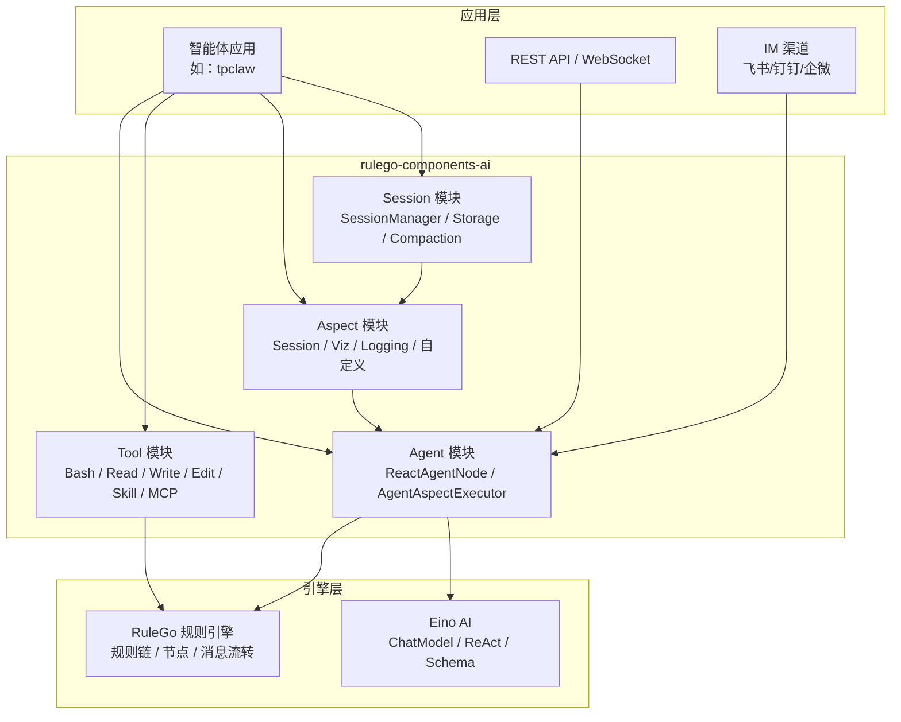

RuleGo AI 智能体开发框架是一套基于 **RuleGo 规则引擎** + **Eino AI** 构建的声明式智能体开发框架。它将 AI 智能体定义为可编排的规则链，融合了 LLM 推理能力与规则引擎的确定性编排能力，提供了工具系统、AOP 切面、会话管理和 MCP 集成等企业级特性。

## 核心理念

### 规则链即智能体

框架的核心设计思想是 **"规则链即智能体"**。每个 AI 智能体本质上是一个 RuleGo 规则链，其中的 `ai/agent` 节点负责 LLM 推理和工具调用循环。这意味着：

- 智能体可以用 JSON 声明式定义，无需编写 Go 代码
- 智能体可以与其他 RuleGo 节点（JS 过滤器、REST API 调用、转换器等）自由组合
- 支持通过规则链实现多智能体编排、管道处理和条件路由
- 智能体配置支持热更新和版本管理

### ReAct 推理循环

框架采用 **ReAct（Reasoning + Acting）** 模式作为智能体的核心执行范式：

1. **推理（Reasoning）**：LLM 分析当前上下文，决定下一步行动
2. **行动（Acting）**：调用工具执行具体操作（读文件、执行命令、调用 API 等）
3. **观察（Observation）**：获取工具返回结果，作为新的上下文
4. **循环**：重复以上步骤，直到任务完成或达到最大步数

这种模式让智能体能够自主规划任务、选择工具、处理异常，实现复杂的多步推理。

## 架构总览

### 四大核心模块

| 模块 | 职责 | 关键组件 |
|------|------|----------|
| **Agent** | 智能体执行引擎，管理 ReAct 循环和生命周期 | ReactAgentNode、AgentAspectExecutor、ToolAgent |
| **Tool** | 工具注册、创建和执行，为智能体提供能力 | ToolRegistry、VisualToolWrapper、RuleGoTool、MCP 适配器 |
| **Aspect** | AOP 横切关注点，可插拔的中间件机制 | AspectManager、SessionAspect、VizAspect、LoggingAspect |
| **Session** | 对话状态管理，历史消息存储和压缩 | SessionManager、SessionStorage、CompactionConfig |

## 与其他框架对比

### vs Eino（CloudWeGo）

Eino 是本框架的底层依赖，提供 LLM 调用、消息 Schema 和基础 ReAct 实现。RuleGo 智能体框架在 Eino 之上增加了：

| 能力 | Eino | RuleGo 智能体框架 |
|------|------|-------------------|
| **智能体定义** | Go 代码构建 | JSON 声明式配置，支持热更新 |
| **编排方式** | Graph/Chain/Workflow（代码） | 规则链可视化编排 + 代码编排 |
| **横切关注点** | 固定 Callback（OnStart/OnEnd/OnError） | AOP 切面体系，10 种可扩展接口 |
| **会话管理** | 基础 Session Values | 完整的会话生命周期：存储、压缩、裁剪 |
| **工具扩展** | Go 接口实现 | 内置 8 种工具 + MCP 协议 + 规则链工具 |
| **模型管理** | 构建时绑定，不可变 | 运行时动态切换，会话级模型选择 |
| **前端可视化** | 原始 AgentEvent 流 | AG-UI 标准协议，内置可视化切面 |
| **企业集成** | 需自行实现 | MCP 工具协议、IM 渠道集成、文件存储 |

简单来说：**Eino 是 LLM 交互库，RuleGo 智能体框架是企业级智能体运行时。**

### vs LangChain / LangGraph（Python）

| 维度 | LangChain/LangGraph | RuleGo 智能体框架 |
|------|---------------------|-------------------|
| **语言** | Python | Go |
| **性能** | 适合原型和数据处理 | 高并发、低延迟，适合生产服务 |
| **定义方式** | Python 代码 / LangGraph Studio | JSON 规则链，可视化编辑器 |
| **与业务系统集成** | 需额外开发 | 原生支持规则引擎编排，与业务逻辑无缝集成 |
| **部署** | Python 运行时 | 单二进制部署，资源占用小 |

### vs AutoGen / CrewAI（Python）

| 维度 | AutoGen / CrewAI | RuleGo 智能体框架 |
|------|-----------------|-------------------|
| **多智能体** | 代码编排对话流程 | 规则链声明式编排，子智能体即工具 |
| **状态管理** | 依赖外部存储 | 内置会话管理，支持多种作用域 |
| **可观测性** | 需集成第三方 | 内置日志、可视化、AG-UI 事件 |

## 适用场景

- **企业级 AI 助手**：多渠道接入（飞书/钉钉/企微/API），会话隔离，权限控制
- **智能客服系统**：知识库检索 + 工具调用 + 多轮对话
- **IoT 智能控制**：自然语言意图分类 → 结构化指令 → 设备控制 API
- **自动化工作流**：文件处理、代码生成、数据分析等自主任务
- **多智能体协作**：主智能体 + 专业子智能体，分工协作完成复杂任务

## 相关文档

- [架构设计](./01.架构设计.md) — 分层架构、核心模块、数据流详解
- [智能体节点](./02.智能体节点.md) — `ai/agent` 节点的配置与使用
- [工具系统](./03.工具系统.md) — 工具类型、内置工具、MCP 集成
- [切面框架](./04.切面框架.md) — AOP 切面体系与自定义扩展
- [会话管理](./05.会话管理.md) — 对话状态、消息压缩、存储扩展
- [开发指南](./06.开发指南.md) — 基于框架开发智能体应用的完整流程
