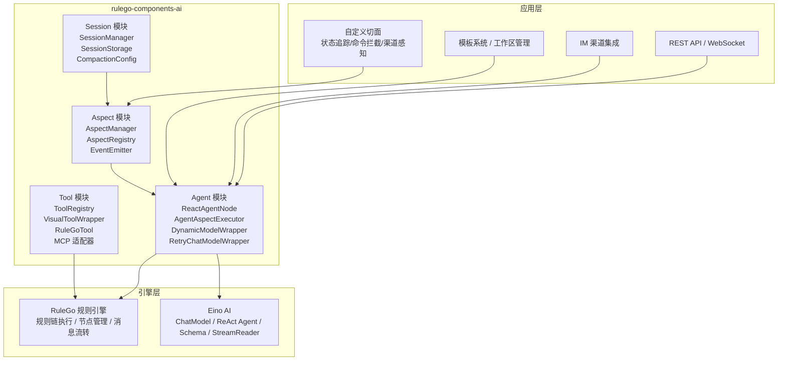
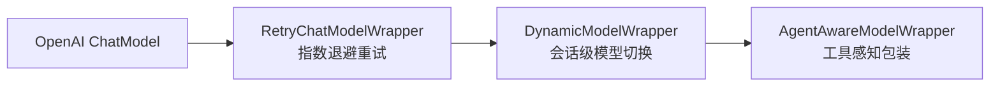
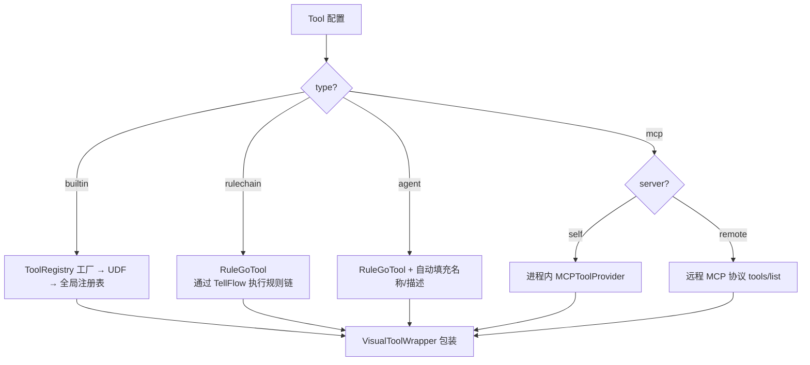
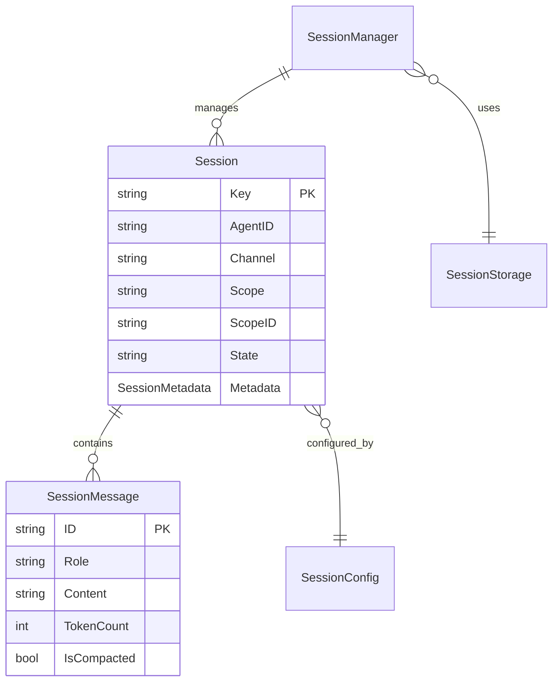
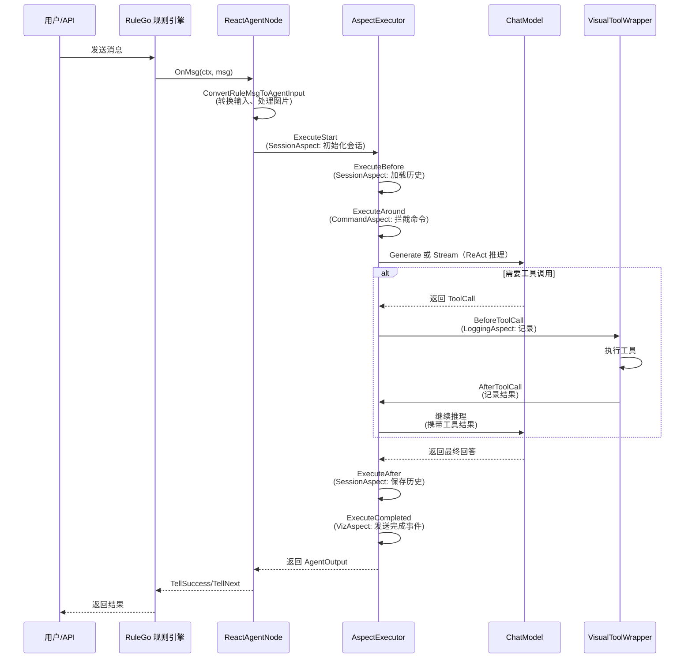

## 技术栈分层

RuleGo AI 智能体框架采用三层架构设计：



| 层级 | 职责 | 代表组件 |
|------|------|----------|
| **应用层** | 业务逻辑、渠道接入、用户管理 | 自定义切面、API 路由 |
| **框架层** | 智能体生命周期管理、工具调度、切面编排、会话管理 | rulego-components-ai |
| **引擎层** | 规则链执行引擎、LLM 调用与 Schema | RuleGo、Eino |

## Agent 模块

Agent 模块是框架的核心，负责智能体的初始化、执行和生命周期管理。

### ReactAgentNode

`ai/agent` 节点的实现，注册到 RuleGo 组件注册表。它是规则链中的智能体节点，负责：

1. **初始化**（`Init`）：解析配置 → 初始化模板 → 创建 ChatModel（含重试包装）→ 包装动态模型切换 → 初始化切面执行器 → 创建工具 → 创建 ReAct Agent
2. **消息处理**（`OnMsg`）：转换输入 → 构建执行上下文 → 构建切面输入 → 分发到同步/流式执行
3. **同步执行**（`executeSync`）：通过 `AgentAspectExecutor` 包装，执行完整的切面生命周期
4. **流式执行**（`executeStream`）：类似同步执行，但逐块输出中间结果

### AgentAspectExecutor

切面执行器，将智能体的执行过程与切面体系桥接。它管理完整的切面生命周期：

```
ExecuteSync:
  Start → Before → (合并消息) → Around → [LLM调用] → After → Completed

ExecuteStream:
  Start → Before → (合并消息) → Around → [LLM流式调用 + OnChunk] → After → Completed
```

消息合并逻辑：切面修改的 SystemPrompt > 切面注入的 Messages > 原始消息。

### 模型装饰器链

ChatModel 通过装饰器模式层层包装，增强功能：



- **RetryChatModelWrapper**：自动处理 429/5xx/网络错误/超时，指数退避（初始 1s，翻倍，最大 30s，随机抖动）
- **DynamicModelWrapper**：从 Context 读取 `session_model`，与默认模型不同时创建新实例，`sync.Map` 缓存

### ToolAgent

将单个 `InvokableTool` 包装为 `adk.Agent`，用于简化场景：提取最后一条用户消息作为工具输入，调用工具后返回结果。

## Tool 模块

### 工具创建工厂

`CreateTools` / `CreateTool` 根据配置类型采用不同策略创建工具：



### VisualToolWrapper

所有工具创建后都会被 `VisualToolWrapper` 装饰，提供统一的横切能力：

1. 参数校验（拒绝空参数/无效 JSON）
2. 步数追踪（检查 `maxStep` 限制）
3. 唯一调用 ID 生成
4. 执行 `ToolCallBeforeAspect` 切面链
5. 发射 AG-UI 事件（`tool_start` / `tool_result` / `tool_error`）
6. SSE 流式推送
7. 记录指标（Token、耗时、错误）
8. 执行 `ToolCallAfterAspect` 切面链
9. 输出截断

### MCP 适配器

三种 MCP 适配模式：

| 模式 | 适配器 | 特点 |
|------|--------|------|
| 进程内 | `MCPToolAdapter` | 零网络调用，从 RuleConfig UDF 获取 MCPToolProvider |
| 远程 HTTP | `RemoteMCPToolAdapter` | 通过 MCP 协议 `tools/list` 自动发现，多适配器共享客户端 |
| 远程 Stdio | `mcpTool` | 通过标准输入输出与 MCP 服务通信 |

## Aspect 模块

### AspectManager

管理所有注册的切面，按类型分类存储，线程安全（`sync.RWMutex`）。

切面注册时按 `Order()` 排序并分类。Around 切面按逆序构建责任链（最后注册的包裹最外层）。

### 事件发射器

`EventEmitter` 接口实现 AG-UI 标准事件协议，支持两种获取方式：
1. 从 Context 中获取（请求级别）
2. 从 `EmitterRegistry` 全局注册表获取（规则链级别）

### 内置切面

| 切面 | Order | 实现的接口 | 职责 |
|------|-------|-----------|------|
| SessionAspect | 50 | Before, After | 加载/保存历史消息，自动压缩 |
| VizAspect | 100 | Start, Completed, StreamChunk, ToolCallBefore, ToolCallAfter | 发送 AG-UI 可视化事件 |
| LoggingAspect | 200 | Start, Completed, StreamChunk, ToolCallBefore, ToolCallAfter | 记录执行日志 |

## Session 模块

### 数据模型



### 存储后端

框架提供 `MemoryStorage`（内存存储）作为默认实现，并通过 `SessionStorage` 接口支持扩展：

- **MemoryStorage**：`sync.RWMutex` 保护的内存 map，深拷贝防并发修改
- **扩展**：实现 `SessionStorage` 接口可对接 Redis、SQLite、文件系统等

## 数据流

以下展示一次完整的智能体请求处理流程：



## 相关文档

- [概述](./00.概述.md) — 框架定位与核心概念
- [智能体节点](./02.智能体节点.md) — ReAct 节点的概念与高级特性
- [智能体组件](../08.组件/01.智能体.md) — `ai/agent` 组件的完整配置参考
- [工具系统](./03.工具系统.md) — 工具类型、内置工具、MCP 集成
- [切面框架](./04.切面框架.md) — AOP 切面体系与自定义扩展
- [会话管理](./05.会话管理.md) — 对话状态、消息压缩、存储扩展
- [开发指南](./06.开发指南.md) — 基于框架开发智能体应用
