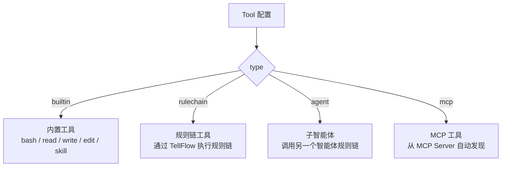

工具（Tool）是智能体可调用的能力单元。智能体在 ReAct 循环中根据任务需要自主选择并调用工具。框架提供四种工具类型，其中内置的 **4 大原始工具**（read、write、edit、bash）构成智能体与世界交互的基础能力，**skill 技能系统** 则为智能体提供可扩展的专业领域知识。

## 工具类型



| 类型 | 标识 | 说明 |
|------|------|------|
| 内置工具 | `builtin` | 框架预注册的工具，支持工厂创建独立实例 |
| 规则链工具 | `rulechain` | 将一个规则链封装为工具 |
| 子智能体 | `agent` | 将另一个智能体作为工具调用（自动填充名称和描述） |
| MCP 工具 | `mcp` | 从 MCP Server 自动发现和加载工具 |

## 4 大原始能力

`read`、`write`、`edit`、`bash` 构成智能体的 4 大原始能力，类比人类的认知与行动体系——智能体通过这 4 个工具感知世界、创造内容、自我迭代并与环境交互：

| 工具 | 能力 | 说明 | 类比 |
|------|------|------|------|
| `read` | **记忆** | 获取/读取信息，感知世界 | 人类的感官与记忆 |
| `write` | **创造** | 创建新内容，生成知识 | 人类的创造力 |
| `edit` | **进化** | 修改/改进现有内容，自我迭代 | 人类的学习与成长 |
| `bash` | **行动** | 执行命令，与世界交互 | 人类的行动力 |

这 4 个工具各有明确的职责边界，组合使用即可覆盖智能体与外部世界交互的绝大部分需求。工具的 `workDir` 配置为智能体的工作区目录，实现文件系统级别的隔离。

### bash — 行动力

执行 Shell 命令，与外部世界交互。支持管道、链式命令和 HTTP 请求。

| 配置字段 | 类型 | 说明 | 默认值 |
|----------|------|------|--------|
| workDir | string | 工作目录 | 当前目录 |
| timeout | int | 超时时间（毫秒） | 30000 |
| maxOutputSize | int | 最大输出大小 | 50000 |
| mode | string | 安全模式：`allow`（白名单）或 `deny`（黑名单） | deny |
| allow | []string | 白名单命令列表 | |
| deny | []string | 黑名单命令列表 | |
| denyArgs | []string | 黑名单参数模式列表 | |
| shellPath | string | Shell 路径 | 自动检测 |

安全机制：
- 自动提取管道（`|`）和链式（`&&`、`;`）中的所有命令逐一检查
- `deny` 模式：默认禁止危险命令（如 `rm -rf`、`format`）
- `allow` 模式：只允许白名单中的命令
- Windows 环境自动检测 Git Bash，处理 UTF-8/UTF-16 编码

### read — 记忆

获取和读取信息，感知外部世界。支持文件内容读取、关键词搜索和目录结构浏览。

| 配置字段 | 类型 | 说明 | 默认值 |
|----------|------|------|--------|
| workDir | string | 工作目录 | 当前目录 |
| maxReadLines | int | 单次最大读取行数 | 1000 |
| maxSearchResults | int | 最大搜索结果数 | 30 |

支持的操作：
- `file`：读取文件内容，支持指定行范围（如第 10-50 行）
- `search`：关键词搜索，支持 glob 模式（`*.go`）和 `**` 递归搜索
- `list`：列出目录内容

### write — 创造力

创建新内容，生成知识。支持新建文件、覆盖文件和追加内容，使用原子写入确保数据安全。

| 配置字段 | 类型 | 说明 | 默认值 |
|----------|------|------|--------|
| workDir | string | 工作目录 | 当前目录 |
| maxFileSize | int | 单文件最大大小 | |

支持的操作：
- `create`：创建新文件（文件已存在时失败）
- `overwrite`：覆盖已有文件（临时文件 + 重命名，原子操作）
- `append`：追加内容（自动添加时间戳分隔符）

### edit — 进化

修改和改进现有内容，实现自我迭代。支持精确的行级编辑、搜索替换、插入、删除和备份恢复。

| 配置字段 | 类型 | 说明 | 默认值 |
|----------|------|------|--------|
| workDir | string | 工作目录 | 当前目录 |

支持的操作：
- `line`：编辑指定行内容
- `search`：搜索并替换（支持字面量和正则表达式）
- `insert`：在匹配内容前/后插入新内容
- `delete`：删除指定行
- `restore`：从备份恢复
- `list_backups`：列出可用备份

安全机制：
- 会话隔离的备份管理（每个智能体实例独立）
- 正则表达式长度限制 1000 字符，防止 ReDoS 攻击
- 所有写入使用原子操作（临时文件 + 重命名）

## 技能系统（skill）

如果说 4 大原始工具是智能体的"本能"，那么 **skill** 就是智能体的"学习与专长"。智能体通过 skill 工具扩展核心能力，获得特定领域的专业知识，就像人类通过学习获得专业技能一样。

| 工具 | 能力 | 说明 | 类比 |
|------|------|------|------|
| `skill` | **学习/专长** | 调用预定义技能，获得特定领域专业能力 | 人类的专业技能培训 |

### skill 配置

| 配置字段 | 类型 | 说明 | 默认值 |
|----------|------|------|--------|
| globalDirs | []string | 全局技能目录列表（所有智能体共享） | |
| localDirs | []string | 本地技能目录列表（当前智能体专属） | |
| useChinese | bool | 使用中文描述 | false |

技能文件格式为 `SKILL.md`（Markdown + YAML frontmatter）。搜索时按目录优先级查找，基于文件指纹（FNV 哈希）缓存并支持热更新。

技能分为两级：
- **全局技能**（`globalDirs`）：所有智能体共享的通用能力
- **本地技能**（`localDirs`）：当前智能体专属的专业能力

智能体也可以通过 `write` 工具在工作区的 `skills/` 目录下创建新的 SKILL.md 文件，实现**自主学习新技能**。

## 其他内置工具

### browser_use — 浏览器自动化

控制 Chrome/Chromium 浏览器执行网页操作（需要额外安装浏览器驱动）。

## MCP 工具

MCP（Model Context Protocol）工具从 MCP 服务器自动发现和加载工具。

### 进程内模式（self）

```json
{
  "type": "mcp",
  "config": {
    "server": "self",
    "tools": ["tool_a", "tool_b"]
  }
}
```

通过 RuleConfig UDF 获取 MCPToolProvider，零网络调用，直接使用当前进程注册的 MCP 工具。`tools` 字段为空或省略时加载全部工具。

### 远程模式

```json
{
  "type": "mcp",
  "config": {
    "server": "http://localhost:8080/mcp",
    "tools": ["search", "lookup"]
  }
}
```

通过 MCP 协议的 `tools/list` 自动发现远程服务器上的工具。支持 HTTP 和 stdio 两种传输方式。多个工具适配器共享同一个 MCP 客户端连接（延迟初始化、线程安全）。

MCP 相关组件的完整配置参考：[MCP 客户端](../08.组件/21.MCP客户端.md)、[MCP 服务端](../08.组件/22.MCP服务端.md)。

## 规则链工具

将一个 RuleGo 规则链封装为工具：

```json
{
  "type": "rulechain",
  "name": "send_email",
  "description": "发送电子邮件到指定收件人",
  "targetId": "email-sender-chain",
  "parameters": "{\"type\":\"object\",\"properties\":{\"to\":{\"type\":\"string\"},\"subject\":{\"type\":\"string\"},\"body\":{\"type\":\"string\"}}}",
  "timeout": 30000
}
```

| 字段 | 类型 | 说明 |
|------|------|------|
| type | string | `"rulechain"` |
| name | string | 工具名称 |
| description | string | 工具描述（LLM 根据此描述决定何时调用） |
| targetId | string | 目标规则链 ID |
| parameters | string | 工具参数的 JSON Schema |
| timeout | int64 | 超时时间（毫秒），默认 120000 |

工具的输入通过 `msg.Data` 传递给目标规则链，输出结果从 `msg.Data` 中获取。

## 子智能体工具

`agent` 类型是 `rulechain` 的语义别名，框架自动从目标规则链填充名称、描述和参数：

```json
{
  "type": "agent",
  "targetId": "code-reviewer"
}
```

| 字段 | 类型 | 说明 |
|------|------|------|
| type | string | `"agent"` |
| targetId | string | 目标智能体（规则链）ID |
| name | string | 工具名称（可选，自动从规则链名称获取） |
| description | string | 工具描述（可选，自动从 `additionalInfo.description` 获取） |
| parameters | string | 参数 JSON Schema（可选，自动生成 OpenAI 消息格式） |

## VisualToolWrapper

所有工具在创建时都会被 `VisualToolWrapper` 装饰，提供统一的增强能力：


| 增强能力 | 说明 |
|----------|------|
| 参数校验 | 拒绝空参数或无效 JSON |
| 步数追踪 | 检查是否超过 `maxStep` 限制 |
| 切面通知 | 执行 `ToolCallBeforeAspect` 和 `ToolCallAfterAspect` |
| AG-UI 事件 | 发送 `tool_start` / `tool_args` / `tool_end` / `tool_result` 事件 |
| SSE 推送 | 流式模式下推送工具调用状态 |
| 指标采集 | 记录 Token 使用、耗时、错误 |
| 输出截断 | 超过 `maxToolOutputLength` 自动截断 |

## 工具注册表

### ToolRegistry

全局工具注册表，管理内置工具的注册和查找：

| 方法 | 说明 |
|------|------|
| `Register(name, tool)` | 注册工具共享实例 |
| `Get(name)` | 获取工具实例 |
| `GetDef(name)` | 获取工具定义（含工厂函数） |
| `RegisterTool[T](name, desc, factory)` | 泛型注册助手 |

### 自定义工具

通过 `ToolRegistry` 注册自定义工具：

```go
// 方式 1：注册共享实例（适用于无状态工具）
tool.Registry.Register("my_tool", &MyTool{})

// 方式 2：通过工厂注册（每个配置创建独立实例，推荐）
tool.Registry.RegisterDef(tool.ToolDefinition{
    Name: "my_tool",
    Desc: "自定义工具描述",
    Factory: func(config map[string]interface{}) (tool.BaseTool, error) {
        return &MyTool{Config: config}, nil
    },
})
```

## 完整工具配置示例

```json
{
  "tools": [
    {
      "type": "builtin",
      "name": "bash",
      "config": {
        "workDir": "${global.root_dir}/workspace-main",
        "timeout": 60000,
        "mode": "deny",
        "deny": ["rm -rf", "format", "del /s"]
      }
    },
    {
      "type": "builtin",
      "name": "read",
      "config": {
        "workDir": "${global.root_dir}/workspace-main",
        "maxReadLines": 500
      }
    },
    {
      "type": "builtin",
      "name": "write",
      "config": {
        "workDir": "${global.root_dir}/workspace-main"
      }
    },
    {
      "type": "builtin",
      "name": "edit",
      "config": {
        "workDir": "${global.root_dir}/workspace-main"
      }
    },
    {
      "type": "builtin",
      "name": "skill",
      "config": {
        "globalDirs": ["${global.root_dir}/skills"],
        "localDirs": ["${global.root_dir}/workspace-main/skills"],
        "useChinese": true
      }
    },
    {
      "type": "mcp",
      "config": {
        "server": "self",
        "tools": ["list_rule_chains", "get_rule_chain", "save_rule_chain"]
      }
    },
    {
      "type": "agent",
      "targetId": "code-reviewer"
    }
  ]
}
```

## 相关文档

- [概述](./00.概述.md) — 框架定位与核心概念
- [智能体节点](./02.智能体节点.md) — ReAct 节点的概念与高级特性
- [智能体组件](../08.组件/01.智能体.md) — `ai/agent` 组件的完整配置参考
- [切面框架](./04.切面框架.md) — 工具调用的切面拦截
- [开发指南](./06.开发指南.md) — 自定义工具开发实战
