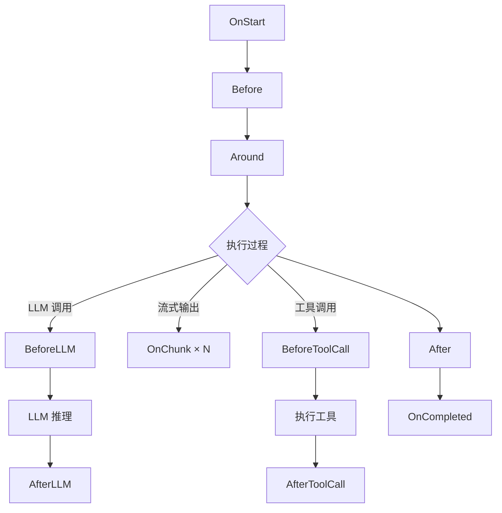
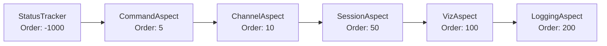

切面框架基于 AOP（面向切面编程）思想，为 AI 智能体提供可插拔的中间件机制。通过切面，可以在不修改智能体核心逻辑的前提下，添加会话管理、日志记录、可视化、权限控制等横切关注点。

## 切面的用途

切面解决的是智能体开发中的**横切关注点**问题——那些跨越所有智能体、但又与业务逻辑无关的通用能力：

| 关注点 | 不用切面 | 用切面 |
|--------|----------|--------|
| 对话历史管理 | 每个智能体都写加载/保存逻辑 | SessionAspect 统一处理 |
| 执行日志 | 在智能体代码中散落 log 语句 | LoggingAspect 统一收集 |
| 前端可视化 | 智能体输出时手动发事件 | VizAspect 自动推送 AG-UI 事件 |
| 命令拦截 | 修改输入处理逻辑 | Around 切面拦截，返回 `SkippedAI` |
| 状态追踪 | 每个调用点手动标记 | Start/Completed 切面自动追踪 |
| 渠道感知 | 智能体感知 IM 平台差异 | Before 切面注入渠道上下文 |
| 权限控制 | 每个工具调用前校验 | ToolCallBefore 切面统一拦截 |

**核心价值**：切面让智能体保持纯粹的推理和工具调用逻辑，所有"基础设施"代码通过切面注入，实现关注点分离。

## 与其他系统的类比

如果你用过 Claude Code 的 Hooks，或者 Web 框架的中间件，那么切面的概念并不陌生——它们都是在特定执行节点插入自定义逻辑。但 RuleGo 切面覆盖的拦截点更细、控制力更强：

### vs Claude Code Hooks

| 维度 | Claude Code Hooks | RuleGo 切面 |
|------|-------------------|-------------|
| **拦截点** | 固定 3 个（PreToolUse、PostToolUse、Notification） | 10 种接口，覆盖完整生命周期 |
| **拦截能力** | 只能允许或拒绝 | Around 切面可以完全替代执行、缓存、重试、跳过 LLM |
| **上下文访问** | 工具名和参数 | 输入消息、系统提示词、历史记录、输出结果、Token 用量 |
| **组合方式** | 独立触发，互不影响 | 按 Order 排序，Around 形成责任链嵌套 |
| **修改能力** | 不能修改输入输出 | Before 可修改系统提示词，Around 可替换返回值 |
| **典型用途** | 安全审批、日志通知 | 会话管理、可视化、命令拦截、渠道感知、权限控制、审计 |

简单说：**Hooks 是"门卫"（放行/拒绝），切面是"中间件链"（读取、修改、拦截、替代，全部都行）。**

### vs Web 中间件

| 维度 | Gin/Echo 中间件 | RuleGo 切面 |
|------|----------------|-------------|
| **作用对象** | HTTP 请求 | 智能体执行过程 |
| **嵌套方式** | `c.Next()` 调用下一个 | `next(ctx, input)` 调用下一个切面或核心逻辑 |
| **拦截点** | 请求前/后 | 10 种生命周期节点 |
| **典型模式** | 鉴权、日志、CORS | 会话、可视化、命令拦截 |

如果你写过 Gin 的 `c.Next()` 中间件，那么 `AgentAroundAspect` 的 `next()` 就是同样的模式——切面包裹在核心逻辑外面，可以决定是否调用、如何修改输入输出。

## 执行生命周期



### 10 种切面接口

| 阶段 | 切面接口 | 时机 | 典型用途 |
|------|----------|------|----------|
| 1 | `AgentStartAspect` | 智能体开始处理前 | 状态追踪、初始化会话、发送开始事件 |
| 2 | `AgentBeforeAspect` | 主执行逻辑之前 | 加载历史消息、注入渠道上下文 |
| 3 | `AgentAroundAspect` | 包裹整个执行过程 | 命令拦截、超时控制、重试、缓存 |
| 4 | `MessageBeforeAspect` | 每次 LLM 调用之前 | 注入动态消息、裁剪上下文 |
| 5 | `MessageAfterAspect` | 每次 LLM 调用之后 | 过滤敏感内容、修改响应 |
| 6 | `StreamChunkAspect` | 每个流式输出块 | 实时可视化、逐字日志 |
| 7 | `ToolCallBeforeAspect` | 工具调用之前 | 参数校验、权限拦截、日志 |
| 8 | `ToolCallAfterAspect` | 工具调用之后 | 日志、指标采集 |
| 9 | `AgentAfterAspect` | 主执行逻辑之后 | 保存历史消息、处理输出 |
| 10 | `AgentCompletedAspect` | 处理完成后（无论成功失败） | 指标统计、状态清理 |

## 内置切面

框架提供三个内置切面，覆盖最常用的横切关注点。它们通过 `AspectRegistry` 全局注册后自动应用于所有智能体。

### SessionAspect — 会话管理

- **Order**：50（在 Before/After 阶段执行）
- **实现接口**：`AgentBeforeAspect`、`AgentAfterAspect`
- **构造函数**：`NewSessionAspect(sessionMgr, defaultScope, logger)`
- **PointCut**：`sessionMgr != nil`（仅当配置了 SessionManager 时生效）

**Before 阶段**——加载对话历史：

1. 根据 AgentId + Channel + Scope + ScopeID + UserID 生成会话 Key
2. 调用 `SessionManager.GetOrCreate()` 获取或创建会话
3. 从会话加载历史消息，转换为 `schema.Message` 格式
4. 过滤历史中的工具调用（保留最近 N 条，避免上下文过长）
5. 当消息数 >= 10 且 Token 数 >= 100,000 时触发自动压缩
6. 将最近 4 条历史消息中的本地图片路径转为 base64
7. 预保存当前用户消息到会话

**After 阶段**——保存对话结果：

1. 保存助手回复消息到会话
2. 保存工具调用消息（过滤无效的空参数调用）
3. 估算 Token 数量（中英文混合感知算法）
4. 更新会话统计信息（消息数、总 Token 数）
5. 当模型返回了准确的 Token 使用量时，修正估算值

**注册方式**：

```go
import (
    agentaspect "github.com/rulego/rulego-components-ai/ai/aspect"
    agentsession "github.com/rulego/rulego-components-ai/ai/session"
    "github.com/rulego/rulego-components-ai/ai/aspect/builtin"
)

// 创建会话管理器
sessionManager := agentsession.NewManager(
    agentsession.NewMemoryStorage(),
    &agentsession.SessionConfig{
        MaxMessages:   100,
        MaxTokenCount: 128000,
    },
)

// 注册会话切面
agentaspect.RegisterAspect("session", builtin.NewSessionAspect(
    sessionManager,
    agentsession.ScopePerPeer, // 默认作用域
    logger,
))
```

### VizAspect — 可视化事件

- **Order**：100
- **实现接口**：`AgentStartAspect`、`AgentCompletedAspect`、`StreamChunkAspect`、`ToolCallBeforeAspect`、`ToolCallAfterAspect`
- **构造函数**：`NewVizAspect()`
- **PointCut**：检查 Context 或全局注册表中是否存在 `EventEmitter`

发送 AG-UI 标准事件，用于前端实时展示智能体的执行过程：

| 生命周期 | 发送的事件 | 事件内容 |
|----------|-----------|----------|
| OnStart | `RUN_STARTED` | 智能体 ID、名称、类型 |
| OnStart | `TEXT_MESSAGE_START/CONTENT/END` | 回显用户输入消息 |
| StreamChunk | `TEXT_MESSAGE_START` → `TEXT_MESSAGE_CONTENT` → ... | 逐块输出助手回复 |
| ToolCallBefore | `TOOL_CALL_START` + `TOOL_CALL_ARGS` | 工具名称、类型、参数 |
| ToolCallAfter | `TOOL_CALL_RESULT` | 工具执行结果 |
| OnCompleted | `RUN_FINISHED` | 耗时、Token 使用量、完成状态 |
| OnCompleted | `RUN_ERROR`（失败时） | 错误信息 |

**注册方式**：

```go
// 注册可视化切面（通常无需手动注册，框架自动注册）
agentaspect.RegisterAspect("viz", builtin.NewVizAspect())

// 为特定规则链注册事件发射器（将事件推送到 WebSocket 等前端通道）
agentaspect.GetGlobalEmitterRegistry().RegisterEmitter("my-agent", myWebSocketEmitter)
```

### LoggingAspect — 执行日志

- **Order**：200（最后执行，确保记录完整信息）
- **实现接口**：`AgentStartAspect`、`AgentCompletedAspect`、`StreamChunkAspect`、`ToolCallBeforeAspect`、`ToolCallAfterAspect`
- **构造函数**：`NewLoggingAspect(logger)`
- **PointCut**：`logger != nil`

使用 `Debugf` 级别记录智能体执行的完整生命周期：

| 阶段 | 记录内容 |
|------|----------|
| OnStart | 智能体名称、类型、线程 ID、用户 ID、消息数量 |
| ToolCallBefore | 工具名称、调用 ID、参数（截断至 200 字符） |
| ToolCallAfter | 工具名称、调用 ID、耗时、结果（截断至 200 字符） |
| StreamChunk | 仅记录工具调用块和错误块（跳过内容块避免刷屏） |
| OnCompleted | 成功/失败、总耗时(ms)、Token 使用量(prompt/completion/total)、工具调用详情 |

**注册方式**：

```go
agentaspect.RegisterAspect("logging", builtin.NewLoggingAspect(logger))
```

### 内置切面执行顺序

所有切面按 `Order` 值从小到大执行：



> StatusTracker、CommandAspect、ChannelAspect 是应用层自定义切面的示例，SessionAspect、VizAspect、LoggingAspect 是框架内置切面。

## 自定义切面开发

### 开发步骤

1. **选择切面接口**：根据你的拦截时机选择合适的接口
2. **实现基础方法**：`Order()`、`New()`、`PointCut()`
3. **实现业务方法**：对应切面接口的方法
4. **注册切面**：应用启动时通过 `AspectRegistry` 注册

### 基础方法说明

```go
// Order() 返回执行优先级，值越小越先执行
// 建议：框架内置切面使用 50-200，应用层切面使用负数或小于 50 的值
func (a *MyAspect) Order() int { return 10 }

// New() 为每个智能体创建独立的切面实例（避免共享状态）
// 如果切面本身无状态，可以返回自身
func (a *MyAspect) New() aspect.Aspect { return &MyAspect{} }

// PointCut() 运行时判断是否应用此切面
// return true 应用于所有智能体
// 也可以根据 AgentId、MessageType 等条件选择性应用
func (a *MyAspect) PointCut(ctx context.Context, point *aspect.AgentPoint) bool {
    return true
}
```

### 示例 1：状态追踪切面（Start + Completed）

追踪智能体是否正在执行，供心跳调度判断：

```go
package aspect

import (
    "context"
    "sync"
    agentaspect "github.com/rulego/rulego-components-ai/ai/aspect"
)

type AgentStatusTracker struct {
    busyMap sync.Map // agentId -> bool
}

func NewAgentStatusTracker() *AgentStatusTracker {
    return &AgentStatusTracker{}
}

// Order 设为 -1000，确保最先执行，在任何其他切面之前标记状态
func (a *AgentStatusTracker) Order() int { return -1000 }

// New 返回自身（共享状态是有意为之，所有智能体共享同一个追踪器）
func (a *AgentStatusTracker) New() agentaspect.Aspect { return a }

func (a *AgentStatusTracker) PointCut(ctx context.Context, point *agentaspect.AgentPoint) bool {
    return true
}

func (a *AgentStatusTracker) OnStart(ctx context.Context, point *agentaspect.AgentPoint, input *agentaspect.AgentInput) (*agentaspect.AgentInput, error) {
    a.busyMap.Store(point.AgentId, true)
    return input, nil
}

func (a *AgentStatusTracker) OnCompleted(ctx context.Context, point *agentaspect.AgentPoint, output *agentaspect.AgentOutput) {
    a.busyMap.Delete(point.AgentId)
}

func (a *AgentStatusTracker) IsBusy(agentId string) bool {
    _, ok := a.busyMap.Load(agentId)
    return ok
}
```

**用途**：心跳服务调用 `tracker.IsBusy(agentId)` 判断智能体是否空闲，避免在执行中触发心跳任务。

### 示例 2：命令拦截切面（Around）

拦截以 `/` 开头的消息，直接处理不经过 LLM：

```go
package aspect

import (
    "context"
    "strings"
    agentaspect "github.com/rulego/rulego-components-ai/ai/aspect"
)

type CommandAspect struct{}

func (c *CommandAspect) Order() int { return 5 }

func (c *CommandAspect) New() agentaspect.Aspect { return &CommandAspect{} }

func (c *CommandAspect) PointCut(ctx context.Context, point *agentaspect.AgentPoint) bool {
    // 仅对 IM 渠道和 API 生效
    channel := point.Metadata["im.channel"]
    platform := point.Metadata["im.platform"]
    return channel != "" || platform != "" || point.Metadata["sourceType"] == "api"
}

func (c *CommandAspect) Around(ctx context.Context, point *agentaspect.AgentPoint,
    input *agentaspect.AgentInput, next agentaspect.AgentExecutor) (*agentaspect.AgentOutput, error) {

    // 获取最后一条用户消息
    if len(input.OriginalMessages) == 0 {
        return next(ctx, input)
    }
    lastMsg := input.OriginalMessages[len(input.OriginalMessages)-1]
    content, _ := lastMsg.Content.(string)

    if !strings.HasPrefix(content, "/") {
        return next(ctx, input) // 非命令，继续正常流程
    }

    // 解析并执行命令
    parts := strings.SplitN(content, " ", 2)
    cmd := parts[0]
    args := ""
    if len(parts) > 1 {
        args = parts[1]
    }

    result := handleCommand(cmd, args)

    // 返回结果，SkippedAI=true 表示跳过 LLM 调用
    return &agentaspect.AgentOutput{
        Content:   result,
        SkippedAI: true,
        IsSuccess: true,
    }, nil
}
```

**用途**：支持 `/help`、`/new`、`/model`、`/status` 等管理命令，直接返回结果无需消耗 LLM Token。

### 示例 3：渠道感知切面（Before）

根据消息来源（IM 渠道、API、心跳）注入不同的上下文提示：

```go
package aspect

import (
    "context"
    agentaspect "github.com/rulego/rulego-components-ai/ai/aspect"
)

type ChannelAspect struct{}

func (c *ChannelAspect) Order() int { return 10 }

func (c *ChannelAspect) New() agentaspect.Aspect { return &ChannelAspect{} }

func (c *ChannelAspect) PointCut(ctx context.Context, point *agentaspect.AgentPoint) bool {
    return true
}

func (c *ChannelAspect) Before(ctx context.Context, point *agentaspect.AgentPoint, input *agentaspect.AgentInput) (*agentaspect.AgentInput, error) {
    sourceType := point.Metadata["sourceType"]
    chatType := point.Metadata["chatType"]

    switch sourceType {
    case "im":
        // IM 渠道：注入聊天模式提示
        if chatType == "group" {
            input.SystemPrompt += "\n\n【注意】当前处于群聊模式，请注意隐私保护。"
        } else {
            input.SystemPrompt += "\n\n当前处于私聊模式。"
        }
    case "heartbeat":
        // 心跳触发：注入最近活跃渠道列表，让智能体可以主动联系用户
        input.SystemPrompt += "\n\n最近活跃的渠道：" + getRecentChannels(point.AgentId)
    case "api":
        input.SystemPrompt += "\n\n当前通过 API 接口交互。"
    }
    return input, nil
}
```

**用途**：让同一个智能体在不同场景下表现不同行为——群聊时注意隐私、心跳时主动触达用户。

### 示例 4：工具权限控制切面（ToolCallBefore + ToolCallAfter）

控制特定工具的调用权限：

```go
package aspect

import (
    "context"
    "fmt"
    agentaspect "github.com/rulego/rulego-components-ai/ai/aspect"
)

type ToolPermissionAspect struct {
    allowedTools map[string]bool // agentId -> 是否有完整权限
}

func (t *ToolPermissionAspect) Order() int { return 0 }

func (t *ToolPermissionAspect) New() agentaspect.Aspect { return t }

func (t *ToolPermissionAspect) PointCut(ctx context.Context, point *agentaspect.AgentPoint) bool {
    return true
}

// BeforeToolCall 在工具调用前检查权限
// 返回 error 可以阻止工具执行
func (t *ToolPermissionAspect) BeforeToolCall(ctx context.Context, point *agentaspect.AgentPoint,
    call *agentaspect.ToolCallInfo) (*agentaspect.ToolCallInfo, error) {

    if !t.allowedTools[point.AgentId] {
        // 非授权智能体禁止使用 bash 工具
        if call.Name == "bash" {
            return nil, fmt.Errorf("权限不足：智能体 %s 无权使用 bash 工具", point.AgentId)
        }
    }
    return call, nil
}

func (t *ToolPermissionAspect) AfterToolCall(ctx context.Context, point *agentaspect.AgentPoint,
    call *agentaspect.ToolCallInfo, result *agentaspect.ToolCallResult) error {
    // 记录工具调用审计日志
    auditLog.Printf("agent=%s tool=%s success=%v", point.AgentId, call.Name, result.Error == nil)
    return nil
}
```

**用途**：实现多租户场景下的工具权限隔离，审计工具调用行为。

### 注册自定义切面

```go
import agentaspect "github.com/rulego/rulego-components-ai/ai/aspect"

// 应用启动时注册
tracker := NewAgentStatusTracker()
agentaspect.RegisterAspect("status_tracker", tracker)

agentaspect.RegisterAspect("command", &CommandAspect{})
agentaspect.RegisterAspect("channel", &ChannelAspect{})
agentaspect.RegisterAspect("tool_permission", &ToolPermissionAspect{})

// 取消注册
agentaspect.UnregisterAspect("tool_permission")
```

## 切面接口参考

### AgentStartAspect / AgentCompletedAspect

```go
type AgentStartAspect interface {
    Aspect
    PointCut
    OnStart(ctx context.Context, point *AgentPoint, input *AgentInput) (*AgentInput, error)
}

type AgentCompletedAspect interface {
    Aspect
    PointCut
    OnCompleted(ctx context.Context, point *AgentPoint, output *AgentOutput)
}
```

- `OnStart`：所有处理之前。返回修改后的 `input` 和 `error`（非 nil 时终止执行）。用于初始化、发送开始事件、状态追踪。
- `OnCompleted`：所有处理之后（无论成功或失败）。用于指标统计、状态清理。

### AgentBeforeAspect / AgentAfterAspect

```go
type AgentBeforeAspect interface {
    Aspect
    PointCut
    Before(ctx context.Context, point *AgentPoint, input *AgentInput) (*AgentInput, error)
}

type AgentAfterAspect interface {
    Aspect
    PointCut
    After(ctx context.Context, point *AgentPoint, output *AgentOutput) (*AgentOutput, error)
}
```

- `Before`：主执行之前。返回修改后的 `input` 和 `error`（非 nil 时终止执行）。可修改 `input.SystemPrompt`、`input.Messages`。
- `After`：主执行之后。返回修改后的 `output`。可读取 `output.Content`、`output.ToolCalls`。

### AgentAroundAspect

```go
type AgentAroundAspect interface {
    Aspect
    PointCut
    Around(ctx context.Context, point *AgentPoint, input *AgentInput,
           next AgentExecutor) (*AgentOutput, error)
}
```

包裹整个执行过程。通过 `next` 参数调用下一个执行器：

| 用途 | 实现方式 |
|------|----------|
| 命令拦截 | 匹配特定输入，不调用 `next`，返回 `SkippedAI: true` |
| 超时控制 | goroutine 中调用 `next`，`select` + `timer` |
| 重试 | 循环调用 `next` 直到成功 |
| 缓存 | 检查缓存命中后跳过 `next` |

Around 切面按注册的逆序嵌套，形成责任链（最后注册的包裹最外层）。

### MessageBeforeAspect / MessageAfterAspect

```go
type MessageBeforeAspect interface {
    Aspect
    PointCut
    BeforeLLM(ctx context.Context, point *AgentPoint,
              messages []*schema.Message) ([]*schema.Message, error)
}

type MessageAfterAspect interface {
    Aspect
    PointCut
    AfterLLM(ctx context.Context, point *AgentPoint,
             response *schema.Message) (*schema.Message, error)
}
```

- `BeforeLLM`：每次 LLM 调用前。返回修改后的消息列表和 `error`（非 nil 时终止执行）。
- `AfterLLM`：每次 LLM 调用后。返回修改后的响应和 `error`。

### StreamChunkAspect

```go
type StreamChunkAspect interface {
    Aspect
    PointCut
    OnChunk(ctx context.Context, point *AgentPoint, chunk *StreamChunk) error
}
```

流式输出时每个输出块触发。返回 `error` 可终止流式输出。用于实时可视化。

### ToolCallBeforeAspect / ToolCallAfterAspect

```go
type ToolCallBeforeAspect interface {
    Aspect
    PointCut
    BeforeToolCall(ctx context.Context, point *AgentPoint,
                   call *ToolCallInfo) (*ToolCallInfo, error)
}

type ToolCallAfterAspect interface {
    Aspect
    PointCut
    AfterToolCall(ctx context.Context, point *AgentPoint,
                  call *ToolCallInfo, result *ToolCallResult) error
}
```

- `BeforeToolCall`：返回修改后的 `ToolCallInfo` 和 `error`（非 nil 时阻止工具调用）。
- `AfterToolCall`：返回 `error`。用于记录日志和指标。

## 核心数据结构

### AgentPoint — 执行点信息

| 字段 | 类型 | 说明 |
|------|------|------|
| AgentId | string | 智能体 ID |
| AgentName | string | 智能体名称 |
| AgentType | string | 智能体类型 |
| ThreadId | string | 会话线程 ID |
| UserId | string | 用户 ID |
| MessageType | string | 消息类型 |
| ToolName | string | 当前工具名称（工具切面中有效） |
| Metadata | map | 元数据（包含渠道、来源等信息） |

### AgentInput — 智能体输入

| 字段 | 类型 | 说明 |
|------|------|------|
| Messages | []*Message | 完整消息列表（含系统消息） |
| OriginalMessages | []*Message | 原始用户消息（不含系统消息） |
| SystemPrompt | string | 解析后的系统提示词（Before 切面可修改） |
| Context | map | 上下文数据 |
| Metadata | map | 消息元数据 |
| SessionKey | string | 会话标识 |
| HistoryMessages | []*Message | 历史消息 |

### AgentOutput — 智能体输出

| 字段 | 类型 | 说明 |
|------|------|------|
| Content | string | 输出内容 |
| Messages | []*Message | 完整消息列表 |
| ToolCalls | []ToolCallInfo | 工具调用记录 |
| TokenUsage | TokenUsage | Token 使用统计 |
| Duration | int64 | 执行耗时（毫秒） |
| SessionKey | string | 会话标识 |
| IsSuccess | bool | 是否执行成功 |
| Error | error | 错误信息 |
| SkippedAI | bool | 是否被 Around 切面拦截（跳过了 AI 调用） |

## AspectManager

管理所有注册的切面，线程安全。

| 方法 | 说明 |
|------|------|
| `Register(aspect)` | 注册单个切面并重新分类 |
| `RegisterAll(aspects)` | 批量注册切面 |
| `ExecuteStart(ctx, point, input)` | 执行 Start 切面链 |
| `ExecuteBefore(ctx, point, input)` | 执行 Before 切面链 |
| `ExecuteAround(ctx, point, input, next)` | 执行 Around 责任链 |
| `ExecuteAfter(ctx, point, output)` | 执行 After 切面链 |
| `ExecuteCompleted(ctx, point, output)` | 执行 Completed 切面链 |

注册时按 `Order()` 排序并分类到对应的切面类型列表。Around 切面按逆序构建责任链。

## 全局注册表

### AspectRegistry

| 方法 | 说明 |
|------|------|
| `RegisterAspect(name, aspect)` | 注册命名切面 |
| `GetGlobalAspects()` | 获取所有已注册切面 |
| `UnregisterAspect(name)` | 取消注册 |
| `HasAspect(name)` | 检查是否已注册 |
| `ClearAspects()` | 清空所有切面 |

### EmitterRegistry

| 方法 | 说明 |
|------|------|
| `RegisterEmitter(chainId, emitter)` | 为规则链注册事件发射器 |
| `GetEmitterWithFallback(ctx, chainId)` | 获取发射器（优先 Context，回退全局注册表） |

## AG-UI 事件类型

| 事件类型 | 说明 |
|----------|------|
| `RUN_STARTED` | 智能体开始执行 |
| `RUN_FINISHED` | 智能体执行完成 |
| `RUN_ERROR` | 执行出错 |
| `STEP_STARTED` / `STEP_FINISHED` | 推理步骤 |
| `TEXT_MESSAGE_START/CONTENT/END` | 文本消息流式输出 |
| `TOOL_CALL_START/ARGS/END/RESULT` | 工具调用生命周期 |
| `THINKING_START/CONTENT/END` | 思考过程输出 |

## 相关文档

- [概述](./00.概述.md) — 框架定位与核心概念
- [架构设计](./01.架构设计.md) — 分层架构详解
- [智能体节点](./02.智能体节点.md) — `ai/agent` 节点配置
- [会话管理](./05.会话管理.md) — 会话切面的底层机制
- [开发指南](./06.开发指南.md) — 自定义切面的实战应用
