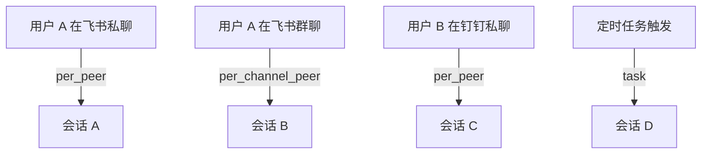
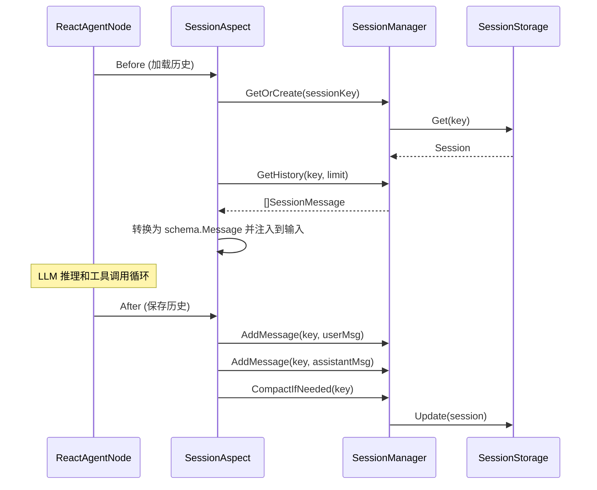

会话（Session）管理智能体的对话状态、消息历史和上下文信息。它负责消息的持久化、历史加载、自动压缩和过期清理，确保智能体在多轮对话中保持连贯的上下文。

## 核心数据模型

### Session

| 字段 | 类型 | 说明 |
|------|------|------|
| Key | string | 会话唯一标识 |
| AgentID | string | 所属智能体 ID |
| Channel | string | 消息渠道（如 feishu、dingtalk、api） |
| Scope | SessionScope | 会话作用域 |
| ScopeID | string | 作用域标识 |
| Messages | []SessionMessage | 消息历史 |
| CompactedSummary | string | 压缩后的历史摘要 |
| Metadata | SessionMetadata | 会话元数据（标题、模型、Token 数等） |
| State | SessionState | 会话状态 |

### SessionMessage

| 字段 | 类型 | 说明 |
|------|------|------|
| ID | string | 消息唯一 ID（格式：`msg_{uuid}_{nanos}`） |
| Role | string | 消息角色：`user`、`assistant`、`tool` |
| Content | string | 消息内容 |
| Images | []string | 图片 URL 列表 |
| TokenCount | int | Token 数量估算 |
| IsCompacted | bool | 是否来自压缩摘要 |
| ToolCalls | []ToolCallInfo | 工具调用信息（assistant 消息） |
| ToolCallID | string | 关联的工具调用 ID（tool 消息） |
| CreatedAt | time | 创建时间 |

## 会话作用域

会话通过作用域（Scope）控制对话的隔离级别：



| 作用域 | 标识 | 说明 |
|--------|------|------|
| 主会话 | `main` | 全局共享，所有用户使用同一上下文 |
| 按对端 | `per_peer` | 每个用户独立会话（默认推荐） |
| 按渠道+对端 | `per_channel_peer` | 同一用户在不同渠道有独立会话 |
| 按账号+渠道+对端 | `per_account_channel_peer` | 多账号场景的完整隔离 |
| 按线程 | `thread` | 按会话线程隔离 |
| 按任务 | `task` | 按任务实例隔离（定时任务、一次性任务） |

### 会话 Key 生成

```
agent:{agentId}:channel:{channel}:scope:{scopeType}:{scopeId}
```

ScopeID 解析优先级：`scopeId` > `chatId` > `threadId` > `userId`

## 会话状态

| 状态 | 说明 |
|------|------|
| `active` | 活跃状态，正常使用中 |
| `idle` | 空闲状态，超过 `IdleTimeout` 未使用 |
| `compacted` | 已压缩，历史消息已摘要化 |
| `archived` | 已归档 |

## 会话配置

### SessionConfig

| 字段 | 类型 | 说明 | 默认值 |
|------|------|------|--------|
| MaxMessages | int | 最大消息条数 | 100 |
| MaxTokenCount | int | 最大 Token 数 | 128000 |
| TTL | duration | 会话生存时间 | |
| IdleTimeout | duration | 空闲超时时间 | |
| PruningConfig | PruningConfig | 消息裁剪配置 | |
| CompactionConfig | CompactionConfig | 消息压缩配置 | |

### PruningConfig — 裁剪配置

| 字段 | 类型 | 说明 | 默认值 |
|------|------|------|--------|
| Enabled | bool | 是否启用裁剪 | false |
| Mode | string | 裁剪模式：`soft`、`hard`、`cache_ttl` | soft |
| KeepRecentCount | int | 保留最近 N 条消息 | 10 |
| MaxToolResultSize | int | 工具结果最大截断大小 | 2000 |
| SaveToolCalls | bool | 是否保留工具调用记录 | true |
| KeepToolCallsCount | int | 保留最近 N 条工具调用 | 5 |

### CompactionConfig — 压缩配置

| 字段 | 类型 | 说明 | 默认值 |
|------|------|------|--------|
| Enabled | bool | 是否启用自动压缩 | false |
| MaxTokenCount | int | 触发压缩的 Token 阈值 | 100000 |
| TriggerThreshold | float64 | 触发阈值百分比（0.0-1.0） | 0.8 |
| KeepRecentCount | int | 压缩时保留最近 N 条消息 | 10 |
| MinMessagesToCompact | int | 最少消息数才触发压缩 | 20 |

## SessionManager

会话管理的核心接口：

| 方法 | 说明 |
|------|------|
| `GetOrCreate(ctx, request)` | 获取或创建会话 |
| `Get(ctx, key)` | 获取指定会话 |
| `AddMessage(ctx, key, message)` | 添加消息到会话 |
| `GetHistory(ctx, key, limit)` | 获取最近 N 条历史消息 |
| `Update(ctx, session)` | 更新会话 |
| `Delete(ctx, key)` | 删除会话 |
| `List(ctx, query)` | 按条件查询会话列表 |
| `CompactIfNeeded(ctx, key)` | 检查并触发自动压缩 |
| `GetConfig()` | 获取会话配置 |

## 存储后端

### MemoryStorage

内存存储，线程安全（`sync.RWMutex`）。适用于单实例部署。

- 读写时深拷贝会话对象，避免并发修改
- 返回最近 N 条消息（按 `MaxMessages` 截断）

### 自定义存储

实现 `SessionStorage` 接口扩展其他存储后端：

```go
type SessionStorage interface {
    Create(ctx context.Context, session *Session) error
    Get(ctx context.Context, key string) (*Session, error)
    Update(ctx context.Context, session *Session) error
    Delete(ctx context.Context, key string) error
    AddMessage(ctx context.Context, key string, message *SessionMessage) error
    GetHistory(ctx context.Context, key string, limit int) ([]*SessionMessage, error)
    List(ctx context.Context, query SessionQuery) ([]*Session, error)
}
```

`SessionQuery` 支持按 `AgentID`、`Channel`、`Scope`、`State` 过滤，支持 `Limit/Offset` 分页。

## 消息处理

### 工具结果截断

工具返回结果可能很长（文件内容、命令输出），框架提供自动截断：

- 超过 `MaxToolResultSize`（默认 2000 字符）自动截断
- 工具调用参数中的大 JSON 字段（`content`、`body`、`data`、`code`、`text` 等）也会被截断

### 参数校验

`IsExecutableToolCallArgs()` 校验工具调用参数：
- 工具名称不能为空
- 参数必须是有效 JSON
- `bash` 工具必须包含 `command` 字段
- `skill` 工具必须包含 `skill` 字段

## Context 传播

会话信息通过 Go `context.Context` 在调用链中传递，提供类型安全的存取方法：

| 函数 | 说明 |
|------|------|
| `WithSession(ctx, session)` | 注入会话 |
| `SessionFromContext(ctx)` | 获取会话 |
| `WithSessionKey(ctx, key)` | 注入会话 Key |
| `SessionKeyFromContext(ctx)` | 获取会话 Key |
| `WithSessionManager(ctx, mgr)` | 注入 SessionManager |
| `SessionManagerFromContext(ctx)` | 获取 SessionManager |
| `NewSessionContext(ctx, mgr, req)` | 一次性创建/获取会话并注入全部值 |

## 会话与切面的协作

会话管理通常通过 `SessionAspect` 切面集成到智能体中：



## 配置示例

```json
{
  "session": {
    "maxMessages": 100,
    "maxTokenCount": 128000,
    "pruning": {
      "enabled": true,
      "mode": "soft",
      "keepRecentCount": 10,
      "maxToolResultSize": 2000,
      "saveToolCalls": true,
      "keepToolCallsCount": 5
    },
    "compaction": {
      "enabled": true,
      "triggerThreshold": 0.8,
      "keepRecentCount": 10,
      "minMessagesToCompact": 20
    }
  }
}
```

## 相关文档

- [概述](./00.概述.md) — 框架定位与核心概念
- [切面框架](./04.切面框架.md) — SessionAspect 切面的接口定义
- [开发指南](./06.开发指南.md) — 会话管理的实战配置
