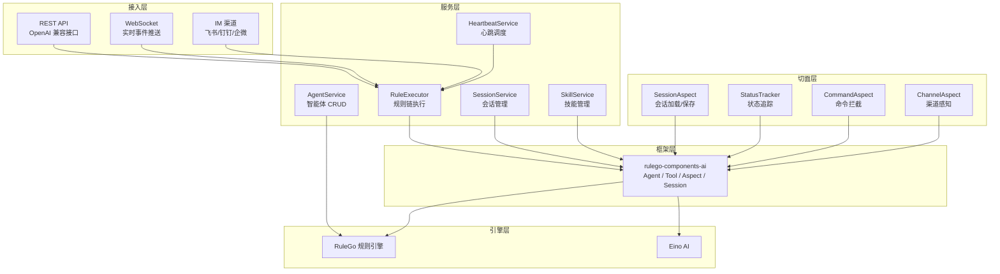

本指南介绍如何基于 RuleGo AI 智能体框架开发完整的智能体应用。以 [tpclaw](https://github.com/rulego-community/tpclaw) 项目为实战案例，展示从初始化到运行的完整流程。

## 应用架构总览

基于框架开发的智能体应用通常包含以下层次：



## 快速开始

### 1. 项目初始化

```go
package main

import (
    "github.com/rulego/rulego"
    agentaspect "github.com/rulego/rulego-components-ai/ai/aspect"
    agentsession "github.com/rulego/rulego-components-ai/ai/session"
    "github.com/rulego/rulego-components-ai/ai/config"
)

func main() {
    // 1. 创建 RuleGo 配置
    ruleConfig := rulego.NewConfig(
        rulego.WithDefaultPool(),
    )

    // 2. 注入全局变量（供规则链中的 ${global.xxx} 引用）
    ruleConfig.Properties.PutValue("root_dir", "/data")
    ruleConfig.Properties.PutValue("models.providers.default.base_url", "https://ai.gitee.com/v1")
    ruleConfig.Properties.PutValue("models.providers.default.api_key", "sk-xxx")
    ruleConfig.Properties.PutValue("models.providers.default.model", "deepseek-chat")

    // 3. 创建规则引擎池
    pool := rulego.NewRuleEnginePool(ruleConfig)

    // 4. 初始化会话管理
    sessionManager := agentsession.NewManager(
        agentsession.NewMemoryStorage(),
        &agentsession.SessionConfig{
            MaxMessages:  100,
            MaxTokenCount: 128000,
        },
    )

    // 5. 注册全局切面
    agentaspect.RegisterAspect("session", agentsession.NewBuiltinSessionAspect(sessionManager))

    // 6. 加载智能体规则链
    pool.Load(ruleConfig, "main", agentJSON)

    // 7. 执行智能体
    meta := rulego.NewMetadata()
    meta.PutValue("stream", "true")
    msg := rulego.NewMsg("USER_COMMAND", "你好，请帮我分析这段代码", rulego.TEXT, meta)
    pool.OnMsg("main", msg)
}
```

### 2. 定义智能体规则链

智能体通过 JSON 文件定义。以下是一个完整的智能体配置：

```json
{
  "ruleChain": {
    "id": "main",
    "name": "主智能体",
    "root": false,
    "additionalInfo": {
      "category": "agents",
      "description": "具有文件读写能力的AI助手"
    }
  },
  "metadata": {
    "firstNodeIndex": 0,
    "nodes": [
      {
        "id": "node_agent",
        "type": "ai/agent",
        "name": "主智能体",
        "configuration": {
          "url": "${global.models.providers.default.base_url}",
          "key": "${global.models.providers.default.api_key}",
          "model": "${global.models.providers.default.model}",
          "maxStep": 100,
          "systemPrompt": "${include(global.root_dir+'/workspace/IDENTITY.md')}\n${include(global.root_dir+'/workspace/AGENTS.md')}\n当前时间：${now()}",
          "params": {
            "temperature": 0.7,
            "topP": 0.9,
            "maxTokens": 16384
          },
          "tools": [
            {"type": "builtin", "name": "bash", "config": {"workDir": "${global.root_dir}/workspace"}},
            {"type": "builtin", "name": "read", "config": {"workDir": "${global.root_dir}/workspace"}},
            {"type": "builtin", "name": "write", "config": {"workDir": "${global.root_dir}/workspace"}},
            {"type": "builtin", "name": "edit", "config": {"workDir": "${global.root_dir}/workspace"}},
            {
              "type": "builtin", "name": "skill",
              "config": {
                "globalDirs": ["${global.root_dir}/skills"],
                "localDirs": ["${global.root_dir}/workspace/skills"]
              }
            }
          ]
        }
      },
      {"id": "node_end", "type": "end", "name": "结束"}
    ],
    "connections": [
      {"fromId": "node_agent", "toId": "node_end", "type": "Success"},
      {"fromId": "node_agent", "toId": "node_end", "type": "Stream"}
    ]
  }
}
```

## 工作区系统

每个智能体可以拥有独立的工作区目录，通过 Markdown 文件定义行为和记忆：

```
workspace/
  IDENTITY.md      智能体身份、角色、能力描述
  AGENTS.md        行为规则、协作规则、任务路由
  SOUL.md          核心价值观、行为原则
  TOOLS.md         工具使用指南和备注
  USER.md          用户画像和偏好
  MEMORY.md        长期记忆（手动维护的重要信息）
  HEARTBEAT.md     心跳任务队列（智能体主动检查和执行）
  BOOTSTRAP.md     首次运行引导（执行后自动删除）
  memory/          每日记忆日志（YYYY-MM-DD.md）
  skills/          智能体私有技能
  rules/           自定义规则链
    cron/          定时任务规则
```

系统提示词通过 `${include()}` 动态加载这些文件：

```json
"systemPrompt": "${include(global.root_dir+'/workspace/IDENTITY.md')}\n\
${include(global.root_dir+'/workspace/AGENTS.md')}\n\
${include(global.root_dir+'/workspace/SOUL.md')}\n\
${include(global.root_dir+'/workspace/TOOLS.md')}\n\
${fileExists(global.root_dir+'/workspace/BOOTSTRAP.md') ? include(global.root_dir+'/workspace/BOOTSTRAP.md') : ''}\n\
当前时间：${now()}"
```

智能体可以使用 `write` 和 `edit` 工具修改这些文件，实现自我进化（更新记忆、调整行为规则）。

## 模板系统

使用 Go 模板批量创建智能体，避免手动编写 JSON。tpclaw 采用了 embed + 磁盘覆盖的模式：

```go
//go:embed templates/*
var templateFS embed.FS

func CreateAgentFromTemplate(templateID, agentID, name string) (string, error) {
    // 1. 读取模板（优先磁盘，回退 embed）
    tmplContent := readTemplateFile(templateID, "agent.json")

    // 2. 渲染模板
    tmpl := template.Must(template.New("agent").Parse(tmplContent))
    var buf bytes.Buffer
    tmpl.Execute(&buf, map[string]string{
        "AgentID":           agentID,
        "Name":              name,
        "WorkspaceExpr":     "global.root_dir+'/workspace-" + agentID + "'",
    })

    // 3. 初始化工作区
    InitAgentWorkspace(agentID, templateID)

    return buf.String(), nil
}
```

模板文件使用 Go `text/template` 语法：

```json
{
  "ruleChain": {
    "id": "{{.AgentID}}",
    "name": "{{.Name}}"
  },
  "metadata": {
    "nodes": [{
      "type": "ai/agent",
      "configuration": {
        "systemPrompt": "${include({{.WorkspaceExpr}}+'/IDENTITY.md')}...",
        "tools": [
          {"type": "builtin", "name": "bash", "config": {"workDir": "{{.WorkspaceExpr}}"}},
          {"type": "builtin", "name": "read", "config": {"workDir": "{{.WorkspaceExpr}}"}}
        ]
      }
    }]
  }
}
```

## 自定义切面

### 状态追踪切面

追踪智能体是否正在执行，供心跳调度判断：

```go
type AgentStatusTracker struct {
    busyMap sync.Map // agentId -> bool
}

func (a *AgentStatusTracker) Order() int { return -1000 }
func (a *AgentStatusTracker) New() aspect.Aspect { return &AgentStatusTracker{} }
func (a *AgentStatusTracker) PointCut(ctx context.Context, point *aspect.AgentPoint) bool {
    return true
}

func (a *AgentStatusTracker) OnStart(ctx context.Context, point *aspect.AgentPoint, input *aspect.AgentInput) (*aspect.AgentInput, error) {
    a.busyMap.Store(point.AgentId, true)
    return input, nil
}

func (a *AgentStatusTracker) OnCompleted(ctx context.Context, point *aspect.AgentPoint, output *aspect.AgentOutput) {
    a.busyMap.Store(point.AgentId, false)
}

func (a *AgentStatusTracker) IsBusy(agentId string) bool {
    v, ok := a.busyMap.Load(agentId)
    return ok && v.(bool)
}
```

### 命令拦截切面

拦截以 `/` 开头的消息，直接处理不经过 LLM：

```go
type CommandAspect struct {
    handlers map[string]CommandHandler
}

func (c *CommandAspect) Order() int { return 5 }
func (c *CommandAspect) New() aspect.Aspect { return &CommandAspect{} }
func (c *CommandAspect) PointCut(ctx context.Context, point *aspect.AgentPoint) bool {
    return true
}

func (c *CommandAspect) Around(ctx context.Context, point *aspect.AgentPoint,
    input *aspect.AgentInput, next aspect.AgentExecutor) (*aspect.AgentOutput, error) {

    lastMsg := input.OriginalMessages[len(input.OriginalMessages)-1]
    if strings.HasPrefix(lastMsg.Content, "/") {
        parts := strings.SplitN(lastMsg.Content, " ", 2)
        cmd := parts[0]
        args := ""
        if len(parts) > 1 {
            args = parts[1]
        }
        if handler, ok := c.handlers[cmd]; ok {
            result := handler.Execute(args)
            return &aspect.AgentOutput{
                Content:   result,
                SkippedAI: true,
                IsSuccess: true,
            }, nil
        }
    }
    return next(ctx, input)
}
```

### 注册切面

```go
statusTracker := &AgentStatusTracker{}
agentaspect.RegisterAspect("status_tracker", statusTracker)

cmdAspect := &CommandAspect{handlers: map[string]CommandHandler{
    "/help":   &HelpCommand{},
    "/new":    &NewSessionCommand{},
    "/model":  &SwitchModelCommand{},
}}
agentaspect.RegisterAspect("command", cmdAspect)
```

## 心跳机制

通过定时任务驱动智能体的主动行为：

```go
type HeartbeatService struct {
    interval    time.Duration
    agentSvc    *AgentService
    executor    *RuleExecutor
    statusTracker *AgentStatusTracker
}

func (h *HeartbeatService) Start() {
    ticker := time.NewTicker(h.interval)
    for range ticker.C {
        h.check()
    }
}

func (h *HeartbeatService) check() {
    for _, agent := range h.agentSvc.List() {
        // 跳过正在执行的智能体
        if h.statusTracker.IsBusy(agent.ID) {
            continue
        }
        // 检查 HEARTBEAT.md 是否有待处理任务
        heartbeatFile := filepath.Join(workspaceDir, "HEARTBEAT.md")
        content := readFile(heartbeatFile)
        if !hasSubstantialContent(content) {
            continue
        }
        // 触发智能体执行心跳任务
        msg := rulego.NewMsg("HEARTBEAT", "检查 HEARTBEAT.md 中的待办任务并执行", rulego.TEXT, meta)
        h.executor.Execute(agent.ID, msg)
    }
}
```

## 多智能体编排

### 子智能体调用

一个智能体可以将另一个智能体作为工具调用：

```json
{
  "tools": [
    {
      "type": "agent",
      "targetId": "code-reviewer",
      "name": "code_review",
      "description": "代码审查智能体，分析代码质量并给出改进建议"
    },
    {
      "type": "agent",
      "targetId": "test-generator",
      "name": "generate_tests",
      "description": "测试生成智能体，为指定代码生成单元测试"
    }
  ]
}
```

LLM 会根据工具描述自动决定何时调用子智能体，子智能体的输出会作为工具结果返回给主智能体继续推理。

### 管道模式

智能体节点与其他 RuleGo 节点组合，构建"分类→路由→执行"管道：

```
用户输入 → [ai/agent 意图分类] → [jsFilter 路由] → True: [restApiCall 执行命令] → [end]
                                             → False: [end 直接对话]
                                             → Stream: [end 流式回复]
```

适用于需要确定性路由的场景（IoT 控制、工单分发等），详见 [智能体节点](./02.智能体节点.md) 的"意图分类智能体"示例。

## 技能扩展

技能（Skill）是预定义的可复用能力单元，以 Markdown 文件形式组织：

```
skills/
  web-search/
    SKILL.md          技能定义（名称、描述、触发规则、执行步骤）
  code-review/
    SKILL.md
  document-writer/
    SKILL.md
```

SKILL.md 格式：

```markdown
---
name: web-search
description: 搜索互联网获取最新信息
---

# Web Search

当需要搜索互联网上的最新信息时使用此技能。

## 步骤

1. 使用 bash 工具执行 curl 命令调用搜索 API
2. 解析搜索结果
3. 整理并返回关键信息
```

技能支持两级目录：
- **全局技能**（`globalDirs`）：所有智能体共享
- **本地技能**（`localDirs`）：特定智能体专属

智能体通过 `skill` 内置工具按名称调用技能。

## REST API 设计

### OpenAI 兼容接口

提供与 OpenAI Chat Completions API 兼容的接口，方便现有客户端直接接入：

```go
// POST /api/v1/agents/{agentId}/v1/chat/completions
func (h *Handler) ChatCompletions(c *gin.Context) {
    agentId := c.Param("agentId")
    var req config.MultiTurnChatRequest
    c.BindJSON(&req)

    // 构建消息
    meta := rulego.NewMetadata()
    if req.Stream {
        meta.PutValue("stream", "true")
    }
    msg := buildMessageFromRequest(req)

    // 执行智能体
    if req.Stream {
        // SSE 流式响应
        h.executor.ExecuteStream(agentId, msg, c.Writer)
    } else {
        // 同步响应
        result := h.executor.ExecuteSync(agentId, msg)
        c.JSON(200, buildChatResponse(result))
    }
}
```

### WebSocket 事件推送

通过 WebSocket 推送 AG-UI 事件，实现前端实时可视化：

```go
// WS /ws?agent={agentId}
func (h *Handler) WebSocket(ws *websocket.Conn, agentId string) {
    emitter := NewWSEventEmitter(ws)
    agentaspect.GetGlobalEmitterRegistry().RegisterEmitter(agentId, emitter)
    defer agentaspect.GetGlobalEmitterRegistry().UnregisterEmitter(agentId)

    // 持续推送事件直到连接关闭
    <-ws.CloseChan()
}
```

## 完整应用示例：tpclaw

[tpclaw](https://github.com/rulego-community/tpclaw) 是基于本框架开发的完整智能体应用平台，包含以下功能：

| 功能 | 实现方式 |
|------|----------|
| 多智能体管理 | AgentService + RuleService，JSON 文件存储 |
| OpenAI 兼容 API | `POST /agents/{id}/v1/chat/completions` |
| IM 多渠道接入 | 飞书/钉钉/企微/Telegram/Slack，endpoint 规则链 |
| 会话管理 | SessionService + SessionAspect，JSONL 文件存储 |
| 工作区系统 | IDENTITY.md/AGENTS.md/MEMORY.md 等文件 |
| 心跳调度 | HeartbeatService，检查 HEARTBEAT.md |
| 技能管理 | SKILL.md 格式，全局 + 私有目录 |
| 实时可视化 | AG-UI 事件 + WebSocket |
| 模板系统 | Go embed 模板 + 磁盘覆盖 |
| 命令系统 | CommandAspect 拦截 `/` 命令 |
| 多智能体编排 | 子智能体工具 + 管道模式 |

### 启动流程

```go
// 1. 加载配置
cfg := config.Load("config.yaml")

// 2. 注册模型能力
config.RegisterModelCapabilitiesFromConfig(cfg.Models.Capabilities)

// 3. 初始化数据目录（首次运行时创建默认智能体）
app.EnsureInitialized(cfg)

// 4. 创建 REST 端点（内部创建所有服务、加载智能体、启动心跳）
endpoint := api.NewRestEndpoint(cfg)
endpoint.Start()
```

### 关键配置（config.yaml）

```yaml
server:
  host: 0.0.0.0
  port: 9527

data:
  rootDir: ./data

models:
  providers:
    default:
      base_url: https://ai.gitee.com/v1
      api_key: sk-xxx
      model: deepseek-chat

agents:
  defaults:
    maxStep: 100
    session:
      enabled: true
      scope: per_peer
      maxMessages: 200
    heartbeat:
      enabled: true
      interval: 30m

channels:
  feishu:
    - accountId: default
      appId: cli_xxx
      appSecret: xxx
      policy:
        dm_policy: allow
        group_policy: disabled
```

## 相关文档

- [概述](./00.概述.md) — 框架定位与核心概念
- [架构设计](./01.架构设计.md) — 分层架构详解
- [智能体节点](./02.智能体节点.md) — `ai/agent` 节点配置
- [工具系统](./03.工具系统.md) — 工具配置与扩展
- [切面框架](./04.切面框架.md) — 切面接口与自定义开发
- [会话管理](./05.会话管理.md) — 会话配置与存储扩展
