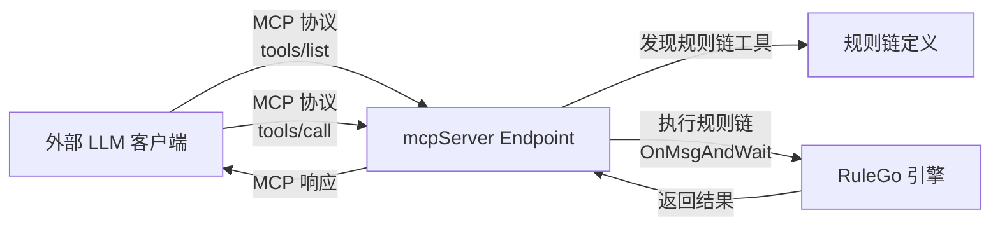

`endpoint/mcpServer` 组件：<Badge text="v0.36.0+"/> MCP（Model Context Protocol）服务端 Endpoint，将 RuleGo 规则链暴露为 MCP 工具，使外部 LLM 客户端可以通过 MCP 协议调用规则链。

MCP 服务端实现了 MCP StreamableHTTP 传输协议，在单一 HTTP 端点上支持 GET/POST/DELETE 请求，兼容所有支持 MCP 协议的客户端。

## 工作原理



1. **工具发现**：MCP 客户端通过 `tools/list` 获取可用工具列表（每个 Router 对应一个工具）
2. **工具调用**：客户端通过 `tools/call` 调用工具，服务端执行对应的规则链并返回结果
3. **参数自动推断**：服务端自动解析规则链中的 `${msg.xxx}` 变量，生成工具的输入参数 Schema

## 配置

| 字段 | 类型 | 说明 | 默认值 |
|------|------|------|--------|
| server | string | 监听地址 | `:6334` |
| certFile | string | TLS 证书文件路径 | |
| certKeyFile | string | TLS 密钥文件路径 | |
| allowCors | bool | 是否启用跨域支持 | false |
| name | string | MCP 服务名称（默认使用规则链名称） | `RuleGo MCP Server` |
| version | string | MCP 服务版本 | `1.0.0` |
| basePath | string | MCP 端点根路径。默认自动生成 `/api/v1/rules/{ruleChain.id}/mcp` | 自动生成 |

## 工具参数 Schema 推断

当 Router 未指定 `inputSchema` 时，服务端自动从规则链定义中提取 `${msg.xxx}` 变量，生成工具参数：

- 如果规则链节点中使用了 `${msg.city}` 和 `${msg.unit}`，工具参数为 `city`（string）和 `unit`（string）
- 如果没有检测到变量，工具接受一个 `inMessage` 对象参数

也可以通过规则链的 `additionalInfo.inputSchema` 手动指定参数 Schema。

## 配置示例

### 作为规则链 Endpoint

```json
{
  "ruleChain": {
    "id": "my-mcp-server",
    "name": "MCP服务"
  },
  "metadata": {
    "endpoints": [
      {
        "id": "e1",
        "type": "endpoint/mcpServer",
        "name": "MCP服务端",
        "configuration": {
          "server": ":6334",
          "name": "My MCP Server",
          "version": "1.0.0"
        },
        "routers": [
          {
            "id": "r1",
            "from": {
              "path": "/get_weather",
              "configuration": {
                "description": "获取指定城市的天气信息"
              },
              "to": {
                "process": "",
                "to": "weather-chain"
              }
            }
          },
          {
            "id": "r2",
            "from": {
              "path": "/search",
              "configuration": {
                "description": "搜索知识库"
              },
              "to": {
                "process": "",
                "to": "search-chain"
              }
            }
          }
        ]
      }
    ],
    "nodes": [],
    "connections": []
  }
}
```

### 与 MCP 客户端配合

MCP 服务端和客户端可以配合使用，实现规则链之间的跨进程工具调用：

```
规则链 A（ai/agent 智能体）
  → x/mcpClient 调用远程工具
    → HTTP 请求到 MCP 服务端
      → 执行规则链 B
        → 返回结果
```

## 连接池

`MCPConnectionPool` 管理多个 MCP 服务端实例（按规则链 ID 索引），支持在同一 HTTP 端口上复用连接，通过请求中的 `id` 参数路由到对应的 MCP 服务实例。
