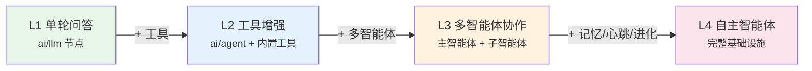
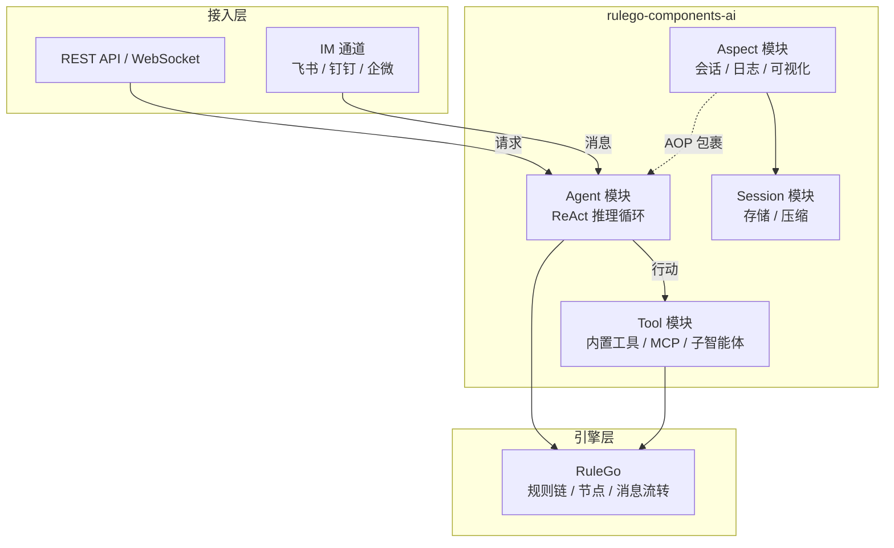

[RuleGo AI](https://github.com/rulego/rulego-components-ai) 智能体开发框架是一套基于 [RuleGo](https://github.com/rulego/rulego) 构建的声明式智能体开发框架。它将 AI 智能体定义为可编排的规则链，融合了 LLM 推理能力与规则引擎的确定性编排能力，提供了工具系统、技能系统、AOP 切面、会话管理和 MCP 集成等企业级特性。

## 为什么选择 RuleGo

大多数 AI 智能体框架需要编写代码来定义智能体。RuleGo 的核心差异：**只需编写 JSON，修改后实时生效，无需编译部署。**

以创建一个带工具的智能体为例：

**Eino（Go 代码）**——需要编写代码，编译后才能运行：

```go
chatModel, _ := openai.NewChatModel(ctx, &openai.ChatModelConfig{
    Model: "gpt-4o", APIKey: os.Getenv("OPENAI_API_KEY"),
})
agent, _ := adk.NewChatModelAgent(ctx, &adk.ChatModelAgentConfig{
    Model: chatModel,
    ToolsConfig: adk.ToolsConfig{ToolsNodeConfig: compose.ToolsNodeConfig{
        Tools: []tool.BaseTool{weatherTool, bashTool},
    }},
})
runner := adk.NewRunner(ctx, adk.RunnerConfig{Agent: agent})
iter := runner.Query(ctx, "北京天气怎么样？")
```

每次修改配置（换模型、加工具、改提示词）→ 改代码 → 编译 → 重新部署。

**RuleGo（JSON 配置）**——无需写代码，修改即生效：

```json
{
  "ruleChain": {"id": "weather-agent", "name": "天气助手"},
  "metadata": {
    "firstNodeIndex": 0,
    "nodes": [
      {
        "id": "node_agent",
        "type": "ai/agent",
        "configuration": {
          "url": "https://ai.gitee.com/v1",
          "key": "${global.api_key}",
          "model": "GLM-5",
          "systemPrompt": "你是一个天气助手。",
          "tools": [
            {"type": "builtin", "name": "bash", "config": {"workDir": "/data/workspace"}}
          ]
        }
      },
      {"id": "node_end", "type": "end", "name": "End"}
    ],
    "connections": [
      {"fromId": "node_agent", "toId": "node_end", "type": "Success"},
      {"fromId": "node_agent", "toId": "node_end", "type": "Stream"}
    ]
  }
}
```

通过 API 或可视化编辑器更新 JSON，智能体**立即使用新配置**，无需重启。

### 概念映射

| 智能体开发概念 | 规则链 JSON 路径 | 说明 |
|---------------|-----------------|------|
| 智能体 | `ruleChain` | 整个规则链就是一个智能体 |
| 智能体 ID | `ruleChain.id` | 唯一标识，用于 API 调用和智能体间引用 |
| AI 推理引擎 | `nodes[type=ai/agent]` | ReAct 循环发生的地方 |
| 系统提示词 | `configuration.systemPrompt` | 定义智能体行为，支持 `${include()}` 从文件加载 |
| 工具集 | `configuration.tools[]` | 智能体可调用的能力（builtin/mcp/agent/rulechain） |
| 模型配置 | `configuration.url/key/model` | 使用哪个 LLM，支持 `${global.xxx}` 变量 |
| 模型参数 | `configuration.params` | temperature、topP 等调优参数 |
| 执行结果 | `connections[type=Success/Stream]` | 成功/流式输出流转到哪里 |
| 错误处理 | `connections[type=Failure]` | 失败时流转到哪里 |
| 多智能体协作 | `tools[type=agent]` | 子智能体即工具，LLM 自动决定何时调用 |
| 业务逻辑集成 | 其他节点（jsFilter、restApiCall 等） | 智能体与业务系统联动 |

> `ai/agent` 节点的完整字段说明，参见 [智能体组件](../08.组件/01.智能体.md)。

## 核心理念

### 规则链即智能体

框架的核心设计思想是 **"规则链即智能体"**。每个 AI 智能体本质上是一个 RuleGo 规则链，其中的 `ai/agent` 节点负责 LLM 推理和工具调用循环。这意味着：

- 智能体可以用 JSON 声明式定义，无需编写 Go 代码
- 智能体可以与其他 RuleGo 节点（JS 过滤器、REST API 调用、转换器等）自由组合
- 支持通过规则链实现多智能体编排、管道处理和条件路由
- 智能体配置支持热更新和版本管理

### ReAct 推理循环

框架采用 **ReAct（Reasoning + Acting）** 模式作为智能体的核心执行范式：

1. **推理（Reasoning）**：LLM 分析当前上下文，决定下一步行动
2. **行动（Acting）**：调用工具执行具体操作（读文件、执行命令、调用 API 等）
3. **观察（Observation）**：获取工具返回结果，作为新的上下文
4. **循环**：重复以上步骤，直到任务完成或达到最大步数

这种模式让智能体能够自主规划任务、选择工具、处理异常，实现复杂的多步推理。

## 能力层级

框架支持从简单到复杂的多种智能体形态。通过组合不同的工具集、切面和编排模式，可以构建不同能力层级的智能体系统：



### L1 — 单轮问答

使用 `ai/llm` 节点，单次 LLM 调用，无工具调用。适合意图分类、内容生成、文本摘要等简单场景。

```json
{ "type": "ai/llm", "configuration": { "model": "GLM-5", "systemPrompt": "你是摘要助手。" } }
```

### L2 — 工具增强对话

使用 `ai/agent` 节点 + 内置工具（bash/read/write/edit），智能体进入 ReAct 循环，可以读写文件、执行命令、自主完成多步任务。这是最常见的智能体形态，适用于编程助手、内容生成、数据分析等场景。

```json
{
  "type": "ai/agent",
  "configuration": {
    "maxStep": 50,
    "tools": [
      { "type": "builtin", "name": "bash" },
      { "type": "builtin", "name": "read" },
      { "type": "builtin", "name": "write" },
      { "type": "builtin", "name": "edit" }
    ]
  }
}
```

### L3 — 多智能体协作

在 L2 基础上，通过 `agent` 类型工具将多个智能体组合。主智能体可以委派任务给专业子智能体（代码审查、测试生成、文档编写等），实现分工协作。LLM 根据工具描述自动决定何时调用哪个子智能体。

```json
{
  "tools": [
    { "type": "agent", "targetId": "code-reviewer", "name": "code_review", "description": "代码审查" },
    { "type": "agent", "targetId": "test-generator", "name": "generate_tests", "description": "生成测试" }
  ]
}
```

### L4 — 自主智能体

类似 Claude Code、OpenClaw、Hermes 等高级智能体的形态。在 L3 基础上叠加完整基础设施：

| 能力 | 框架支撑 | 说明 |
|------|----------|------|
| **工作区隔离** | workDir 配置 | 每个智能体独立的工作目录，文件系统级隔离 |
| **会话记忆** | Session 模块 + SessionAspect | 多轮对话历史管理、自动压缩、长期记忆 |
| **自我进化** | 工作区文件 + write/edit 工具 | 智能体通过 `${include()}` 加载行为文件，并可自行修改 |
| **技能扩展** | skill 技能系统 | 通过 SKILL.md 文件定义可复用的专业能力，智能体可自主学习新技能 |
| **心跳调度** | 外部 HeartbeatService | 定时触发智能体主动执行任务（检查待办、发送通知） |
| **多模型切换** | DynamicModelWrapper | 会话级别动态切换 LLM 模型 |
| **MCP 工具集成** | MCP 适配器 | 自动发现和加载 MCP Server 提供的工具 |
| **实时可视化** | VizAspect + AG-UI 协议 | 前端实时展示推理过程、工具调用和流式输出 |
| **命令拦截** | Around 切面 | 支持 `/help`、`/model` 等管理命令，无需消耗 Token |

> 完整的 L4 智能体平台案例，参见 [应用案例](./08.应用案例.md)。

## 架构总览



### 四大核心模块

| 模块 | 职责 | 关键组件 |
|------|------|----------|
| **Agent** | 智能体执行引擎，管理 ReAct 循环和生命周期 | ReactAgentNode、AgentAspectExecutor、ToolAgent |
| **Tool** | 工具注册、创建和执行，为智能体提供能力 | ToolRegistry、VisualToolWrapper、RuleGoTool、MCP 适配器 |
| **Aspect** | AOP 横切关注点，可插拔的中间件机制 | AspectManager、SessionAspect、VizAspect、LoggingAspect |
| **Session** | 对话状态管理，历史消息存储和压缩 | SessionManager、SessionStorage、CompactionConfig |

## 与其他框架对比

### vs Eino（CloudWeGo）

Eino 是本框架的底层依赖，提供 LLM 调用、消息 Schema 和基础 ReAct 实现。RuleGo 智能体框架在 Eino 之上增加了：

| 能力 | Eino | RuleGo 智能体框架 |
|------|------|-------------------|
| **智能体定义** | Go 代码构建 | JSON 声明式配置，支持热更新 |
| **编排方式** | Graph/Chain/Workflow（代码） | 规则链可视化编排 + 代码编排 |
| **横切关注点** | 固定 Callback（OnStart/OnEnd/OnError） | AOP 切面体系，10 种可扩展接口 |
| **会话管理** | 基础 Session Values | 完整的会话生命周期：存储、压缩、裁剪 |
| **工具扩展** | Go 接口实现 | 内置 8 种工具 + MCP 协议 + 规则链工具 |
| **模型管理** | 构建时绑定，不可变 | 运行时动态切换，会话级模型选择 |
| **前端可视化** | 原始 AgentEvent 流 | AG-UI 标准协议，内置可视化切面 |
| **企业集成** | 需自行实现 | MCP 工具协议、IM 渠道集成、文件存储 |

简单来说：**Eino 是 LLM 交互库，RuleGo 智能体框架是企业级智能体运行时。**

### vs LangChain / LangGraph（Python）

| 维度 | LangChain/LangGraph | RuleGo 智能体框架 |
|------|---------------------|-------------------|
| **语言** | Python | Go |
| **性能** | 适合原型和数据处理 | 高并发、低延迟，适合生产服务 |
| **定义方式** | Python 代码 / LangGraph Studio | JSON 规则链，可视化编辑器 |
| **与业务系统集成** | 需额外开发 | 原生支持规则引擎编排，与业务逻辑无缝集成 |
| **部署** | Python 运行时 | 单二进制部署，资源占用小 |

### vs AutoGen / CrewAI（Python）

| 维度 | AutoGen / CrewAI | RuleGo 智能体框架 |
|------|-----------------|-------------------|
| **多智能体** | 代码编排对话流程 | 规则链声明式编排，子智能体即工具 |
| **状态管理** | 依赖外部存储 | 内置会话管理，支持多种作用域 |
| **可观测性** | 需集成第三方 | 内置日志、可视化、AG-UI 事件 |

## 适用场景

- **编程助手**：类似 Claude Code、OpenClaw、Hermes，具备文件读写、命令执行、自主规划能力的编程智能体
- **企业级 AI 助手**：多渠道接入（飞书/钉钉/企微/API），会话隔离，权限控制
- **智能客服系统**：知识库检索 + 工具调用 + 多轮对话
- **IoT 智能控制**：自然语言意图分类 → 结构化指令 → 设备控制 API
- **自动化工作流**：文件处理、代码生成、数据分析等自主任务
- **多智能体协作**：主智能体 + 专业子智能体，分工协作完成复杂任务

## 相关文档

- [架构设计](./01.架构设计.md) — 分层架构、核心模块、数据流详解
- [智能体节点](./02.智能体节点.md) — ReAct 节点的概念与高级特性
- [智能体组件](../08.组件/01.智能体.md) — `ai/agent` 组件的完整配置参考
- [工具系统](./03.工具系统.md) — 工具类型、内置工具、MCP 集成
- [切面框架](./04.切面框架.md) — AOP 切面体系与自定义扩展
- [会话管理](./05.会话管理.md) — 对话状态、消息压缩、存储扩展
- [开发指南](./06.开发指南.md) — 基于框架开发智能体应用的完整流程
- [编排案例](./07.编排案例.md) — 智能体与规则链节点组合编排的实际案例
- [应用案例](./08.应用案例.md) — 智能助手平台完整生产案例

如需开箱即用的智能体平台，参见 [RuleGo-Server AI 功能](/pages/rulego-server-ai/)。

可视化创建智能体的图文教程，参见 [创建智能体教程](/pages/rulego-server-create-agent/)。

通过 API 或文件部署规则链的教程，参见 [规则链部署与调用](/pages/rulego-server-deploy-rule-chain/)。
