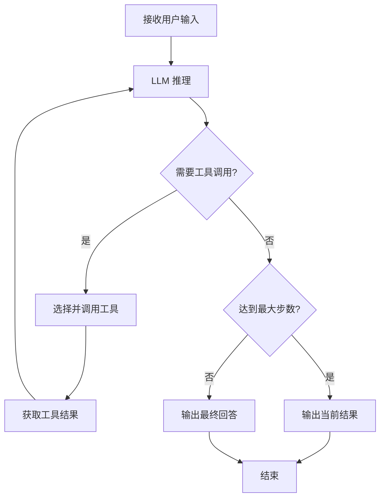

`ai/agent` 是 RuleGo 规则链中的 AI 智能体节点，基于 ReAct 模式实现。智能体通过多轮推理和工具调用循环，自主完成用户任务。

完整的配置字段和参数说明，参见 [智能体组件](../08.组件/01.智能体.md)。

## ReAct 循环

智能体的核心是 ReAct（Reasoning + Acting）循环：LLM 分析上下文 → 决定调用工具或直接回答 → 获取工具结果 → 继续推理。



每次 LLM 调用时，智能体会将当前上下文（系统提示词 + 历史消息 + 工具调用结果）发送给大模型。模型根据上下文决定：

- **直接输出回答**：任务完成，循环结束
- **调用工具**：获取更多信息后继续推理

`maxStep` 限制最大循环次数，防止无限循环。默认 150 步，对于简单的分类任务可以设置为 1（单次推理，不进入工具调用循环）。

## 系统提示词模板

系统提示词支持 RuleGo 表达式语言，实现动态内容注入：

| 表达式 | 说明 | 示例 |
|--------|------|------|
| `${global.xxx}` | 全局变量引用 | `${global.llm_url}` |
| `${include("路径")}` | 包含文件内容 | `${include(global.data_dir+'/AGENTS.md')}` |
| `${fileExists("路径")}` | 判断文件是否存在 | `${fileExists(global.data_dir+'/BOOTSTRAP.md')}` |
| `${now()}` | 当前时间 | `${now()}` |
| `${ruleChain.id}` | 当前规则链 ID | `${ruleChain.id}` |

通过 `${include()}` 和 `${fileExists()}` 组合，可以实现条件加载的系统提示词：

```json
"systemPrompt": "${include(global.data_dir+'/IDENTITY.md')}\n${include(global.data_dir+'/AGENTS.md')}\n${fileExists(global.data_dir+'/BOOTSTRAP.md') ? include(global.data_dir+'/BOOTSTRAP.md') : ''}\n当前时间：${now()}"
```

这种机制让智能体的行为可以通过外部文件动态调整，无需修改规则链配置。配合 `write`/`edit` 工具，智能体甚至可以修改自身的行为规则文件，实现自我进化。

## 动态模型切换

智能体支持会话级别的模型切换。当消息 Metadata 中包含 `session_model` 字段时，`DynamicModelWrapper` 会检测到与默认模型不同，自动创建并缓存对应模型实例：

```
请求 Metadata: { "session_model": "qwen-max" }
→ 检测到模型变更
→ 从 sync.Map 缓存获取或创建新的 ChatModel
→ 使用新模型执行本次请求
```

这意味着多个用户可以共享同一个智能体配置，但各自使用不同的模型。

## Relation Type

| 连接类型 | 说明 |
|----------|------|
| Success | 同步模式执行成功，`msg.Data` 包含完整回答 |
| Stream | 流式模式，逐块输出中间结果（每个 chunk 是一条消息） |
| Failure | 执行失败，`msg.Data` 包含错误信息 |

流式模式下，最后会额外发送一条 `Success` 类型消息（Metadata 中标记 `full_content=true`），包含完整的合并内容。

## 多节点管道

智能体节点可以与 JS 过滤器、REST API 调用等节点组合，构建"分类→路由→执行"的管道：

```json
{
  "ruleChain": {
    "id": "intent-router",
    "name": "意图路由智能体"
  },
  "metadata": {
    "firstNodeIndex": 0,
    "nodes": [
      {
        "id": "node_agent",
        "type": "ai/agent",
        "name": "意图分类",
        "configuration": {
          "url": "${global.models.providers.default.base_url}",
          "key": "${global.models.providers.default.api_key}",
          "model": "${global.models.providers.default.model}",
          "maxStep": 1,
          "systemPrompt": "分析用户意图，输出JSON。支持的意图：createRule、deleteRule、control、chat。",
          "params": { "temperature": 0.3, "maxTokens": 1024 }
        }
      },
      {
        "id": "node_filter",
        "type": "jsFilter",
        "name": "路由判断",
        "configuration": {
          "jsScript": "var data = JSON.parse(msg.data); return data.action !== undefined;"
        }
      },
      {
        "id": "node_api",
        "type": "restApiCall",
        "name": "执行命令",
        "configuration": {
          "url": "http://127.0.0.1/api/v1/cmd",
          "requestMethod": "POST",
          "body": "${msg.data}"
        }
      },
      {"id": "node_end", "type": "end", "name": "结束"}
    ],
    "connections": [
      {"fromId": "node_agent", "toId": "node_filter", "type": "Success"},
      {"fromId": "node_agent", "toId": "node_end", "type": "Stream"},
      {"fromId": "node_filter", "toId": "node_api", "type": "True"},
      {"fromId": "node_filter", "toId": "node_end", "type": "False"},
      {"fromId": "node_api", "toId": "node_end", "type": "Success"}
    ]
  }
}
```

## 高级特性

### 模型重试机制

内置指数退避重试，自动处理以下错误：

| 错误类型 | 处理方式 |
|----------|----------|
| 429 速率限制 | 等待 `Retry-After` 或指数退避后重试 |
| 5xx 服务器错误 | 指数退避重试 |
| 网络错误 | 指数退避重试 |
| 超时 | 指数退避重试 |

参数：初始等待 1s，每次翻倍，最大 30s，随机抖动避免惊群效应。通过 `maxRetries` 控制重试次数（默认 3）。

### 故障转移与熔断

配置 `failover` 备用端点后，主端点重试耗尽会自动按优先级切换到备用端点。主端点长时间故障时，熔断器跳过主直接用备用，并通过探测退避（冷却逐次翻倍、封顶 10 分钟）减少对故障主的无效探测；半开探测成功后自动切回主。相关字段：`failover`、`circuitCooldownSec`、`streamRetryMode`，完整说明与示例见 [智能体组件](../08.组件/01.智能体.md)。

### 未知工具调用处理

当 LLM 产生幻觉调用不存在的工具时，框架返回错误提示引导模型使用已注册工具，而不是中断执行：

```
"错误：未知工具 'search_web'，请使用已注册的工具。"
```

### 工具输出截断

工具返回结果超过 `maxToolOutputLength`（默认 50000 字节）时自动截断，防止占用过多上下文窗口：

```
前 50000 字符...(truncated, original: 120000 bytes)
```

## 相关文档

- [概述](./00.概述.md) — 框架定位与核心概念
- [架构设计](./01.架构设计.md) — 分层架构与数据流详解
- [智能体组件](../08.组件/01.智能体.md) — 完整配置字段与示例
- [工具系统](./03.工具系统.md) — 工具配置与扩展
- [切面框架](./04.切面框架.md) — 切面生命周期与自定义
- [开发指南](./06.开发指南.md) — 完整的智能体应用开发流程
