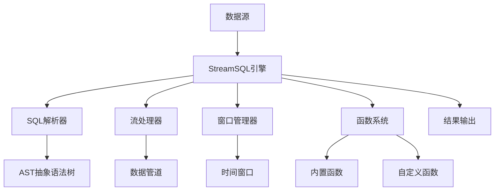

# 概述

## 流式计算的新选择

在传统的流式数据处理场景中，开发者通常面临两个极端的选择：

- **时序数据库方案**：如InfluxDB、TimescaleDB等，虽然存储能力强，但实时计算能力有限，复杂聚合运算性能不佳
- **分布式框架方案**：如Apache Flink、Apache Storm等，功能强大但部署复杂，资源消耗巨大，不适合边缘环境

**StreamSQL 提供了第三种选择**：一个专为边缘端设计的轻量级流处理引擎，能够在资源受限的环境中对海量数据进行实时聚合运算，填补了轻量级与高性能之间的空白。

### 🌐 典型应用场景

**边缘-云协同架构**：在物联网和工业4.0场景中，大量传感器和设备产生海量原始数据，如果直接上传云端会造成：
- 网络带宽压力巨大
- 云端计算成本高昂
- 实时性要求无法满足

**StreamSQL的解决方案**：
```
海量原始数据 → 边缘端StreamSQL处理 → 聚合结果 → 云端存储/分析
   (TB级)         (实时过滤/聚合)      (MB级)     (长期存储)
```

**具体场景示例**：
- **智能工厂**：1000台设备每秒产生10万条数据，边缘端实时聚合为每分钟100条关键指标
- **智慧城市**：数千个传感器的环境数据，边缘端预处理后只上传异常事件和统计摘要
- **车联网**：车队实时数据在边缘网关聚合，只向云端发送驾驶行为分析和异常告警

## StreamSQL 是什么

StreamSQL 是一个专为物联网边缘场景设计的轻量级流处理引擎。它使用熟悉的SQL语法来处理无界数据流，让开发者能够用简单的SQL语句实现复杂的实时数据分析。它也可以作为[RuleGo](https://rulego.cc)组件融入RuleGo生态，利用其提供丰富的输入输出以及数据处理组件库和规则引擎功能。

## 核心架构



### 核心组件

1. **SQL解析器 (rsql)：** 解析标准SQL语句，生成抽象语法树(AST)，配置流处理管道
2. **流处理器 (stream)：** 实时数据处理，过滤和转换，聚合计算
3. **窗口管理器 (window)：** 时间窗口：滚动、滑动、会话，计数窗口，窗口生命周期管理
4. **函数系统 (functions)：** 60+ 内置函数，插件式自定义函数，8种函数类型支持
5. **表达式引擎 (expr)：** 算术表达式计算，逻辑表达式处理，字段引用解析

## 设计理念

🪶 **轻量级优先**：纯Go实现，零外部依赖，内存高效，秒级启动。专为边缘设备和资源受限环境设计。

📝 **SQL优先**：使用标准SQL语法，声明式编程，业务逻辑直观表达，学习成本极低。

🔧 **扩展优先**：插件化架构，支持热插拔函数，与RuleGo深度集成，利用其丰富的输入输出组件生态，并支持热更新。

## 技术特点

- 🚀 **高性能**：流式处理，内存计算，并发设计，充分利用多核性能。
- 🔧 **易于使用**：使用标准SQL语法，无需学习复杂的流处理框架。
- 🛡️ **纯内存计算**：无磁盘存储，所有计算都在内存中进行，处理速度极快。
- 📦 **基础库设计**：可作为基础库集成到其他项目中，仅依赖Go标准库和expr表达式引擎，无第三方依赖。
- 🔄 **RuleGo集成**：可以与RuleGo深度集成，利用其丰富的组件生态和规则引擎功能。
  - **数据输入**：MQTT、HTTP、WebSocket、TCP/UDP、消息队列、文件等
  - **数据输出**：数据库、消息队列、REST API、邮件、短信等
  - **数据处理**：过滤、转换、路由、聚合等60+组件
  - **扩展能力**：自定义组件、热插拔、动态配置
  - **低代码**：无需编写代码，仅需配置规则链即可实现复杂的数据处理逻辑。

## 与其他方案对比

### 📊 全面对比分析

| 特性        | StreamSQL  | Apache Flink | Apache Storm | ksqlDB     | eKuiper      | 时序数据库        |
|-----------|------------|--------------|--------------|------------|--------------|--------------|
| **部署复杂度** | 极简         | 复杂           | 中等           | 中等         | 简单           | 中等           |
| **资源占用**  | 极低(10MB)   | 高(GB级)       | 中等           | 高(GB级)     | 极低(10MB)     | 中等           |
| **可嵌入性**  | ✅ 可嵌入/独立部署 | ❌ 重依赖/独立部署   | ⚠️ 中等依赖/独立部署 | ❌ 重依赖/独立部署 | ⚠️ 少量依赖/独立部署 | ⚠️ 中等依赖/独立部署 |
| **SQL支持** | ✅ 完整       | ✅ 完整         | ❌ 无          | ✅ 完整       | ✅ 完整         | ⚠️ 有限        |
| **边缘部署**  | ✅ 优秀       | ❌ 不适合        | ⚠️ 勉强        | ❌ 不适合      | ✅ 优秀         | ⚠️ 勉强        |
| **实时聚合**  | ✅ 支持       | ✅ 强大         | ⚠️ 有限        | ✅ 支持       | ✅ 支持         | ❌ 性能差        |
| **学习成本**  | 极低         | 高            | 高            | 中等         | 低            | 低            |
| **嵌套字段**  | ✅ 原生支持     | ⚠️ 需配置       | ❌ 不支持        | ⚠️ 有限      | ✅ 支持         | ⚠️ 有限        |
| **集群扩展**  | ❌ 单机       | ✅ 水平扩展       | ✅ 水平扩展       | ✅ 水平扩展     | ❌ 单机         | ✅ 支持         |
| **开发语言**  | Go         | Java/Scala   | Clojure      | Java       | Go           | 多种           |


## 适用场景

### ✅ 适合场景
- **边缘计算**：物联网设备、工业网关、边缘服务器
- **实时分析**：设备监控、异常检测、实时告警
- **快速部署**：单机部署、容器化、嵌入式应用
- **原型验证**：快速验证流处理逻辑和业务规则
- **RuleGo增强**：为RuleGo规则链添加SQL流处理能力

### ❌ 不适合场景
- **大规模集群**：需要水平扩展的分布式系统
- **复杂状态**：需要持久化状态管理的应用
- **高并发写入**：超出单机处理能力的数据量
- **事务处理**：需要ACID特性的复杂事务场景

## 核心应用场景

### 🏭 工业物联网 - 海量设备数据实时处理
**设备监控与预测性维护**：实时监控设备状态，异常检测，预测性维护

**场景描述**：某制造工厂有1000+设备，每秒产生10,000+数据点，需要实时监控和异常检测

```sql
-- 设备异常检测示例 - 处理百万级TPS数据流
SELECT device_id,
       COUNT(*) as data_points,
       AVG(temperature) as avg_temp,
       MAX(temperature) as max_temp,
       STDDEV(vibration) as vibration_variance,
       CASE WHEN AVG(temperature) > 80 OR STDDEV(vibration) > 5 
            THEN 'ALERT' ELSE 'NORMAL' END as status
FROM stream
GROUP BY device_id, TumblingWindow('5m')
HAVING status = 'ALERT'
```

### 🏙️ 智慧城市
**交通流量优化**：实时分析交通流量，拥堵检测，信号灯优化
**环境监测**：空气质量监测，污染预警，环境数据分析

### 🚗 车联网 - 大规模车队实时监控
**车辆状态监控**：实时监控车辆运行状态，故障诊断，驾驶行为分析

**场景描述**：某物流公司拥有5000+车辆，每辆车每秒上报20+数据点，总计100,000+ events/sec

```sql
-- 车辆异常检测 - 处理百万级数据流
SELECT vehicle_id,
       COUNT(*) as total_events,
       AVG(engine_temp) as avg_engine_temp,
       MAX(engine_temp) as max_engine_temp,
       AVG(fuel_consumption) as avg_fuel,
       COUNT(CASE WHEN brake_pressure > 80 THEN 1 END) as hard_brake_count,
       COUNT(CASE WHEN speed > 120 THEN 1 END) as speeding_count
FROM stream
GROUP BY vehicle_id, TumblingWindow('10m')
HAVING avg_engine_temp > 90 OR hard_brake_count > 5 OR speeding_count > 3
```

**边缘部署优势**：
- 多个边缘节点分布式部署，每个节点处理1000+车辆
- 本地实时处理，减少网络传输压力
- 故障隔离，单点故障不影响整体系统

### 💰 金融风控
**实时风控**：交易行为分析，欺诈检测，风险评分

```sql
-- 异常交易检测
SELECT user_id,
       COUNT(*) as transaction_count,
       SUM(amount) as total_amount
FROM stream
WHERE amount > 0
GROUP BY user_id, TumblingWindow('1h')
HAVING transaction_count > 20 OR total_amount > 10000
```

### 🔥 核心优势
- **告别重型框架**：无需部署复杂的Flink集群，单机即可处理百万级TPS
- **超越时序数据库**：不仅能存储，更能实时计算，毫秒级响应
- **边缘计算首选**：10MB内存占用，完美适配资源受限环境
- **开发效率极高**：标准SQL语法，零学习成本，分钟级上手
- **高性能处理**：单机可达百万级TPS，内存计算，毫秒级响应

### 📈 适用规模
- **小型项目**：快速原型验证，MVP开发
- **中型应用**：单机百万级TPS，满足大部分业务需求
- **边缘场景**：IoT网关、工业控制器、车载系统
- **混合架构**：与RuleGo结合，构建完整的边缘计算解决方案

**StreamSQL = 时序数据库的实时性 + Flink的计算能力 + 极简的部署和集成体验**

### 🎈代码托管

> 🐙 **[Gitee](https://gitee.com/rulego/streamsql)** | 🐙 **[Github](https://github.com/rulego/streamsql)** | 🐙 **[GitCode](https://gitcode.com/rulego/streamsql)**

### 🧸参与贡献

欢迎各路好汉一起来参与完善 StreamSQL，我们期待你的 PR！

- 贡献代码：代码地址 [StreamSQL](https://github.com/rulego/streamsql) ，欢迎提交 Issue 或者 Pull Requests
- 维护文档：文档地址 [StreamSQL-Doc](https://github.com/rulego/rulego-doc) ，欢迎参与翻译和修订

## 下一步

- 📚 [快速开始](/pages/streamsql-quickstart/) - 5分钟上手指南
- 🧩 [核心概念](/pages/streamsql-concepts/) - 理解基本概念
- 🪟 [窗口](/pages/streamsql-window/) - 深入了解窗口处理
- 💻 [案例集锦](/pages/streamsql-cases-overview/) - 查看实际案例
- 📖 [API参考](/pages/streamsql-api/) - 完整的API文档