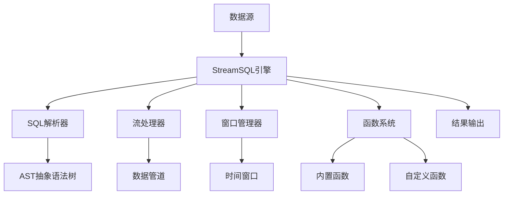

# 概述

## StreamSQL 是什么

StreamSQL 是一个专为物联网边缘场景设计的轻量级流处理引擎。它使用熟悉的SQL语法来处理无界数据流，让开发者能够用简单的SQL语句实现复杂的实时数据分析。

### 核心价值
- **降低门槛**：使用标准SQL语法，无需学习复杂的流处理框架
- **边缘优化**：专为资源受限的边缘设备设计
- **即插即用**：零配置启动，几行代码即可运行
- **生产就绪**：完善的错误处理和资源管理机制

## 核心架构

### 核心组件

1. **SQL解析器 (rsql)**
   - 解析标准SQL语句
   - 生成抽象语法树(AST)
   - 配置流处理管道

2. **流处理器 (stream)**
   - 实时数据处理
   - 过滤和转换
   - 聚合计算

3. **窗口管理器 (window)**
   - 时间窗口：滚动、滑动、会话
   - 计数窗口
   - 窗口生命周期管理

4. **函数系统 (functions)**
   - 60+ 内置函数
   - 插件式自定义函数
   - 8种函数类型支持

5. **表达式引擎 (expr)**
   - 算术表达式计算
   - 逻辑表达式处理
   - 字段引用解析

## 设计理念

### 轻量级优先
- **零外部依赖**：纯Go实现，无需安装其他组件
- **内存高效**：针对边缘设备的内存限制优化
- **快速启动**：秒级启动，适合短生命周期应用

### SQL优先
- **标准语法**：使用熟悉的SQL语法，学习成本低
- **声明式编程**：专注于"做什么"而不是"怎么做"
- **易于理解**：业务逻辑直观表达

### 扩展优先
- **插件化架构**：核心功能可扩展
- **热插拔**：运行时动态加载函数
- **类型丰富**：支持多种函数类型

## 技术特点

### 🚀 高性能
- **流式处理**：数据无需存储即可处理
- **内存计算**：避免磁盘I/O开销
- **并发设计**：充分利用多核性能

### 🔧 易于使用
- **SQL语法**：降低学习成本
- **简单API**：几行代码即可启动
- **丰富示例**：覆盖常见应用场景

### 🛡️ 生产就绪
- **错误处理**：完善的错误恢复机制
- **资源管理**：自动资源清理
- **日志系统**：可配置的日志级别

### 🔄 可扩展
- **函数插件**：支持自定义业务逻辑
- **数据源适配**：可接入不同数据源
- **结果输出**：支持多种输出格式

## 与其他方案对比

| 特性 | StreamSQL | Apache Flink | Apache Storm | ksqlDB | eKuiper |
|------|-----------|--------------|--------------|--------|----------|
| **部署复杂度** | 极简 | 复杂 | 中等 | 中等 | 简单 |
| **资源占用** | 极低 | 高 | 中等 | 高 | 低 |
| **SQL支持** | ✅ 完整 | ✅ 完整 | ❌ 无 | ✅ 完整 | ✅ 完整 |
| **边缘部署** | ✅ 优秀 | ❌ 不适合 | ⚠️ 勉强 | ❌ 不适合 | ✅ 优秀 |
| **学习成本** | 极低 | 高 | 高 | 中等 | 低 |
| **自定义函数** | ✅ 热插拔 | ✅ 支持 | ⚠️ 复杂 | ✅ 支持 | ✅ 支持 |
| **嵌套字段** | ✅ 原生支持 | ⚠️ 需配置 | ❌ 不支持 | ⚠️ 有限 | ✅ 支持 |
| **性能模式** | ✅ 多种模式 | ⚠️ 复杂配置 | ❌ 固定 | ❌ 固定 | ⚠️ 有限 |

## 适用场景

### ✅ 适合场景
- **边缘设备**：资源受限的边缘计算节点
- **实时分析**：需要低延迟的数据处理
- **简单部署**：无法维护复杂集群的环境
- **快速原型**：需要快速验证流处理逻辑

### ❌ 不适合场景
- **大规模集群**：需要水平扩展的大型系统
- **复杂状态管理**：需要持久化状态的应用
- **高并发写入**：单机无法处理的数据量
- **复杂事务**：需要ACID特性的场景

## 版本兼容性

| 版本 | Go版本要求 | 主要特性 |
|------|-----------|----------|
| v1.0.x | Go 1.18+ | 基础流处理、窗口函数 |
| v1.1.x | Go 1.18+ | 自定义函数系统 |
| v1.2.x | Go 1.18+ | 表达式引擎优化、嵌套字段支持 |
| v1.3.x | Go 1.18+ | 性能模式、RuleGo集成 |

## 下一步

- 📚 [快速开始](./02.快速开始.md) - 5分钟上手指南
- 🧩 [核心概念](./03.核心概念.md) - 理解基本概念
- 💻 [示例集合](./07.示例.md) - 查看实际案例