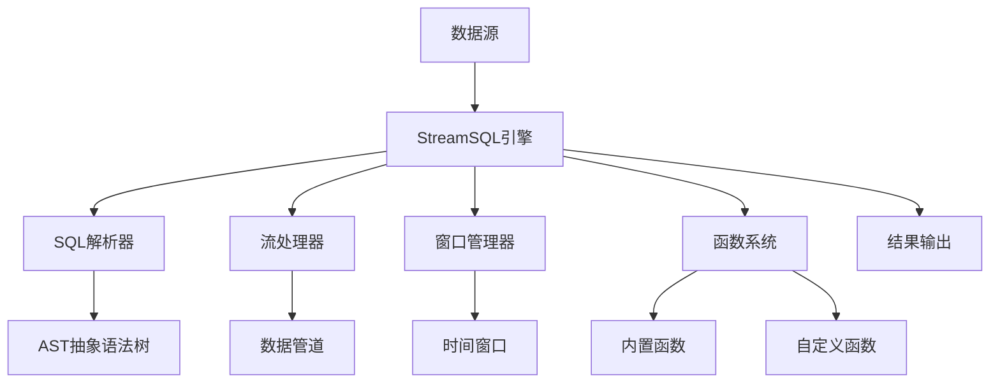

# 概述

## StreamSQL 是什么

StreamSQL 是一个专为物联网边缘场景设计的轻量级流处理引擎。它使用熟悉的SQL语法来处理无界数据流，让开发者能够用简单的SQL语句实现复杂的实时数据分析。它也可以作为[RuleGo](https://rulego.cn)组件融入RuleGo生态，利用其提供丰富的输入输出以及数据处理组件库和规则引擎功能。

### 核心价值
- **降低门槛**：使用标准SQL语法，无需学习复杂的流处理框架
- **边缘优化**：专为资源受限的边缘设备设计
- **即插即用**：零配置启动，几行代码即可运行
- **生产就绪**：完善的错误处理和资源管理机制

## 核心架构



### 核心组件

1. **SQL解析器 (rsql)**
   - 解析标准SQL语句
   - 生成抽象语法树(AST)
   - 配置流处理管道

2. **流处理器 (stream)**
   - 实时数据处理
   - 过滤和转换
   - 聚合计算

3. **窗口管理器 (window)**
   - 时间窗口：滚动、滑动、会话
   - 计数窗口
   - 窗口生命周期管理

4. **函数系统 (functions)**
   - 60+ 内置函数
   - 插件式自定义函数
   - 8种函数类型支持

5. **表达式引擎 (expr)**
   - 算术表达式计算
   - 逻辑表达式处理
   - 字段引用解析

## 设计理念

🪶 **轻量级优先**：纯Go实现，零外部依赖，内存高效，秒级启动。专为边缘设备和资源受限环境设计。

📝 **SQL优先**：使用标准SQL语法，声明式编程，业务逻辑直观表达，学习成本极低。

🔧 **扩展优先**：插件化架构，支持热插拔函数，与RuleGo深度集成，利用其丰富的输入输出组件生态，并支持热更新。

## 技术特点

- 🚀 **高性能**：流式处理，内存计算，并发设计，充分利用多核性能。
- 🔧 **易于使用**：SQL语法，简单API，几行代码即可启动，丰富示例覆盖常见场景。
- 🛡️ **生产就绪**：完善的错误处理和资源管理机制，可配置的日志系统。
- 🔄 **RuleGo集成**：与RuleGo深度集成，利用其丰富的组件生态：
  - **数据输入**：MQTT、HTTP、WebSocket、TCP/UDP、文件等
  - **数据输出**：数据库、消息队列、REST API、邮件、短信等
  - **数据处理**：过滤、转换、路由、聚合等60+组件
  - **扩展能力**：自定义组件、热插拔、动态配置

## 与其他方案对比

| 特性 | StreamSQL | Apache Flink | Apache Storm | ksqlDB | eKuiper |
|------|-----------|--------------|--------------|--------|----------|
| **部署复杂度** | 极简 | 复杂 | 中等 | 中等 | 简单 |
| **资源占用** | 极低 | 高 | 中等 | 高 | 低 |
| **SQL支持** | ✅ 完整 | ✅ 完整 | ❌ 无 | ✅ 完整 | ✅ 完整 |
| **边缘部署** | ✅ 优秀 | ❌ 不适合 | ⚠️ 勉强 | ❌ 不适合 | ✅ 优秀 |
| **学习成本** | 极低 | 高 | 高 | 中等 | 低 |
| **自定义函数** | ✅ 热插拔 | ✅ 支持 | ⚠️ 需打包 | ✅ 支持 | ✅ 支持 |
| **嵌套字段** | ✅ 原生支持 | ⚠️ 需配置 | ❌ 不支持 | ⚠️ 有限 | ✅ 支持 |
| **开发语言** | Go | Java/Scala | Clojure | Java | Go |

## 适用场景

### ✅ 适合场景
- **边缘计算**：物联网设备、工业网关、边缘服务器
- **实时分析**：设备监控、异常检测、实时告警
- **快速部署**：单机部署、容器化、嵌入式应用
- **原型验证**：快速验证流处理逻辑和业务规则
- **RuleGo增强**：为RuleGo规则链添加SQL流处理能力

### ❌ 不适合场景
- **大规模集群**：需要水平扩展的分布式系统
- **复杂状态**：需要持久化状态管理的应用
- **高并发写入**：超出单机处理能力的数据量
- **事务处理**：需要ACID特性的复杂事务场景

## 核心应用场景

### 🏭 工业物联网
**设备监控与预测性维护**：实时监控设备状态，异常检测，预测性维护

```sql
-- 设备异常检测示例
SELECT device_id,
       AVG(temperature) as avg_temp,
       STDDEV(vibration) as vibration_variance,
       CASE WHEN AVG(temperature) > 80 OR STDDEV(vibration) > 5 
            THEN 'ALERT' ELSE 'NORMAL' END as status
FROM stream
GROUP BY device_id, TumblingWindow('5m')
HAVING status = 'ALERT'
```

### 🏙️ 智慧城市
**交通流量优化**：实时分析交通流量，拥堵检测，信号灯优化
**环境监测**：空气质量监测，污染预警，环境数据分析

### 🚗 车联网
**车辆状态监控**：实时监控车辆运行状态，故障诊断，驾驶行为分析

```sql
-- 车辆异常检测
SELECT vehicle_id,
       AVG(engine_temp) as avg_engine_temp,
       COUNT(CASE WHEN brake_pressure > 80 THEN 1 END) as hard_brake_count
FROM stream
GROUP BY vehicle_id, TumblingWindow('10m')
HAVING avg_engine_temp > 90 OR hard_brake_count > 5
```

### 💰 金融风控
**实时风控**：交易行为分析，欺诈检测，风险评分

```sql
-- 异常交易检测
SELECT user_id,
       COUNT(*) as transaction_count,
       SUM(amount) as total_amount
FROM stream
WHERE amount > 0
GROUP BY user_id, TumblingWindow('1h')
HAVING transaction_count > 20 OR total_amount > 10000
```

### 🏢 智能建筑
**能耗优化**：实时监控建筑能耗，设备控制，节能分析
**安防监控**：异常行为检测，自动报警，安全防护


## 下一步

- 📚 [快速开始](/pages/streamsql-quickstart/) - 5分钟上手指南
- 🧩 [核心概念](/pages/streamsql-concepts/) - 理解基本概念
- 🪟 [窗口](/pages/streamsql-window/) - 深入了解窗口处理
- 💻 [案例集锦](/pages/streamsql-cases-overview/) - 查看实际案例
- 📖 [API参考](/pages/streamsql-api/) - 完整的API文档