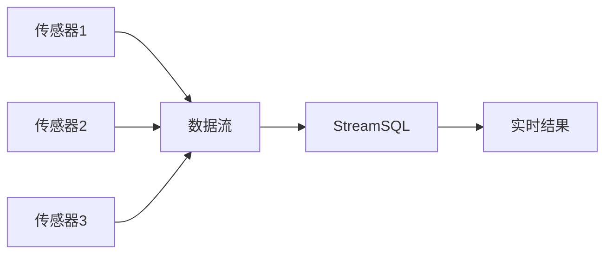
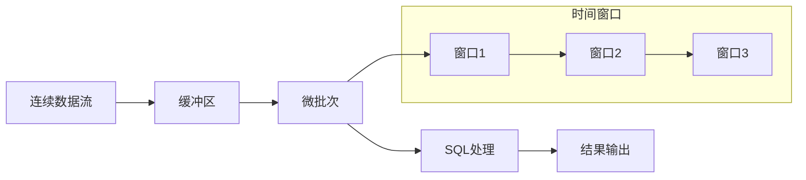
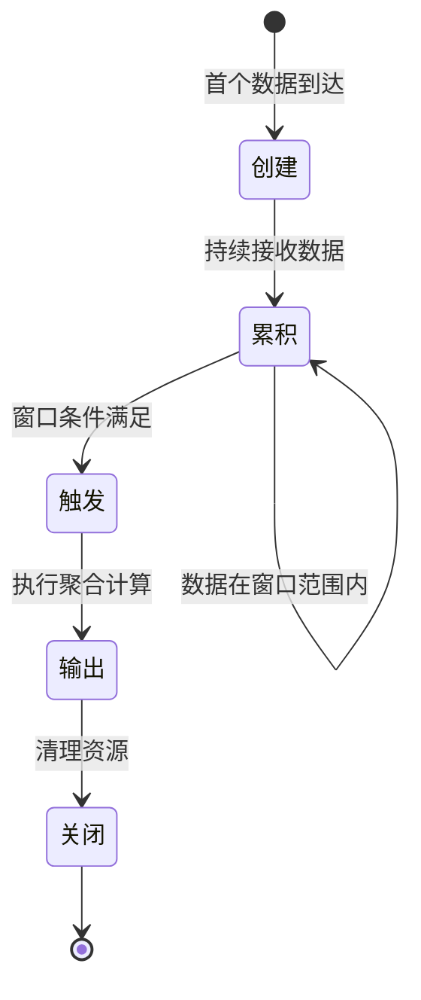
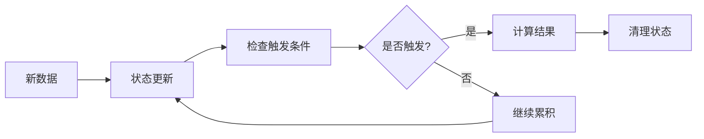

# 核心概念

理解StreamSQL的核心概念是高效使用它的关键。本章将详细介绍流处理、窗口、聚合等重要概念。

## 流处理基础

### 什么是数据流

数据流（Stream）是一系列连续产生的数据记录，具有以下特征：

- **无界性**：数据持续不断地产生，没有明确的结束
- **时序性**：数据按时间顺序到达
- **实时性**：需要快速处理，不能等待所有数据
- **不可变性**：历史数据不可修改



### 流处理 vs 批处理

| 特征 | 流处理 | 批处理 |
|------|--------|--------|
| **数据边界** | 无界 | 有界 |
| **处理延迟** | 毫秒级 | 分钟/小时级 |
| **数据完整性** | 近似结果 | 精确结果 |
| **资源使用** | 持续占用 | 周期性占用 |
| **应用场景** | 实时监控、告警 | 报表、分析 |

### 流处理模型

StreamSQL采用**微批处理**模型：



## 时间语义

### 时间类型

StreamSQL支持两种时间概念：

#### 1. 事件时间 (Event Time)
- 数据产生时的真实时间
- 使用 `with (TIMESTAMP='field_name')` 指定
- 适用于需要精确时序的场景
- **重要**：设置了事件时间后，窗口时间基于消息内的时间戳字段，而非消息到达时间

```sql
SELECT deviceId, AVG(temperature) 
FROM stream 
GROUP BY deviceId, TumblingWindow('1m')
WITH (TIMESTAMP='event_time')
```

#### 2. 处理时间 (Processing Time)
- 数据到达处理系统的时间
- 默认使用系统当前时间
- 处理简单，但可能不准确

```sql
-- 使用处理时间（默认）
SELECT deviceId, AVG(temperature) 
FROM stream 
GROUP BY deviceId, TumblingWindow('1m')
```

### 时间格式

支持多种时间单位：

```sql
-- 时间单位配置
WITH (TIMEUNIT='ss')  -- 秒
WITH (TIMEUNIT='ms')  -- 毫秒  
WITH (TIMEUNIT='mi')  -- 分钟
WITH (TIMEUNIT='hh')  -- 小时
WITH (TIMEUNIT='dd')  -- 天
```

## 窗口概念

窗口是流处理中的核心概念，用于将无界流分割成有界的数据集进行聚合操作。

### 窗口类型

#### 1. 滚动窗口 (Tumbling Window)

固定大小、无重叠的时间窗口：

```mermaid
gantt
    title 滚动窗口 (TumblingWindow) - 5分钟窗口
    dateFormat X
    axisFormat %s
    
    section 时间轴
    事件1 :milestone, e1, 1, 0s
    事件2 :milestone, e2, 3, 0s
    事件3 :milestone, e3, 7, 0s
    事件4 :milestone, e4, 12, 0s
    事件5 :milestone, e5, 14, 0s
    事件6 :milestone, e6, 18, 0s
    
    section 窗口1 (0-5分钟)
    包含事件1,2,3 :active, w1, 0, 5
    
    section 窗口2 (5-10分钟)
    包含事件4,5 :active, w2, 5, 10
    
    section 窗口3 (10-15分钟)
    包含事件6 :active, w3, 10, 15
```



```sql
-- 每5分钟计算一次平均值
SELECT AVG(temperature) 
FROM stream 
GROUP BY TumblingWindow('5m')
```

**特点**：
- 每条数据只属于一个窗口
- 窗口之间无重叠
- 适合周期性统计

#### 2. 滑动窗口 (Sliding Window)

固定大小、有重叠的时间窗口：

```mermaid
gantt
    title 滑动窗口 (SlidingWindow) - 5分钟窗口，每2分钟滑动
    dateFormat X
    axisFormat %s
    
    section 时间轴
    事件1 :milestone, e1, 0, 0s
    事件2 :milestone, e2, 2, 0s
    事件3 :milestone, e3, 4, 0s
    事件4 :milestone, e4, 6, 0s
    事件5 :milestone, e5, 8, 0s
    事件6 :milestone, e6, 10, 0s
    
    section 窗口1 (0-5分钟)
    包含事件1,2,3 :active, w1, 0, 5
    
    section 窗口2 (2-7分钟)
    包含事件2,3,4 :active, w2, 2, 7
    
    section 窗口3 (4-9分钟)
    包含事件3,4,5 :active, w3, 4, 9
    
    section 窗口4 (6-11分钟)
    包含事件4,5,6 :active, w4, 6, 11
```



```sql
-- 5分钟窗口，每2分钟滑动一次
SELECT AVG(temperature) 
FROM stream 
GROUP BY SlidingWindow('5m', '2m')
```

**特点**：
- 每条数据可能属于多个窗口
- 提供更平滑的分析结果
- 计算开销相对较大

#### 3. 计数窗口 (Counting Window)

基于数据条数的窗口：

```mermaid
gantt
    title 计数窗口 (CountingWindow) - 每5个事件一个窗口
    dateFormat X
    axisFormat %d
    
    section 事件序列
    事件1 :milestone, e1, 1, 0d
    事件2 :milestone, e2, 2, 0d
    事件3 :milestone, e3, 3, 0d
    事件4 :milestone, e4, 4, 0d
    事件5 :milestone, e5, 5, 0d
    事件6 :milestone, e6, 6, 0d
    事件7 :milestone, e7, 7, 0d
    事件8 :milestone, e8, 8, 0d
    事件9 :milestone, e9, 9, 0d
    事件10 :milestone, e10, 10, 0d
    
    section 窗口1 (事件1-5)
    包含5个事件 :active, w1, 1, 5
    
    section 窗口2 (事件6-10)
    包含5个事件 :active, w2, 6, 10
```



```sql
-- 每100条数据计算一次
SELECT AVG(temperature) 
FROM stream 
GROUP BY CountingWindow(100)
```

**特点**：
- 基于数据量而非时间
- 窗口大小固定
- 适合数据量稳定的场景

#### 4. 会话窗口 (Session Window)

基于数据活跃度的动态窗口：

```mermaid
gantt
    title 会话窗口 (SessionWindow) - 5秒超时
    dateFormat X
    axisFormat %s
    
    section 时间轴
    事件1 :milestone, e1, 2, 0s
    事件2 :milestone, e2, 5, 0s
    事件3 :milestone, e3, 8, 0s
    事件4 :milestone, e4, 15, 0s
    事件5 :milestone, e5, 20, 0s
    事件6 :milestone, e6, 22, 0s
    事件7 :milestone, e7, 30, 0s
    事件8 :milestone, e8, 33, 0s
    事件9 :milestone, e9, 35, 0s
    
    section 会话1
    活动期间 :active, s1, 2, 8
    超时等待 :done, t1, 8, 13
    
    section 会话2
    活动期间 :active, s2, 15, 22
    超时等待 :done, t2, 22, 27
    
    section 会话3
    活动期间 :active, s3, 30, 35
    超时等待 :done, t3, 35, 40
```



```sql
-- 超时5分钟关闭会话
SELECT user_id, COUNT(*) 
FROM stream 
GROUP BY user_id, SessionWindow('5m')
```

**特点**：
- 窗口大小动态变化
- 基于数据间隔判断会话
- 适合用户行为分析

### 窗口生命周期



## 聚合操作

### 聚合函数分类

#### 1. 统计聚合
```sql
SELECT deviceId,
       COUNT(*) as data_count,           -- 计数
       SUM(temperature) as total_temp,   -- 求和
       AVG(temperature) as avg_temp,     -- 平均值
       MIN(temperature) as min_temp,     -- 最小值
       MAX(temperature) as max_temp      -- 最大值
FROM stream 
GROUP BY deviceId, TumblingWindow('1m')
```

#### 2. 高级统计
```sql
SELECT deviceId,
       STDDEV(temperature) as std_temp,      -- 标准差
       MEDIAN(temperature) as med_temp,      -- 中位数
       PERCENTILE(temperature, 0.95) as p95 -- 95分位数
FROM stream 
GROUP BY deviceId, TumblingWindow('1m')
```

#### 3. 集合聚合
```sql
SELECT deviceId,
       COLLECT(temperature) as temp_list,     -- 收集到数组
       LAST_VALUE(temperature) as last_temp   -- 最后一个值
FROM stream 
GROUP BY deviceId, TumblingWindow('1m')
```

### 聚合状态管理

StreamSQL自动管理聚合状态：



## 表达式系统

### 算术表达式
```sql
SELECT deviceId,
       temperature * 1.8 + 32 as fahrenheit,  -- 温度转换
       (humidity + moisture) / 2 as avg_wet   -- 平均湿度
FROM stream
```

### 逻辑表达式
```sql
SELECT deviceId,
       temperature > 30 AND humidity > 80 as alert_condition
FROM stream
WHERE temperature IS NOT NULL
```

### 字符串表达式
```sql
SELECT deviceId,
       CONCAT(deviceId, '_', status) as device_status,
       UPPER(location) as location_upper
FROM stream
```

### 条件表达式
```sql
SELECT deviceId,
       CASE 
           WHEN temperature > 35 THEN '高温'
           WHEN temperature > 25 THEN '正常'
           ELSE '低温'
       END as temp_level
FROM stream
```

## 数据类型

### 基本类型

| 类型 | 说明 | 示例 |
|------|------|------|
| **数值** | 整数、浮点数 | `25`, `3.14`, `-10` |
| **字符串** | 文本数据 | `"sensor001"`, `'active'` |
| **布尔** | 逻辑值 | `true`, `false` |
| **时间** | 时间戳 | `time.Now()` |

### 复合类型

```go
// 支持嵌套结构
data := map[string]interface{}{
    "deviceId": "sensor001",
    "location": map[string]interface{}{
        "building": "A",
        "floor": 3,
    },
    "readings": []float64{23.5, 24.1, 25.2},
}
```

### 类型转换

StreamSQL提供自动类型转换：

```sql
-- 自动转换字符串到数字
SELECT deviceId, temperature + '5' as adjusted_temp
FROM stream

-- 显式转换
SELECT deviceId, CAST(temperature AS STRING) as temp_str
FROM stream
```

## 执行模型

### 数据流向


### 处理阶段

1. **解析阶段**：SQL语句解析为抽象语法树
2. **规划阶段**：生成执行计划和配置
3. **执行阶段**：创建流处理管道
4. **运行阶段**：持续处理数据流

### 资源管理

```go
// 正确的资源管理
ssql := streamsql.New()
defer ssql.Stop()  // 确保资源释放

// 错误处理
err := ssql.Execute(sql)
if err != nil {
    log.Printf("执行失败: %v", err)
    return
}
```

## 性能考虑

### 内存使用

- **窗口大小**：较大窗口占用更多内存
- **聚合状态**：复杂聚合需要更多状态存储
- **数据类型**：避免不必要的大型对象

### 计算复杂度

- **滑动窗口** > **滚动窗口** > **无窗口**
- **复杂表达式** > **简单表达式**
- **多重GROUP BY** > **单一GROUP BY**
