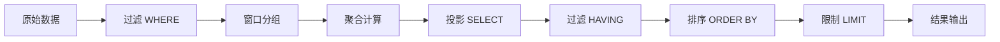

# 核心概念

理解StreamSQL的核心概念是高效使用它的关键。本章将详细介绍流处理、窗口、聚合等重要概念。

## 流处理基础

### 什么是数据流

数据流（Stream）是一系列连续产生的数据记录，具有以下特征：

- **无界性**：数据持续不断地产生，没有明确的结束
- **时序性**：数据按时间顺序到达
- **实时性**：需要快速处理，不能等待所有数据
- **不可变性**：历史数据不可修改


### 流处理 vs 批处理

| 特征 | 流处理 | 批处理 |
|------|--------|--------|
| **数据边界** | 无界 | 有界 |
| **处理延迟** | 毫秒级 | 分钟/小时级 |
| **数据完整性** | 近似结果 | 精确结果 |
| **资源使用** | 持续占用 | 周期性占用 |
| **应用场景** | 实时监控、告警 | 报表、分析 |

### 流处理模型

StreamSQL采用**微批处理**模型：


## 时间语义

### 时间类型

StreamSQL支持两种时间概念，它们决定了窗口如何划分和触发：

#### 1. 事件时间 (Event Time)

**定义**：事件时间是指数据实际产生的时间，通常记录在数据本身的某个字段中（如 `order_time`、`event_time`、`timestamp` 等）。

**特点**：
- 窗口基于数据中的时间戳字段值来划分
- 即使数据延迟到达，也能根据事件时间正确统计到对应的窗口
- 使用 Watermark 机制来处理乱序和延迟数据
- 结果准确，但可能有延迟（需要等待延迟数据）

**使用场景**：
- 需要精确时序分析的场景
- 数据可能乱序或延迟到达的场景
- 历史数据回放和分析

**配置方法**：使用 `WITH (TIMESTAMP='field_name')` 指定事件时间字段

**示例场景**：订单流统计

假设有一个订单流，订单事件上有 `order_time` 字段：

```sql
-- 事件时间窗口：按 order_time 划分窗口
-- 统计 10:00~10:05 的订单量，即使数据在 11:00 才到达，也能正确统计
SELECT COUNT(*) as order_count
FROM stream
GROUP BY TumblingWindow('5m')
WITH (TIMESTAMP='order_time')
```

**工作原理**：
- 数据到达时，系统提取 `order_time` 字段的值
- 根据 `order_time` 的值将数据分配到对应的时间窗口（如 10:00~10:05）
- 使用 Watermark 机制判断窗口是否可以触发
- 即使数据在 11:00 才到达，只要 `order_time` 是 10:03，就会统计到 10:00~10:05 的窗口

```sql
-- 完整示例：使用事件时间进行窗口聚合
SELECT deviceId, AVG(temperature) 
FROM stream 
GROUP BY deviceId, TumblingWindow('1m')
WITH (TIMESTAMP='event_time', TIMEUNIT='ms')
```

#### 2. 处理时间 (Processing Time)

**定义**：处理时间是指数据到达 StreamSQL 处理系统的时间，即系统接收到数据时的当前时间。

**特点**：
- 窗口基于数据到达系统的时间（`time.Now()`）来划分
- 不管数据中的时间字段是什么值，都按到达时间统计到当前窗口
- 使用系统时钟（Timer）来触发窗口
- 延迟低，但结果可能不准确（无法处理乱序和延迟数据）

**使用场景**：
- 实时监控和告警场景
- 对延迟要求高，对准确性要求相对较低的场景
- 数据顺序到达且延迟可控的场景

**配置方法**：不指定 `WITH (TIMESTAMP=...)` 或 `TsProp` 为空时，默认使用处理时间

**示例场景**：订单流统计

```sql
-- 处理时间窗口：按系统时间划分窗口
-- 统计 11:00~11:05 到达的数据，不管它的 order_time 是多少
SELECT COUNT(*) as order_count
FROM stream
GROUP BY TumblingWindow('5m')
-- 不指定 WITH (TIMESTAMP=...)，默认使用处理时间
```

**工作原理**：
- 数据到达时，系统使用当前时间（`time.Now()`）作为时间戳
- 根据到达时间将数据分配到对应的时间窗口（如 11:00~11:05）
- 使用系统时钟定时器触发窗口
- 如果数据在 11:00~11:05 到达，即使 `order_time` 是 10:03，也会统计到 11:00~11:05 的窗口

```sql
-- 默认使用处理时间（不指定 WITH 子句）
SELECT deviceId, AVG(temperature) 
FROM stream 
GROUP BY deviceId, TumblingWindow('1m')
```

### 事件时间 vs 处理时间对比

| 特性 | 事件时间 (Event Time) | 处理时间 (Processing Time) |
|------|---------------------|-------------------------|
| **时间来源** | 数据中的时间戳字段 | 系统当前时间 |
| **窗口划分** | 基于事件时间戳 | 基于数据到达时间 |
| **延迟处理** | 支持（Watermark机制） | 不支持 |
| **乱序处理** | 支持（Watermark机制） | 不支持 |
| **结果准确性** | 准确 | 可能不准确 |
| **处理延迟** | 较高（需等待延迟数据） | 低（实时触发） |
| **配置方式** | `WITH (TIMESTAMP='field')` | 默认（不指定WITH） |
| **适用场景** | 精确时序分析、历史回放 | 实时监控、低延迟要求 |

### 时间单位配置

当使用事件时间时，如果时间戳字段是整数类型（如 Unix 时间戳），需要指定时间单位：

```sql
-- 时间单位配置（仅在事件时间中使用）
WITH (TIMEUNIT='ns')  -- 纳秒
WITH (TIMEUNIT='ms')  -- 毫秒（默认）
WITH (TIMEUNIT='ss')  -- 秒
WITH (TIMEUNIT='mi')  -- 分钟
WITH (TIMEUNIT='hh')  -- 小时
WITH (TIMEUNIT='dd')  -- 天
```

**注意**：
- 如果时间戳字段是 `time.Time` 类型，不需要指定 `TIMEUNIT`
- 如果时间戳字段是整数类型（如 `int64`），必须指定 `TIMEUNIT` 来正确解析时间戳
- 处理时间窗口不需要配置时间单位（始终使用系统时间）

### Watermark 和延迟数据处理

事件时间窗口使用 **Watermark** 机制来处理乱序和延迟数据：

#### Watermark 机制

Watermark 表示"小于该时间的事件不应该再到达"，用于判断窗口是否可以触发：

- **Watermark 计算公式**：`Watermark = max(event_time) - MaxOutOfOrderness`
- **窗口触发条件**：当 `watermark >= window_end` 时，窗口触发
- **MaxOutOfOrderness**：允许的最大乱序时间，用于容忍数据乱序

**示例**：
- MaxOutOfOrderness = 5秒
- 当前最大事件时间 = 10:10
- Watermark = 10:10 - 5秒 = 10:05
- 窗口 [10:00 - 10:05) 可以触发（因为 watermark >= 10:05）

#### 延迟数据处理

事件时间窗口支持两种延迟数据处理机制：

**1. MaxOutOfOrderness（最大乱序时间）**

- **作用阶段**：窗口触发前
- **作用**：容忍数据乱序，延迟 Watermark 推进
- **配置**：`WITH (MAXOUTOFORDERNESS='5s')`
- **影响**：窗口触发时机（延迟触发，但能处理更多乱序数据）

**2. AllowedLateness（允许延迟时间）**

- **作用阶段**：窗口触发后
- **作用**：窗口触发后还能接受延迟数据，更新窗口结果
- **配置**：`WITH (ALLOWEDLATENESS='2s')`
- **影响**：窗口关闭时间（窗口保持开放，接受延迟数据）

**完整示例**：

```sql
-- 配置最大乱序时间和允许延迟时间
SELECT COUNT(*) as order_count
FROM stream
GROUP BY TumblingWindow('5m')
WITH (
    TIMESTAMP = 'order_time',
    MAXOUTOFORDERNESS = '5s',  -- 容忍5秒的乱序
    ALLOWEDLATENESS = '2s'     -- 窗口触发后还能接受2秒的延迟数据
)
```

**3. IdleTimeout（空闲超时）**

- **作用阶段**：数据源空闲时
- **作用**：当数据源空闲（无新数据到达）时，基于处理时间推进 Watermark，确保窗口能够关闭
- **配置**：`WITH (IDLETIMEOUT='5s')`
- **影响**：防止窗口因数据源停止而无法关闭，避免内存泄漏

**完整示例**：

```sql
-- 配置最大乱序时间、允许延迟时间和空闲超时
SELECT COUNT(*) as order_count
FROM stream
GROUP BY TumblingWindow('5m')
WITH (
    TIMESTAMP = 'order_time',
    MAXOUTOFORDERNESS = '5s',  -- 容忍5秒的乱序
    ALLOWEDLATENESS = '2s',    -- 窗口触发后还能接受2秒的延迟数据
    IDLETIMEOUT = '5s'         -- 5秒无数据，基于处理时间推进watermark
)
```

**工作流程**：
1. 数据到达，更新 Watermark（考虑 MaxOutOfOrderness）
2. 当 `watermark >= window_end` 时，窗口触发并输出结果
3. 窗口保持开放，直到 `watermark >= window_end + AllowedLateness`
4. 延迟数据到达时，如果窗口仍开放，触发延迟更新（窗口再次触发）
5. 超过 AllowedLateness 后，窗口关闭，延迟数据被忽略
6. **如果数据源空闲超过 IdleTimeout**：Watermark 基于处理时间推进，确保窗口能够关闭

**IdleTimeout 工作原理**：
- 正常情况下：Watermark 基于事件时间更新（`Watermark = max(event_time) - MaxOutOfOrderness`）
- 数据源空闲时：如果 `timeSinceLastEvent > IdleTimeout`，Watermark 基于处理时间推进（`Watermark = currentProcessingTime - MaxOutOfOrderness`）
- 作用：确保即使数据源停止发送数据，窗口也能最终关闭，防止内存泄漏

## 窗口概念

窗口是流处理中的核心概念，用于将无界流分割成有界的数据集进行聚合操作。

### 窗口类型

#### 1. 滚动窗口 (Tumbling Window)

固定大小、无重叠的时间窗口：


```sql
-- 每5分钟计算一次平均值
SELECT AVG(temperature) 
FROM stream 
GROUP BY TumblingWindow('5m')
```

**特点**：
- 每条数据只属于一个窗口
- 窗口之间无重叠
- 适合周期性统计

#### 2. 滑动窗口 (Sliding Window)

固定大小、有重叠的时间窗口：


```sql
-- 5分钟窗口，每2分钟滑动一次
SELECT AVG(temperature) 
FROM stream 
GROUP BY SlidingWindow('5m', '2m')
```

**特点**：
- 每条数据可能属于多个窗口
- 提供更平滑的分析结果
- 计算开销相对较大

#### 3. 计数窗口 (Counting Window)

基于数据条数的窗口：


```sql
-- 每100条数据计算一次
SELECT AVG(temperature) 
FROM stream 
GROUP BY CountingWindow(100)
```

**特点**：
- 基于数据量而非时间
- 窗口大小固定
- 适合数据量稳定的场景

#### 4. 会话窗口 (Session Window)

基于数据活跃度的动态窗口：


```sql
-- 超时5分钟关闭会话
SELECT user_id, COUNT(*) 
FROM stream 
GROUP BY user_id, SessionWindow('5m')
```

**特点**：
- 窗口大小动态变化
- 基于数据间隔判断会话
- 适合用户行为分析

### 窗口生命周期


## 聚合操作

### 聚合函数分类

#### 1. 统计聚合
```sql
SELECT deviceId,
       COUNT(*) as data_count,           -- 计数
       SUM(temperature) as total_temp,   -- 求和
       AVG(temperature) as avg_temp,     -- 平均值
       MIN(temperature) as min_temp,     -- 最小值
       MAX(temperature) as max_temp      -- 最大值
FROM stream 
GROUP BY deviceId, TumblingWindow('1m')
```

#### 2. 高级统计
```sql
SELECT deviceId,
       STDDEV(temperature) as std_temp,      -- 标准差
       MEDIAN(temperature) as med_temp,      -- 中位数
       PERCENTILE(temperature, 0.95) as p95 -- 95分位数
FROM stream 
GROUP BY deviceId, TumblingWindow('1m')
```

#### 3. 集合聚合
```sql
SELECT deviceId,
       COLLECT(temperature) as temp_list,     -- 收集到数组
       LAST_VALUE(temperature) as last_temp   -- 最后一个值
FROM stream 
GROUP BY deviceId, TumblingWindow('1m')
```

### 聚合状态管理

StreamSQL自动管理聚合状态：


## 表达式系统

### 算术表达式
```sql
SELECT deviceId,
       temperature * 1.8 + 32 as fahrenheit,  -- 温度转换
       (humidity + moisture) / 2 as avg_wet   -- 平均湿度
FROM stream
```

### 逻辑表达式
```sql
SELECT deviceId,
       temperature > 30 AND humidity > 80 as alert_condition
FROM stream
WHERE temperature IS NOT NULL
```

### 字符串表达式
```sql
SELECT deviceId,
       CONCAT(deviceId, '_', status) as device_status,
       UPPER(location) as location_upper
FROM stream
```

### 条件表达式
```sql
SELECT deviceId,
       CASE 
           WHEN temperature > 35 THEN '高温'
           WHEN temperature > 25 THEN '正常'
           ELSE '低温'
       END as temp_level
FROM stream
```

## 数据类型

### 基本类型

| 类型 | 说明 | 示例 |
|------|------|------|
| **数值** | 整数、浮点数 | `25`, `3.14`, `-10` |
| **字符串** | 文本数据 | `"sensor001"`, `'active'` |
| **布尔** | 逻辑值 | `true`, `false` |
| **时间** | 时间戳 | `time.Now()` |

### 复合类型

```go
// 支持嵌套结构
data := map[string]interface{}{
    "deviceId": "sensor001",
    "location": map[string]interface{}{
        "building": "A",
        "floor": 3,
    },
    "readings": []float64{23.5, 24.1, 25.2},
}
```

### 类型转换

StreamSQL提供自动类型转换：

```sql
-- 自动转换字符串到数字
SELECT deviceId, temperature + '5' as adjusted_temp
FROM stream

-- 显式转换
SELECT deviceId, CAST(temperature AS STRING) as temp_str
FROM stream
```

## 执行模型

### 数据流向



### 处理阶段

1. **解析阶段**：SQL语句解析为抽象语法树
2. **规划阶段**：生成执行计划和配置
3. **执行阶段**：创建流处理管道
4. **运行阶段**：持续处理数据流

### 资源管理

```go
// 正确的资源管理
ssql := streamsql.New()
defer ssql.Stop()  // 确保资源释放

// 错误处理
err := ssql.Execute(sql)
if err != nil {
    log.Printf("执行失败: %v", err)
    return
}
```

## 性能考虑

### 内存使用

- **窗口大小**：较大窗口占用更多内存
- **聚合状态**：复杂聚合需要更多状态存储
- **数据类型**：避免不必要的大型对象

### 计算复杂度

- **滑动窗口** > **滚动窗口** > **无窗口**
- **复杂表达式** > **简单表达式**
- **多重GROUP BY** > **单一GROUP BY**
