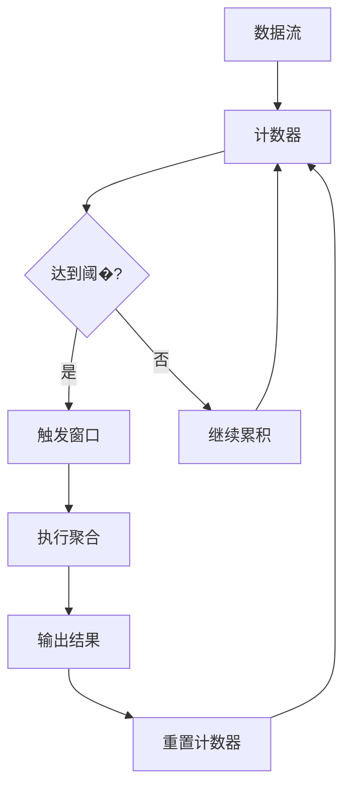

---

title: 窗口函数
date: 2024-01-15 10:05:00
permalink: /pages/streamsql/05/
article: false
author:
    name: StreamSQL
    link: https://github.com/rulego/streamsql
---

# 窗口函数

窗口函数是流处理的核心概念，用于将无界数据流分割成有界的数据集进行聚合分析。StreamSQL提供了四种窗口类型，满足不同的业务场景需求�?
## 窗口基础概念

### 为什么需要窗�?
在流处理中，数据是连续不断的，我们无法等�?所有数�?到达后再进行计算。窗口函数解决了这个问题�?
```mermaid
graph TB
    A[无界数据流] --> B[窗口分割]
    B --> C[有界数据集]
    C --> D[聚合计算]
    D --> E[结果输出]
    
    subgraph "数据�?
        F[数据1] --> G[数据2] --> H[数据3] --> I[...]
    end
    
    subgraph "窗口处理"
        J[窗口1: 数据1,2] --> K[窗口2: 数据3,4] --> L[窗口3: 数据5,6]
    end
```

### 窗口的关键属�?
| 属�?    | 说明            | 影响      |
| ------ | ------------- | ------- |
| **大小** | 窗口包含的时间范围或数据�?| 分析精度和延�?|
| **触发** | 窗口何时执行计算      | 结果产生频率  |
| **重叠** | 窗口之间是否有数据重�?  | 计算复杂�?  |
| **对齐** | 窗口边界的时间对齐方�?  | 结果一致�?  |

## 滚动窗口 (TumblingWindow)

### 特点

滚动窗口�?*固定大小、无重叠**的时间窗口，每个数据点只属于一个窗口�?
```mermaid
gantt
    title 滚动窗口示例 (5分钟窗口)
    dateFormat X
    axisFormat %H:%M
    
    section 窗口1
    10:00-10:05    :done, w1, 0, 5
    section 窗口2
    10:05-10:10    :done, w2, 5, 10
    section 窗口3
    10:10-10:15    :active, w3, 10, 15
    section 窗口4
    10:15-10:20    :w4, 15, 20
```

### 语法

```sql
GROUP BY [field1, field2, ...], TumblingWindow('duration')
```

### 参数说明

| 参数         | 类型     | 说明   | 示例                             |
| ---------- | ------ | ---- | ------------------------------ |
| `duration` | string | 窗口大小 | `'5s'`, `'1m'`, `'1h'`, `'1d'` |

### 基础示例

```sql
-- 每分钟计算设备平均温�?SELECT deviceId, 
       AVG(temperature) as avg_temp,
       COUNT(*) as sample_count,
       window_start() as start_time,
       window_end() as end_time
FROM stream
GROUP BY deviceId, TumblingWindow('1m')
```

### 实际应用

#### 1. 设备监控

```sql
-- �?分钟监控设备状�?SELECT deviceId,
       COUNT(*) as total_events,
       SUM(CASE WHEN status = 'error' THEN 1 ELSE 0 END) as error_count,
       AVG(cpu_usage) as avg_cpu,
       MAX(memory_usage) as max_memory
FROM stream
WHERE deviceId IS NOT NULL
GROUP BY deviceId, TumblingWindow('5m')
HAVING error_count > 0  -- 只输出有错误的设�?```

#### 2. 流量统计

```sql
-- 每小时API调用统计
SELECT api_endpoint,
       COUNT(*) as request_count,
       SUM(CASE WHEN status_code >= 400 THEN 1 ELSE 0 END) as error_count,
       AVG(response_time) as avg_response_time,
       PERCENTILE(response_time, 0.95) as p95_response_time
FROM stream
GROUP BY api_endpoint, TumblingWindow('1h')
```

#### 3. 业务指标

```sql
-- 每日销售统�?SELECT product_category,
       SUM(amount) as total_sales,
       COUNT(DISTINCT customer_id) as unique_customers,
       AVG(amount) as avg_order_value
FROM stream
GROUP BY product_category, TumblingWindow('1d')
```

### 优缺�?
**优点�?*

* 计算开销�?
* 每个数据点只处理一�?
* 适合周期性报�?
**缺点�?*

* 窗口边界可能切断相关事件

* 结果不够平滑

### 适用场景

* �?周期性报告（每小时、每天）

* �?资源使用监控

* �?业务指标统计

* �?批处理风格的分析

## 滑动窗口 (SlidingWindow)

### 特点

滑动窗口�?*固定大小、有重叠**的时间窗口，每个数据点可能属于多个窗口�?
```mermaid
gantt
    title 滑动窗口示例 (5分钟窗口�?分钟滑动)
    dateFormat X
    axisFormat %H:%M
    
    section 窗口1
    10:00-10:05    :done, w1, 0, 5
    section 窗口2
    10:02-10:07    :done, w2, 2, 7
    section 窗口3
    10:04-10:09    :active, w3, 4, 9
    section 窗口4
    10:06-10:11    :w4, 6, 11
```

### 语法

```sql
GROUP BY [field1, field2, ...], SlidingWindow('window_size', 'slide_interval')
```

### 参数说明

| 参数               | 类型     | 说明   | 示例              |
| ---------------- | ------ | ---- | --------------- |
| `window_size`    | string | 窗口大小 | `'5m'`, `'1h'`  |
| `slide_interval` | string | 滑动间隔 | `'1m'`, `'30s'` |

### 基础示例

```sql
-- 5分钟窗口，每分钟滑动一�?SELECT deviceId,
       AVG(temperature) as avg_temp,
       STDDEV(temperature) as temp_stddev,
       window_start() as start_time
FROM stream
GROUP BY deviceId, SlidingWindow('5m', '1m')
```

### 实际应用

#### 1. 实时异常检�?
```sql
-- 检测温度异常：5分钟窗口内的标准差异�?SELECT deviceId,
       AVG(temperature) as current_avg,
       STDDEV(temperature) as current_stddev,
       CASE 
           WHEN STDDEV(temperature) > 5.0 THEN 'UNSTABLE'
           WHEN AVG(temperature) > 35.0 THEN 'OVERHEAT'
           ELSE 'NORMAL'
       END as device_status
FROM stream
WHERE temperature IS NOT NULL
GROUP BY deviceId, SlidingWindow('5m', '30s')
HAVING STDDEV(temperature) > 2.0 OR AVG(temperature) > 30.0
```

#### 2. 性能趋势分析

```sql
-- 系统性能趋势�?0分钟窗口，每2分钟更新
SELECT server_id,
       AVG(cpu_usage) as avg_cpu,
       AVG(memory_usage) as avg_memory,
       AVG(disk_io) as avg_disk_io,
       -- 计算变化趋势
       CASE 
           WHEN AVG(cpu_usage) > LAG(AVG(cpu_usage)) THEN 'INCREASING'
           WHEN AVG(cpu_usage) < LAG(AVG(cpu_usage)) THEN 'DECREASING'
           ELSE 'STABLE'
       END as cpu_trend
FROM stream
GROUP BY server_id, SlidingWindow('10m', '2m')
```

#### 3. 移动平均分析

```sql
-- 股价移动平均�?0分钟窗口，每5分钟更新
SELECT symbol,
       AVG(price) as moving_avg_30m,
       MIN(price) as min_price_30m,
       MAX(price) as max_price_30m,
       COUNT(*) as trade_count,
       window_start() as window_start
FROM stream
WHERE price > 0
GROUP BY symbol, SlidingWindow('30m', '5m')
ORDER BY moving_avg_30m DESC
```

### 配置建议

#### 窗口大小与滑动间隔的关系

```sql
-- 高频更新（延迟低，开销大）
SlidingWindow('5m', '30s')   -- �?0秒更�?分钟数据

-- 中频更新（平衡）
SlidingWindow('10m', '2m')   -- �?分钟更新10分钟数据

-- 低频更新（延迟高，开销小）
SlidingWindow('1h', '10m')   -- �?0分钟更新1小时数据
```

### 优缺�?
**优点�?*

* 提供平滑的分析结�?
* 能够更快地响应数据变�?
* 适合趋势分析

**缺点�?*

* 计算开销较大

* 同一数据被多次处�?
* 内存使用较多

### 适用场景

* �?实时监控和告�?
* �?趋势分析

* �?移动平均计算

* �?异常检�?
## 计数窗口 (CountingWindow)

### 特点

计数窗口基于**数据条数**而非时间，当累积数据达到指定数量时触发计算�?


### 语法

```sql
GROUP BY [field1, field2, ...], CountingWindow(count)
```

### 参数说明

| 参数      | 类型      | 说明   | 示例                    |
| ------- | ------- | ---- | --------------------- |
| `count` | integer | 触发阈�?| `100`, `1000`, `5000` |

### 基础示例

```sql
-- �?00条数据计算一次设备平均�?SELECT deviceId,
       AVG(temperature) as avg_temp,
       COUNT(*) as batch_size,
       MIN(timestamp) as batch_start,
       MAX(timestamp) as batch_end
FROM stream
GROUP BY deviceId, CountingWindow(100)
```

### 实际应用

#### 1. 批量数据处理

```sql
-- �?000条数据进行一次数据质量检�?SELECT data_source,
       COUNT(*) as total_records,
       SUM(CASE WHEN value IS NULL THEN 1 ELSE 0 END) as null_count,
       SUM(CASE WHEN value < 0 THEN 1 ELSE 0 END) as negative_count,
       AVG(value) as avg_value,
       STDDEV(value) as value_stddev
FROM stream
GROUP BY data_source, CountingWindow(1000)
HAVING null_count > 50 OR negative_count > 100  -- 数据质量告警
```

#### 2. 采样分析

```sql
-- �?00条消息分析一次用户行为模�?SELECT user_category,
       COUNT(DISTINCT user_id) as unique_users,
       AVG(session_duration) as avg_session_time,
       SUM(page_views) as total_page_views,
       COUNT(DISTINCT page_url) as unique_pages
FROM stream
WHERE session_duration > 0
GROUP BY user_category, CountingWindow(500)
```

#### 3. 性能基准测试

```sql
-- �?0000个请求分析一次API性能
SELECT api_endpoint,
       COUNT(*) as request_count,
       AVG(response_time) as avg_response_time,
       PERCENTILE(response_time, 0.50) as median_response_time,
       PERCENTILE(response_time, 0.95) as p95_response_time,
       PERCENTILE(response_time, 0.99) as p99_response_time,
       MAX(response_time) as max_response_time
FROM stream
WHERE response_time > 0
GROUP BY api_endpoint, CountingWindow(10000)
```

### 动态阈�?
```sql
-- 根据数据源调整计数阈�?SELECT device_type,
       CASE device_type
           WHEN 'high_frequency' THEN 1000
           WHEN 'medium_frequency' THEN 500  
           WHEN 'low_frequency' THEN 100
           ELSE 200
       END as optimal_count
FROM stream
GROUP BY device_type, CountingWindow(200)  -- 基础阈�?```

### 优缺�?
**优点�?*

* 保证固定的数据处理量

* 适合数据采样分析

* 不受时间波动影响

**缺点�?*

* 触发时间不可预测

* 数据稀少时延迟较大

* 不适合实时性要求高的场�?
### 适用场景

* �?批量数据处理

* �?数据采样分析

* �?性能基准测试

* �?数据质量检�?
## 会话窗口 (SessionWindow)

### 特点

会话窗口�?*动态大�?*的窗口，根据数据到达的间隔时间自动调整窗口边界。当数据间隔超过设定的超时时间时，会话结束�?

```mermaid
gantt
    title 会话窗口示例 (5分钟超时)
    dateFormat X
    axisFormat %H:%M
    
    section 会话1
    活跃�?   :done, s1, 0, 8
    section 超时
    空闲�?   :crit, gap1, 8, 10
    section 会话2  
    活跃�?   :done, s2, 10, 15
    section 超时
    空闲�?   :crit, gap2, 15, 18
    section 会话3
    活跃�?   :active, s3, 18, 22
```


### 语法

```sql
GROUP BY [session_key, ...], SessionWindow('timeout_duration')
```

### 参数说明

| 参数                 | 类型     | 说明     | 示例                      |
| ------------------ | ------ | ------ | ----------------------- |
| `timeout_duration` | string | 会话超时时间 | `'5m'`, `'30s'`, `'1h'` |
| `session_key`      | string | 会话分组字段 | `user_id`, `device_id`  |

### 基础示例

```sql
-- 用户会话分析�?分钟无活动则认为会话结束
SELECT user_id,
       COUNT(*) as page_views,
       SUM(duration) as total_session_time,
       MIN(timestamp) as session_start,
       MAX(timestamp) as session_end,
       COUNT(DISTINCT page_url) as unique_pages
FROM stream
GROUP BY user_id, SessionWindow('5m')
HAVING total_session_time > 60  -- 只分析超�?分钟的会�?```

### 实际应用

#### 1. 用户行为分析

```sql
-- 网站用户会话分析
SELECT user_id,
       COUNT(*) as actions_count,
       COUNT(DISTINCT action_type) as unique_actions,
       SUM(CASE WHEN action_type = 'purchase' THEN 1 ELSE 0 END) as purchases,
       SUM(CASE WHEN action_type = 'add_to_cart' THEN 1 ELSE 0 END) as cart_adds,
       AVG(page_load_time) as avg_load_time,
       -- 计算会话时长（秒�?       (MAX(timestamp) - MIN(timestamp)) / 1000000000 as session_duration_seconds
FROM stream
WHERE user_id IS NOT NULL
GROUP BY user_id, SessionWindow('10m')  -- 10分钟无活动结束会�?HAVING actions_count >= 3  -- 至少3个动作才算有效会�?```

#### 2. 设备连接会话

```sql
-- IoT设备连接会话监控
SELECT device_id,
       COUNT(*) as message_count,
       AVG(signal_strength) as avg_signal,
       MIN(signal_strength) as min_signal,
       SUM(data_bytes) as total_data_bytes,
       STDDEV(message_interval) as interval_stability,
       -- 连接质量评估
       CASE 
           WHEN AVG(signal_strength) > 80 AND STDDEV(message_interval) < 2.0 THEN 'EXCELLENT'
           WHEN AVG(signal_strength) > 60 AND STDDEV(message_interval) < 5.0 THEN 'GOOD'
           WHEN AVG(signal_strength) > 40 THEN 'FAIR'
           ELSE 'POOR'
       END as connection_quality
FROM stream
WHERE device_id IS NOT NULL AND signal_strength > 0
GROUP BY device_id, SessionWindow('2m')  -- 2分钟无数据认为断�?```

#### 3. 应用程序会话

```sql
-- 移动应用使用会话
SELECT app_version,
       user_category,
       COUNT(*) as events_count,
       COUNT(DISTINCT event_type) as unique_events,
       AVG(cpu_usage) as avg_cpu_usage,
       AVG(memory_usage) as avg_memory_usage,
       SUM(CASE WHEN event_type = 'crash' THEN 1 ELSE 0 END) as crash_count,
       -- 会话评分
       CASE 
           WHEN SUM(CASE WHEN event_type = 'crash' THEN 1 ELSE 0 END) > 0 THEN 'BAD'
           WHEN AVG(cpu_usage) > 80 OR AVG(memory_usage) > 80 THEN 'POOR'
           WHEN COUNT(*) > 50 THEN 'ACTIVE'
           ELSE 'NORMAL'
       END as session_quality
FROM stream
WHERE app_version IS NOT NULL
GROUP BY app_version, user_category, SessionWindow('15m')
HAVING events_count >= 5
```

### 会话配置策略

#### 超时时间选择

```sql
-- 不同场景的超时配�?-- Web浏览会话
GROUP BY user_id, SessionWindow('30m')  -- 30分钟无活�?
-- API调用会话  
GROUP BY api_key, SessionWindow('5m')   -- 5分钟无调�?
-- 设备心跳会话
GROUP BY device_id, SessionWindow('2m') -- 2分钟无心�?
-- 实时游戏会话
GROUP BY player_id, SessionWindow('30s') -- 30秒无操作
```

### 优缺�?
**优点�?*

* 自动适应用户行为模式

* 符合业务语义

* 能够准确分析用户/设备会话

**缺点�?*

* 触发时间不可预测

* 内存使用不可�?
* 实现复杂度较�?
### 适用场景

* �?用户行为分析

* �?设备连接监控

* �?应用使用分析

* �?异常检测（基于活动模式�?
## 窗口函数高级用法

### 1. 多层窗口分析

```sql
-- 结合不同窗口类型进行多层分析
-- 第一层：实时监控（滑动窗口）
WITH real_time_stats AS (
    SELECT device_id,
           AVG(temperature) as current_avg,
           STDDEV(temperature) as current_stddev
    FROM stream
    GROUP BY device_id, SlidingWindow('5m', '1m')
),
-- 第二层：趋势分析（滚动窗口）  
trend_stats AS (
    SELECT device_id,
           AVG(temperature) as hourly_avg,
           COUNT(*) as hourly_count
    FROM stream
    GROUP BY device_id, TumblingWindow('1h')
)
-- 在应用层合并结果进行综合分析
```

### 2. 自适应窗口大小

```sql
-- 根据数据密度调整窗口参数
SELECT device_type,
       -- 高频设备使用小窗�?       CASE 
           WHEN AVG(message_interval) < 1.0 THEN '30s'
           WHEN AVG(message_interval) < 10.0 THEN '2m'
           ELSE '5m'
       END as recommended_window_size,
       COUNT(*) as message_count,
       AVG(message_interval) as avg_interval
FROM stream
GROUP BY device_type, TumblingWindow('10m')
```

### 3. 窗口结果缓存

```sql
-- 利用窗口函数实现结果缓存
SELECT device_id,
       -- 当前窗口统计
       AVG(temperature) as current_avg,
       -- 与历史数据比较需要在应用层实�?       window_start() as window_id
FROM stream
GROUP BY device_id, TumblingWindow('5m')
```

## 性能优化

### 1. 窗口大小选择

```sql
-- 性能考虑：窗口大小与内存使用
-- 小窗口：低延迟，高频输出，内存使用稳�?GROUP BY TumblingWindow('1m')

-- 大窗口：高延迟，低频输出，内存使用较�? 
GROUP BY TumblingWindow('1h')

-- 滑动窗口：计算开销最�?GROUP BY SlidingWindow('10m', '1m')  -- 需要维护多个窗口状�?```

### 2. 分组字段优化

```sql
-- 好的实践：合理的分组粒度
GROUP BY device_type, TumblingWindow('5m')     -- 粗粒度，状态少

-- 避免：过细粒度分�?GROUP BY device_id, user_id, TumblingWindow('5m')  -- 细粒度，状态多
```

### 3. 内存管理

```sql
-- 使用LIMIT控制输出大小
SELECT device_id, AVG(temperature)
FROM stream
GROUP BY device_id, TumblingWindow('5m')
LIMIT 100  -- 限制每个窗口最�?00个结�?```

## 故障排除

### 常见问题

#### 1. 窗口不触�?
```sql
-- 检查：是否有足够的数据
SELECT COUNT(*) as data_count, 
       MIN(timestamp) as first_data,
       MAX(timestamp) as last_data
FROM stream
-- 滚动窗口需要等待窗口结束时�?```

#### 2. 内存使用过高

```sql
-- 优化：减少分组维度或窗口大小
-- 从这样：
GROUP BY device_id, location, user_id, TumblingWindow('1h')
-- 改为�?GROUP BY device_type, TumblingWindow('10m')
```

#### 3. 结果延迟

```sql
-- 解决：使用更小的窗口或滑动间�?-- 从这样：
GROUP BY SlidingWindow('1h', '30m')  -- 30分钟才更新一�?-- 改为�?GROUP BY SlidingWindow('10m', '2m')  -- 2分钟更新一�?```

## 下一�?
现在您已经掌握了窗口函数的使用方法，建议继续学习�?
* 🔧 [自定义函数](../06.自定义函�?) - 扩展处理能力

* 💡 [示例集合](../07.示例/) - 查看更多窗口函数应用案例

* 📖 [最佳实践](../09.最佳实�?) - 生产环境优化建议

* 📚 [API参考](../08.API参�?) - 完整的API文档

