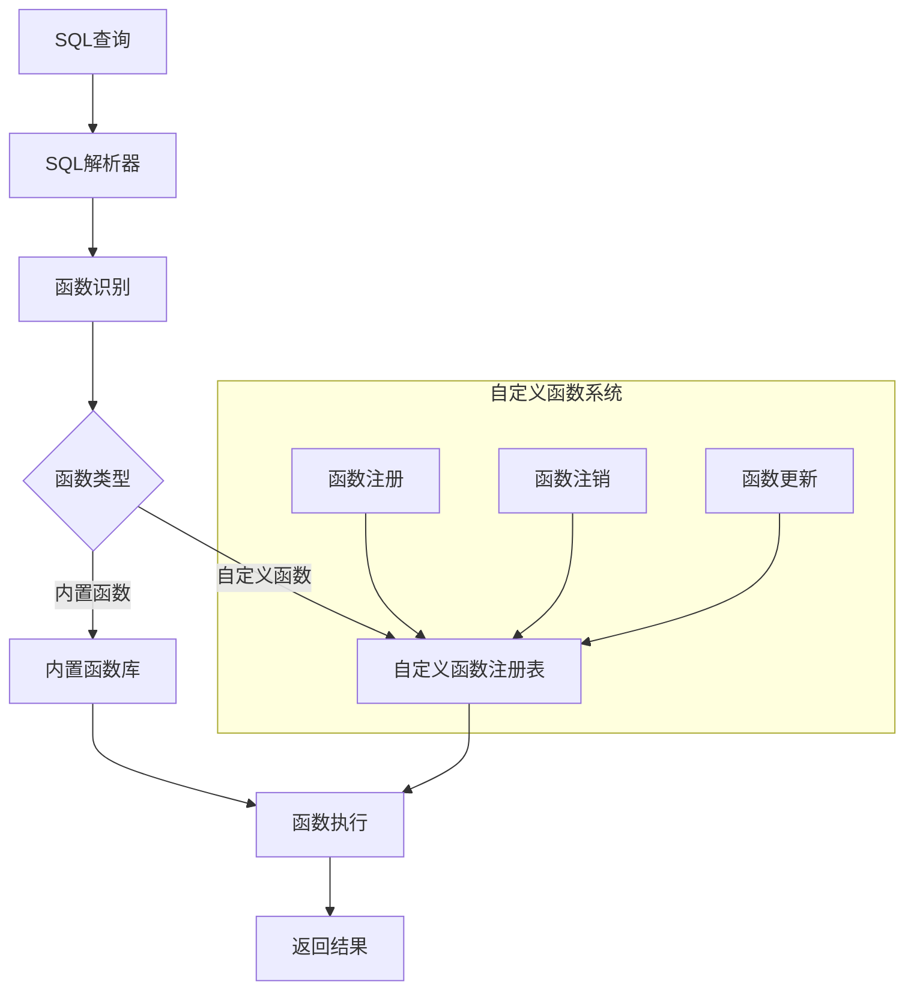

# 自定义函数

StreamSQL提供了强大的插件式自定义函数系统，支持运行时动态注册函数，无需重启系统。通过自定义函数，您可以扩展StreamSQL的处理能力，实现特定的业务逻辑。

## 自定义函数概述

StreamSQL提供了强大的自定义函数扩展能力，允许用户根据业务需求注册自定义函数。基于源码项目的实际实现，自定义函数系统具有以下特性：

### 核心特性

- **模块化架构**：统一的聚合函数和分析函数管理
- **自动适配**：自动处理函数类型转换和参数验证
- **类型安全**：完整的参数类型检查和转换系统
- **简化扩展**：简单的API，几行代码即可注册
- **运行时管理**：支持动态注册和注销函数

### 架构图



## 函数类型系统

基于StreamSQL源码项目，函数系统支持多种函数类型，每种类型都有特定的使用场景：

### 函数类型表

| 类型 | 常量 | 用途 | 示例 |
|------|------|------|------|
| **聚合函数** | `TypeAggregation` | 聚合计算 | `COUNT()`, `SUM()`, `AVG()` |
| **分析函数** | `TypeAnalytical` | 数据分析 | `ROW_NUMBER()`, `RANK()` |
| **窗口函数** | `TypeWindow` | 窗口扩展 | `TumblingWindow()`, `SlidingWindow()` |
| **数学函数** | `TypeMath` | 数值计算 | `ABS()`, `ROUND()`, `SQRT()` |
| **字符串函数** | `TypeString` | 文本处理 | `UPPER()`, `CONCAT()`, `SUBSTRING()` |
| **转换函数** | `TypeConversion` | 类型转换 | `CAST()`, `TO_JSON()` |
| **时间函数** | `TypeDateTime` | 时间处理 | `NOW()`, `DATE_FORMAT()` |
| **通用函数** | `TypeCustom` | 通用逻辑 | 自定义业务函数 |

## 基础使用

### 1. 自定义聚合函数

基于StreamSQL源码项目的实际实现，创建自定义聚合函数：

```go
package main

import (
    "github.com/rulego/streamsql/functions"
    "github.com/rulego/streamsql/utils/cast"
)

// 自定义乘积聚合函数
type CustomProductFunction struct {
    *functions.BaseFunction
    product float64
    first   bool
}

func NewCustomProductFunction() *CustomProductFunction {
    return &CustomProductFunction{
        BaseFunction: functions.NewBaseFunction("product", functions.TypeAggregation, 
            "自定义聚合函数", "计算数值乘积", 1, -1),
        product: 1.0,
        first:   true,
    }
}

// 实现AggregatorFunction接口
func (f *CustomProductFunction) New() functions.AggregatorFunction {
    return &CustomProductFunction{
        BaseFunction: f.BaseFunction,
        product:      1.0,
        first:        true,
    }
}

func (f *CustomProductFunction) Add(value interface{}) {
    if val, err := cast.ToFloat64E(value); err == nil {
        if f.first {
            f.product = val
            f.first = false
        } else {
            f.product *= val
        }
    }
}

func (f *CustomProductFunction) Result() interface{} {
    if f.first {
        return 0.0
    }
    return f.product
}

func (f *CustomProductFunction) Reset() {
    f.product = 1.0
    f.first = true
}

func (f *CustomProductFunction) Clone() functions.AggregatorFunction {
    return &CustomProductFunction{
        BaseFunction: f.BaseFunction,
        product:      f.product,
        first:        f.first,
    }
}

func main() {
    // 注册自定义聚合函数
    productFunc := NewCustomProductFunction()
    functions.RegisterAggregator("product", productFunc)
    
    // 现在可以在SQL中使用
    // SELECT deviceId, PRODUCT(value) FROM stream GROUP BY deviceId, TumblingWindow('1m')
}
```

### 2. 在SQL中使用

```sql
-- 注册后立即可用
SELECT deviceId, 
       distance(start_lat, start_lon, end_lat, end_lon) as travel_distance,
       temperature
FROM stream
WHERE travel_distance > 1000  -- 距离超过1000米
```

### 3. 函数管理

```go
// 检查函数是否存在
if exists := functions.Exists("distance"); exists {
    fmt.Println("函数distance已注册")
}

// 获取函数信息
if fn, exists := functions.Get("distance"); exists {
    fmt.Printf("函数类型: %s\n", fn.GetType())
    fmt.Printf("函数描述: %s\n", fn.GetDescription())
}

// 注销函数
functions.Unregister("distance")

// 列出所有自定义函数
customFuncs := functions.ListCustomFunctions()
for name, fn := range customFuncs {
    fmt.Printf("函数: %s, 类型: %s\n", name, fn.GetType())
}
```

## 函数开发详情

### 1. 数学函数 (TypeMath)

用于数值计算和数学运算。

```go
// 计算两个向量的夹角
functions.RegisterCustomFunction("vector_angle", functions.TypeMath, 
    "向量计算", "计算两个向量的夹角（弧度）", 4, 4,
    func(ctx *functions.FunctionContext, args []interface{}) (interface{}, error) {
        x1, _ := functions.ConvertToFloat64(args[0])
        y1, _ := functions.ConvertToFloat64(args[1])
        x2, _ := functions.ConvertToFloat64(args[2])
        y2, _ := functions.ConvertToFloat64(args[3])
        
        // 计算向量夹角
        dot := x1*x2 + y1*y2
        mag1 := math.Sqrt(x1*x1 + y1*y1)
        mag2 := math.Sqrt(x2*x2 + y2*y2)
        
        if mag1 == 0 || mag2 == 0 {
            return 0.0, nil
        }
        
        angle := math.Acos(dot / (mag1 * mag2))
        return angle, nil
    })
```

```sql
-- 使用数学函数
SELECT deviceId,
       vector_angle(acc_x, acc_y, gravity_x, gravity_y) as tilt_angle,
       temperature
FROM stream
WHERE tilt_angle > 0.5  -- 倾斜角度大于0.5弧度
```

### 2. 字符串函数 (TypeString)

用于文本处理和字符串操作。

```go
// 提取设备类型
functions.RegisterCustomFunction("extract_device_type", functions.TypeString,
    "文本处理", "从设备ID中提取设备类型", 1, 1,
    func(ctx *functions.FunctionContext, args []interface{}) (interface{}, error) {
        deviceId, err := functions.ConvertToString(args[0])
        if err != nil {
            return "", err
        }
        
        // 假设设备ID格式：TYPE_LOCATION_NUMBER
        parts := strings.Split(deviceId, "_")
        if len(parts) >= 1 {
            return strings.ToUpper(parts[0]), nil
        }
        
        return "UNKNOWN", nil
    })

// 格式化传感器读数
functions.RegisterCustomFunction("format_reading", functions.TypeString,
    "数据格式化", "格式化传感器读数", 2, 3,
    func(ctx *functions.FunctionContext, args []interface{}) (interface{}, error) {
        value, err := functions.ConvertToFloat64(args[0])
        if err != nil {
            return "", err
        }
        
        unit, err := functions.ConvertToString(args[1])
        if err != nil {
            return "", err
        }
        
        precision := 2
        if len(args) > 2 {
            if p, err := functions.ConvertToInt(args[2]); err == nil {
                precision = p
            }
        }
        
        format := fmt.Sprintf("%%.%df %s", precision, unit)
        return fmt.Sprintf(format, value), nil
    })
```

```sql
-- 使用字符串函数
SELECT deviceId,
       extract_device_type(deviceId) as device_type,
       format_reading(temperature, '°C', 1) as temp_display,
       format_reading(humidity, '%', 0) as humidity_display
FROM stream
```

### 3. 转换函数 (TypeConversion)

用于数据类型转换和格式变换：

```go
// 温度单位转换
functions.RegisterCustomFunction("temp_convert", functions.TypeConversion,
    "单位转换", "温度单位转换", 3, 3,
    func(ctx *functions.FunctionContext, args []interface{}) (interface{}, error) {
        value, err := functions.ConvertToFloat64(args[0])
        if err != nil {
            return nil, err
        }
        
        fromUnit, err := functions.ConvertToString(args[1])
        if err != nil {
            return nil, err
        }
        
        toUnit, err := functions.ConvertToString(args[2])
        if err != nil {
            return nil, err
        }
        
        // 先转换到摄氏度
        var celsius float64
        switch strings.ToLower(fromUnit) {
        case "c", "celsius":
            celsius = value
        case "f", "fahrenheit":
            celsius = (value - 32) * 5 / 9
        case "k", "kelvin":
            celsius = value - 273.15
        default:
            return nil, fmt.Errorf("不支持的源温度单位: %s", fromUnit)
        }
        
        // 从摄氏度转换到目标单位
        switch strings.ToLower(toUnit) {
        case "c", "celsius":
            return celsius, nil
        case "f", "fahrenheit":
            return celsius*9/5 + 32, nil
        case "k", "kelvin":
            return celsius + 273.15, nil
        default:
            return nil, fmt.Errorf("不支持的目标温度单位: %s", toUnit)
        }
    })
```

```sql
-- 使用转换函数
SELECT deviceId,
       temperature,
       temp_convert(temperature, 'C', 'F') as temp_fahrenheit,
       temp_convert(temperature, 'C', 'K') as temp_kelvin
FROM stream
```

### 4. 时间函数 (TypeDateTime)

用于时间处理和日期计算：

```go
// 计算时间差
functions.RegisterCustomFunction("time_diff_minutes", functions.TypeDateTime,
    "时间计算", "计算两个时间戳之间的分钟差", 2, 2,
    func(ctx *functions.FunctionContext, args []interface{}) (interface{}, error) {
        t1, err := functions.ConvertToTime(args[0])
        if err != nil {
            return nil, err
        }
        
        t2, err := functions.ConvertToTime(args[1])
        if err != nil {
            return nil, err
        }
        
        diff := t2.Sub(t1)
        minutes := diff.Minutes()
        
        return minutes, nil
    })

// 工作日判断
functions.RegisterCustomFunction("is_workday", functions.TypeDateTime,
    "时间判断", "判断给定时间是否为工作日", 1, 1,
    func(ctx *functions.FunctionContext, args []interface{}) (interface{}, error) {
        t, err := functions.ConvertToTime(args[0])
        if err != nil {
            return nil, err
        }
        
        weekday := t.Weekday()
        isWorkday := weekday >= time.Monday && weekday <= time.Friday
        
        return isWorkday, nil
    })
```

```sql
-- 使用时间函数
SELECT deviceId,
       timestamp,
       is_workday(timestamp) as is_business_hours,
       time_diff_minutes(last_maintenance, timestamp) as minutes_since_maintenance
FROM stream
WHERE is_business_hours = true
```

### 5. 聚合函数 (TypeAggregation)

用于自定义聚合计算：

```go
// 加权平均值
functions.RegisterCustomFunction("weighted_avg", functions.TypeAggregation,
    "聚合计算", "计算加权平均值", 2, 2,
    func(ctx *functions.FunctionContext, args []interface{}) (interface{}, error) {
        values, err := functions.ConvertToFloat64Array(args[0])
        if err != nil {
            return nil, err
        }
        
        weights, err := functions.ConvertToFloat64Array(args[1])
        if err != nil {
            return nil, err
        }
        
        if len(values) != len(weights) {
            return nil, fmt.Errorf("值和权重数组长度不匹配")
        }
        
        var weightedSum, totalWeight float64
        for i := 0; i < len(values); i++ {
            weightedSum += values[i] * weights[i]
            totalWeight += weights[i]
        }
        
        if totalWeight == 0 {
            return 0.0, nil
        }
        
        return weightedSum / totalWeight, nil
    })
```

```sql
-- 使用聚合函数（需要在窗口中使用）
SELECT deviceId,
       weighted_avg(temperature, reliability_score) as reliable_avg_temp
FROM stream
GROUP BY deviceId, TumblingWindow('5m')
```

### 6. 分析函数 (TypeAnalytical)

用于数据分析和统计计算：

```go
// 异常检测
functions.RegisterCustomFunction("detect_anomaly", functions.TypeAnalytical,
    "异常检测", "基于Z-Score检测异常", 2, 3,
    func(ctx *functions.FunctionContext, args []interface{}) (interface{}, error) {
        value, err := functions.ConvertToFloat64(args[0])
        if err != nil {
            return nil, err
        }
        
        mean, err := functions.ConvertToFloat64(args[1])
        if err != nil {
            return nil, err
        }
        
        threshold := 3.0 // 默认3倍标准差
        if len(args) > 2 {
            if t, err := functions.ConvertToFloat64(args[2]); err == nil {
                threshold = t
            }
        }
        
        // 这里需要标准差，实际应用中可能需要从上下文获取
        stddev := 1.0 // 简化示例
        
        zScore := math.Abs(value-mean) / stddev
        isAnomaly := zScore > threshold
        
        return map[string]interface{}{
            "is_anomaly": isAnomaly,
            "z_score":    zScore,
            "threshold":  threshold,
        }, nil
    })
```

```sql
-- 使用分析函数
SELECT deviceId,
       temperature,
       detect_anomaly(temperature, avg_temp, 2.5) as anomaly_info
FROM stream
GROUP BY deviceId, SlidingWindow('10m', '1m')
```

## 高级特性

### 1. 上下文使用

FunctionContext提供了额外的执行上下文信息：

```go
functions.RegisterCustomFunction("context_example", functions.TypeCustom,
    "上下文示例", "展示如何使用函数上下文", 1, 1,
    func(ctx *functions.FunctionContext, args []interface{}) (interface{}, error) {
        // 获取当前处理的数据行（如果在流处理中）
        if ctx.CurrentRow != nil {
            // 可以访问当前行的其他字段
            if deviceId, exists := ctx.CurrentRow["deviceId"]; exists {
                fmt.Printf("当前处理设备: %v\n", deviceId)
            }
        }
        
        // 获取窗口信息（如果在窗口聚合中）
        if ctx.WindowInfo != nil {
            fmt.Printf("窗口开始时间: %v\n", ctx.WindowInfo.StartTime)
            fmt.Printf("窗口结束时间: %v\n", ctx.WindowInfo.EndTime)
        }
        
        // 执行自定义逻辑
        input, _ := functions.ConvertToString(args[0])
        return fmt.Sprintf("处理结果: %s", input), nil
    })
```

### 2. 错误处理

完善的错误处理机制：

```go
functions.RegisterCustomFunction("safe_divide", functions.TypeMath,
    "安全除法", "安全的除法运算，避免除零错误", 2, 2,
    func(ctx *functions.FunctionContext, args []interface{}) (interface{}, error) {
        dividend, err := functions.ConvertToFloat64(args[0])
        if err != nil {
            return nil, fmt.Errorf("被除数转换失败: %w", err)
        }
        
        divisor, err := functions.ConvertToFloat64(args[1])
        if err != nil {
            return nil, fmt.Errorf("除数转换失败: %w", err)
        }
        
        if divisor == 0 {
            return nil, fmt.Errorf("除数不能为零")
        }
        
        return dividend / divisor, nil
    })
```

### 3. 参数验证

使用内置的参数验证功能：

```go
functions.RegisterCustomFunction("validate_range", functions.TypeCustom,
    "范围验证", "验证数值是否在指定范围内", 3, 3,
    func(ctx *functions.FunctionContext, args []interface{}) (interface{}, error) {
        // 使用内置转换函数，自动处理错误
        value, err := functions.ConvertToFloat64(args[0])
        if err != nil {
            return nil, err
        }
        
        min, err := functions.ConvertToFloat64(args[1])
        if err != nil {
            return nil, err
        }
        
        max, err := functions.ConvertToFloat64(args[2])
        if err != nil {
            return nil, err
        }
        
        if min > max {
            return nil, fmt.Errorf("最小值 %.2f 不能大于最大值 %.2f", min, max)
        }
        
        inRange := value >= min && value <= max
        return map[string]interface{}{
            "in_range": inRange,
            "value":    value,
            "min":      min,
            "max":      max,
        }, nil
    })
```

## 实际应用案例

### 1. IoT设备监控

```go
// 设备健康状态评估
functions.RegisterCustomFunction("device_health", functions.TypeAnalytical,
    "设备监控", "评估设备健康状态", 4, 4,
    func(ctx *functions.FunctionContext, args []interface{}) (interface{}, error) {
        temperature, _ := functions.ConvertToFloat64(args[0])
        voltage, _ := functions.ConvertToFloat64(args[1])
        signalStrength, _ := functions.ConvertToFloat64(args[2])
        errorCount, _ := functions.ConvertToInt(args[3])
        
        var score int = 100
        var issues []string
        
        // 温度检测
        if temperature > 70 {
            score -= 30
            issues = append(issues, "高温告警")
        } else if temperature > 60 {
            score -= 15
            issues = append(issues, "温度偏高")
        }
        
        // 电压检测
        if voltage < 3.0 {
            score -= 25
            issues = append(issues, "电压不足")
        } else if voltage < 3.3 {
            score -= 10
            issues = append(issues, "电压偏低")
        }
        
        // 信号强度检测
        if signalStrength < -80 {
            score -= 20
            issues = append(issues, "信号弱")
        }
        
        // 错误计数检查
        if errorCount > 10 {
            score -= 30
            issues = append(issues, "错误频发")
        } else if errorCount > 5 {
            score -= 15
            issues = append(issues, "错误偏多")
        }
        
        var status string
        if score >= 90 {
            status = "优秀"
        } else if score >= 70 {
            status = "良好"
        } else if score >= 50 {
            status = "一般"
        } else {
            status = "故障"
        }
        
        return map[string]interface{}{
            "score":  score,
            "status": status,
            "issues": issues,
        }, nil
    })
```

```sql
-- 设备健康监控
SELECT deviceId,
       device_health(temperature, voltage, signal_strength, error_count) as health,
       AVG(temperature) as avg_temp,
       COUNT(*) as message_count
FROM stream
GROUP BY deviceId, TumblingWindow('5m')
HAVING JSON_EXTRACT(health, '$.score') < 70  -- 健康分数低于70的设备
```

### 2. 金融数据分析

```go
// 技术指标计算
functions.RegisterCustomFunction("rsi", functions.TypeAnalytical,
    "技术分析", "计算相对强弱指数(RSI)", 2, 2,
    func(ctx *functions.FunctionContext, args []interface{}) (interface{}, error) {
        prices, err := functions.ConvertToFloat64Array(args[0])
        if err != nil {
            return nil, err
        }
        
        period, err := functions.ConvertToInt(args[1])
        if err != nil {
            return nil, err
        }
        
        if len(prices) < period+1 {
            return nil, fmt.Errorf("数据不足，需要至少 %d 个价格点", period+1)
        }
        
        var gains, losses []float64
        for i := 1; i < len(prices); i++ {
            change := prices[i] - prices[i-1]
            if change > 0 {
                gains = append(gains, change)
                losses = append(losses, 0)
            } else {
                gains = append(gains, 0)
                losses = append(losses, -change)
            }
        }
        
        // 计算平均涨跌幅
        var avgGain, avgLoss float64
        for i := 0; i < period; i++ {
            avgGain += gains[i]
            avgLoss += losses[i]
        }
        avgGain /= float64(period)
        avgLoss /= float64(period)
        
        if avgLoss == 0 {
            return 100.0, nil // 避免除零
        }
        
        rs := avgGain / avgLoss
        rsi := 100 - (100 / (1 + rs))
        
        return rsi, nil
    })
```

### 3. 用户行为分析

```go
// 用户活跃度评估
functions.RegisterCustomFunction("user_engagement", functions.TypeAnalytical,
    "用户分析", "计算用户参与度评分", 5, 5,
    func(ctx *functions.FunctionContext, args []interface{}) (interface{}, error) {
        pageViews, _ := functions.ConvertToInt(args[0])
        timeSpent, _ := functions.ConvertToFloat64(args[1])  // 分钟
        interactions, _ := functions.ConvertToInt(args[2])
        bounceRate, _ := functions.ConvertToFloat64(args[3]) // 0-1
        returnVisits, _ := functions.ConvertToInt(args[4])
        
        // 计算各项评分
        pageScore := math.Min(float64(pageViews)*2, 20)
        timeScore := math.Min(timeSpent/10*15, 25)
        interactionScore := math.Min(float64(interactions)*3, 25)
        retentionScore := (1-bounceRate)*15 + math.Min(float64(returnVisits)*2, 15)
        
        totalScore := pageScore + timeScore + interactionScore + retentionScore
        
        var level string
        if totalScore >= 80 {
            level = "高度活跃"
        } else if totalScore >= 60 {
            level = "中度活跃"
        } else if totalScore >= 40 {
            level = "低度活跃"
        } else {
            level = "不活跃"
        }
        
        return map[string]interface{}{
            "score":            totalScore,
            "level":            level,
            "page_score":       pageScore,
            "time_score":       timeScore,
            "interaction_score": interactionScore,
            "retention_score":  retentionScore,
        }, nil
    })
```

## 性能优化

### 1. 函数缓存

对于计算开销大的函数，考虑实现缓存

```go
var calculationCache = make(map[string]interface{})
var cacheMutex sync.RWMutex

functions.RegisterCustomFunction("expensive_calculation", functions.TypeMath,
    "复杂计算", "带缓存的复杂计算", 1, 1,
    func(ctx *functions.FunctionContext, args []interface{}) (interface{}, error) {
        input, err := functions.ConvertToString(args[0])
        if err != nil {
            return nil, err
        }
        
        // 生成缓存键
        cacheKey := fmt.Sprintf("calc_%s", input)
        
        // 检查缓存
        cacheMutex.RLock()
        if result, exists := calculationCache[cacheKey]; exists {
            cacheMutex.RUnlock()
            return result, nil
        }
        cacheMutex.RUnlock()
        
        // 执行复杂计算
        time.Sleep(100 * time.Millisecond) // 模拟耗时操作
        result := fmt.Sprintf("processed_%s", input)
        
        // 存入缓存
        cacheMutex.Lock()
        calculationCache[cacheKey] = result
        cacheMutex.Unlock()
        
        return result, nil
    })
```

### 2. 参数预处理

提前验证和转换参数，避免重复处理

```go
functions.RegisterCustomFunction("optimized_function", functions.TypeMath,
    "优化函数", "参数预处理优化", 2, 2,
    func(ctx *functions.FunctionContext, args []interface{}) (interface{}, error) {
        // 批量转换参数，减少重复调用
        var values [2]float64
        for i, arg := range args {
            val, err := functions.ConvertToFloat64(arg)
            if err != nil {
                return nil, fmt.Errorf("参数 %d 转换失败: %w", i+1, err)
            }
            values[i] = val
        }
        
        // 执行计算
        result := values[0] * values[1]
        return result, nil
    })
```

## 最佳实践

### 1. 函数命名

- 使用清晰、描述性的名称
- 遵循snake_case命名规范
- 避免与内置函数冲突

```go
// 好的命名
functions.RegisterCustomFunction("calculate_distance", ...)
functions.RegisterCustomFunction("validate_email", ...)
functions.RegisterCustomFunction("format_currency", ...)

// 避免的命名
functions.RegisterCustomFunction("func1", ...)      // 不具描述性
functions.RegisterCustomFunction("AVG", ...)        // 与内置函数冲突
functions.RegisterCustomFunction("calculateDistance", ...) // 不符合规范
```

### 2. 错误处理

- 提供有意义的错误信息
- 使用类型安全的参数转换
- 避免panic，总是返回error

```go
// 好的错误处理
func(ctx *functions.FunctionContext, args []interface{}) (interface{}, error) {
    if len(args) < 2 {
        return nil, fmt.Errorf("函数需要至少 2 个参数，但只提供 %d", len(args))
    }
    
    value, err := functions.ConvertToFloat64(args[0])
    if err != nil {
        return nil, fmt.Errorf("第一个参数必须是数字类型: %w", err)
    }
    
    if value < 0 {
        return nil, fmt.Errorf("参数值不能为负数: %.2f", value)
    }
    
    // 处理逻辑...
    return result, nil
}
```

### 3. 文档和测试

为自定义函数编写测试

```go
func TestCustomFunction(t *testing.T) {
    // 注册测试函数
    err := functions.RegisterCustomFunction("test_func", functions.TypeMath,
        "测试", "测试函数", 1, 1,
        func(ctx *functions.FunctionContext, args []interface{}) (interface{}, error) {
            val, _ := functions.ConvertToFloat64(args[0])
            return val * 2, nil
        })
    require.NoError(t, err)
    defer functions.Unregister("test_func")
    
    // 测试函数执行
    fn, exists := functions.Get("test_func")
    require.True(t, exists)
    
    result, err := fn.Execute(&functions.FunctionContext{}, []interface{}{5.0})
    require.NoError(t, err)
    assert.Equal(t, 10.0, result)
}
```

## 故障排除

### 常见问题

#### 1. 函数注册失败
```go
// 检查函数名是否已存在
if functions.Exists("my_function") {
    functions.Unregister("my_function")  // 先注销再注册
}
err := functions.RegisterCustomFunction("my_function", ...)
```

#### 2. 参数类型错误
```go
// 使用安全的类型转换
value, err := functions.ConvertToFloat64(args[0])
if err != nil {
    return nil, fmt.Errorf("参数类型错误: %w", err)
}
```

#### 3. 函数在SQL中不可用
```sql
-- 确保函数已注册成功
-- 检查函数名拼写
-- 验证参数数量是否正确
SELECT custom_function(param1, param2) FROM stream
```

## 下一步

现在您已经掌握了自定义函数的开发和使用，建议继续学习：

- 💡 [示例集合](/pages/streamsql-examples/) - 查看更多自定义函数应用案例
- 📚 [API参考](/pages/streamsql-api/) - 完整的API文档
- 📖 [最佳实践](/pages/streamsql-best-practices/) - 生产环境使用建议
- 🔙 [快速开始](/pages/streamsql-quickstart/) - 回顾基础用法
