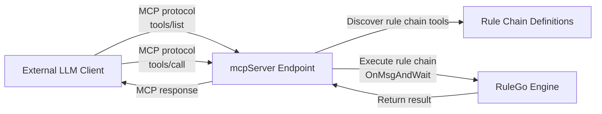

The `endpoint/mcpServer` component: <Badge text="v0.36.0+"/> an MCP (Model Context Protocol) server endpoint that exposes RuleGo rule chains as MCP tools, so external LLM clients can invoke rule chains over the MCP protocol.

The MCP server implements the MCP StreamableHTTP transport on a single HTTP endpoint supporting GET/POST/DELETE, compatible with all MCP-capable clients.

## How It Works



1. **Tool discovery**: the MCP client fetches the available tool list via `tools/list` (each Router maps to one tool)
2. **Tool invocation**: the client invokes a tool via `tools/call`; the server executes the corresponding rule chain and returns the result
3. **Automatic parameter inference**: the server parses `${msg.xxx}` variables from the rule chain to generate the tool's input schema

## Configuration

| Field | Type | Description | Default |
|------|------|------|--------|
| server | string | Listen address | `:6334` |
| certFile | string | TLS certificate file path | |
| certKeyFile | string | TLS key file path | |
| allowCors | bool | Enable cross-origin support | false |
| name | string | MCP service name (defaults to the rule chain name) | `RuleGo MCP Server` |
| version | string | MCP service version | `1.0.0` |
| basePath | string | MCP endpoint base path. Defaults to `/api/v1/rules/{ruleChain.id}/mcp` | auto-generated |

## Tool Parameter Schema Inference

When a Router does not specify `inputSchema`, the server automatically extracts `${msg.xxx}` variables from the rule chain definition to generate the tool parameters:

- If the rule chain nodes use `${msg.city}` and `${msg.unit}`, the tool parameters are `city` (string) and `unit` (string)
- If no variables are detected, the tool accepts a single `inMessage` object parameter

The schema can also be specified manually via the rule chain's `additionalInfo.inputSchema`.

## Configuration Example

### As a Rule Chain Endpoint

```json
{
  "ruleChain": {
    "id": "my-mcp-server",
    "name": "MCP Service"
  },
  "metadata": {
    "endpoints": [
      {
        "id": "e1",
        "type": "endpoint/mcpServer",
        "name": "MCP Server",
        "configuration": {
          "server": ":6334",
          "name": "My MCP Server",
          "version": "1.0.0"
        },
        "routers": [
          {
            "id": "r1",
            "from": {
              "path": "/get_weather",
              "configuration": {
                "description": "Get weather information for a given city"
              },
              "to": {
                "process": "",
                "to": "weather-chain"
              }
            }
          },
          {
            "id": "r2",
            "from": {
              "path": "/search",
              "configuration": {
                "description": "Search the knowledge base"
              },
              "to": {
                "process": "",
                "to": "search-chain"
              }
            }
          }
        ]
      }
    ],
    "nodes": [],
    "connections": []
  }
}
```

### Pairing with the MCP Client

The MCP server and client can work together for cross-process tool invocation between rule chains:

```
Rule chain A (ai/agent agent)
  → ai/mcpClient invokes a remote tool
    → HTTP request to the MCP server
      → executes rule chain B
        → returns the result
```

## Connection Pool

`MCPConnectionPool` manages multiple MCP server instances (indexed by rule chain ID), reusing connections on the same HTTP port and routing to the corresponding MCP service instance via the `id` parameter in requests.
