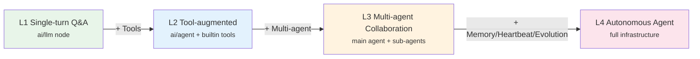
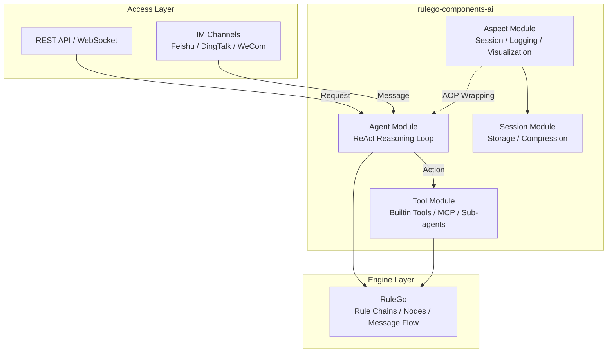

[RuleGo AI](https://github.com/rulego/rulego-components-ai) Agent Development Framework is a declarative agent development framework built on [RuleGo](https://github.com/rulego/rulego). It defines AI agents as orchestrable rule chains, combining LLM reasoning capabilities with the deterministic orchestration of a rule engine. It provides enterprise-grade features including a tool system, skill system, AOP aspects, session management, and MCP integration.

## Why RuleGo

Most AI agent frameworks require writing code to define agents. RuleGo's core differentiator: **just write JSON, changes take effect in real-time, no compilation or deployment needed.**

Take creating an agent with tools as an example:

**Eino (Go code)** — requires writing code, compilation before running:

```go
chatModel, _ := openai.NewChatModel(ctx, &openai.ChatModelConfig{
    Model: "gpt-4o", APIKey: os.Getenv("OPENAI_API_KEY"),
})
agent, _ := adk.NewChatModelAgent(ctx, &adk.ChatModelAgentConfig{
    Model: chatModel,
    ToolsConfig: adk.ToolsConfig{ToolsNodeConfig: compose.ToolsNodeConfig{
        Tools: []tool.BaseTool{weatherTool, bashTool},
    }},
})
runner := adk.NewRunner(ctx, adk.RunnerConfig{Agent: agent})
iter := runner.Query(ctx, "北京天气怎么样？")
```

Every configuration change (swap model, add tool, modify prompt) → modify code → compile → redeploy.

**RuleGo (JSON config)** — no code needed, changes take effect immediately:

```json
{
  "ruleChain": {"id": "weather-agent", "name": "Weather Assistant"},
  "metadata": {
    "firstNodeIndex": 0,
    "nodes": [
      {
        "id": "node_agent",
        "type": "ai/agent",
        "configuration": {
          "url": "https://ai.gitee.com/v1",
          "key": "${global.api_key}",
          "model": "GLM-5",
          "systemPrompt": "You are a weather assistant.",
          "tools": [
            {"type": "builtin", "name": "bash", "config": {"workDir": "/data/workspace"}}
          ]
        }
      },
      {"id": "node_end", "type": "end", "name": "End"}
    ],
    "connections": [
      {"fromId": "node_agent", "toId": "node_end", "type": "Success"},
      {"fromId": "node_agent", "toId": "node_end", "type": "Stream"}
    ]
  }
}
```

Update the JSON via API or visual editor, and the agent **immediately uses the new configuration** without restart.

### Concept Mapping

| Agent Concept | Rule Chain JSON Path | Description |
|---------------|---------------------|-------------|
| Agent | `ruleChain` | The entire rule chain is an agent |
| Agent ID | `ruleChain.id` | Unique identifier for API calls and inter-agent references |
| AI Reasoning Engine | `nodes[type=ai/agent]` | Where the ReAct loop happens |
| System Prompt | `configuration.systemPrompt` | Defines agent behavior, supports `${include()}` to load from files |
| Tool Set | `configuration.tools[]` | Capabilities the agent can invoke (builtin/mcp/agent/rulechain) |
| Model Config | `configuration.url/key/model` | Which LLM to use, supports `${global.xxx}` variables |
| Model Parameters | `configuration.params` | Tuning parameters like temperature, topP |
| Execution Result | `connections[type=Success/Stream]` | Where success/streaming output flows to |
| Error Handling | `connections[type=Failure]` | Where failures flow to |
| Multi-Agent Collaboration | `tools[type=agent]` | Sub-agents are tools; LLM decides when to call them |
| Business Logic Integration | Other nodes (jsFilter, restApiCall, etc.) | Agents interact with business systems |

> For complete field descriptions of the `ai/agent` node, see [Agent Component](../08.Components/01.Agent.md).

## Core Concepts

### Rule Chain as Agent

The framework's core design principle is **"rule chain as agent"**. Each AI agent is essentially a RuleGo rule chain, where the `ai/agent` node handles LLM reasoning and tool invocation loops. This means:

- Agents can be defined declaratively via JSON without writing Go code
- Agents can freely combine with other RuleGo nodes (JS filters, REST API calls, transformers, etc.)
- Multi-agent orchestration, pipeline processing, and conditional routing via rule chains
- Agent configurations support hot-reload and version management

### ReAct Reasoning Loop

The framework adopts the **ReAct (Reasoning + Acting)** pattern as the core execution paradigm for agents:

1. **Reasoning**: LLM analyzes the current context and decides the next action
2. **Acting**: Invokes tools to perform specific operations (read files, execute commands, call APIs, etc.)
3. **Observation**: Gets tool results as new context
4. **Loop**: Repeats the above steps until the task is complete or the maximum step count is reached

This pattern enables agents to autonomously plan tasks, select tools, and handle exceptions for complex multi-step reasoning.

## Capability Levels

The framework supports various agent forms from simple to complex. By combining different tool sets, aspects, and orchestration patterns, you can build agent systems at different capability levels:



### L1 — Single-turn Q&A

Uses the `ai/llm` node for a single LLM call without tool invocation. Suitable for simple scenarios like intent classification, content generation, and text summarization.

```json
{ "type": "ai/llm", "configuration": { "model": "GLM-5", "systemPrompt": "You are a summarization assistant." } }
```

### L2 — Tool-augmented Conversation

Uses the `ai/agent` node + builtin tools (bash/read/write/edit). The agent enters a ReAct loop, can read/write files, execute commands, and autonomously complete multi-step tasks. This is the most common agent form, suitable for coding assistants, content generation, data analysis, etc.

```json
{
  "type": "ai/agent",
  "configuration": {
    "maxStep": 50,
    "tools": [
      { "type": "builtin", "name": "bash" },
      { "type": "builtin", "name": "read" },
      { "type": "builtin", "name": "write" },
      { "type": "builtin", "name": "edit" }
    ]
  }
}
```

### L3 — Multi-agent Collaboration

Building on L2, combines multiple agents via `agent` type tools. The main agent can delegate tasks to specialized sub-agents (code review, test generation, documentation, etc.), achieving division of labor. The LLM automatically decides when to call which sub-agent based on tool descriptions.

```json
{
  "tools": [
    { "type": "agent", "targetId": "code-reviewer", "name": "code_review", "description": "Code review" },
    { "type": "agent", "targetId": "test-generator", "name": "generate_tests", "description": "Generate tests" }
  ]
}
```

### L4 — Autonomous Agent

Similar to advanced agents like Claude Code, OpenClaw, and Hermes. Built on L3 with full infrastructure:

| Capability | Framework Support | Description |
|-----------|-------------------|-------------|
| **Workspace Isolation** | workDir config | Independent working directory per agent, file-system-level isolation |
| **Session Memory** | Session module + SessionAspect | Multi-turn conversation history management, auto-compression, long-term memory |
| **Self-Evolution** | Workspace files + write/edit tools | Agent loads behavior files via `${include()}` and can modify them itself |
| **Skill Extension** | skill system | Define reusable professional capabilities via SKILL.md files; agents can learn new skills autonomously |
| **Heartbeat Scheduling** | External HeartbeatService | Periodically triggers agents to proactively execute tasks (check todos, send notifications) |
| **Multi-model Switching** | DynamicModelWrapper | Session-level dynamic LLM model switching |
| **MCP Tool Integration** | MCP adapter | Auto-discovers and loads tools from MCP Servers |
| **Real-time Visualization** | VizAspect + AG-UI protocol | Frontend real-time display of reasoning process, tool calls, and streaming output |
| **Command Interception** | Around aspect | Supports management commands like `/help`, `/model` without consuming tokens |

> For a complete L4 agent platform case study, see [Application Case Study](./08.Application Case Study.md).

## Architecture Overview



### Four Core Modules

| Module | Responsibility | Key Components |
|--------|---------------|----------------|
| **Agent** | Agent execution engine, manages ReAct loop and lifecycle | ReactAgentNode, AgentAspectExecutor, ToolAgent |
| **Tool** | Tool registration, creation, and execution; provides capabilities to agents | ToolRegistry, VisualToolWrapper, RuleGoTool, MCP adapter |
| **Aspect** | AOP cross-cutting concerns, pluggable middleware mechanism | AspectManager, SessionAspect, VizAspect, LoggingAspect |
| **Session** | Conversation state management, history storage and compression | SessionManager, SessionStorage, CompactionConfig |

## Comparison with Other Frameworks

### vs Eino (CloudWeGo)

Eino is the underlying dependency of this framework, providing LLM calls, message schemas, and basic ReAct implementation. The RuleGo agent framework adds on top of Eino:

| Capability | Eino | RuleGo Agent Framework |
|-----------|------|----------------------|
| **Agent Definition** | Go code construction | JSON declarative config with hot-reload |
| **Orchestration** | Graph/Chain/Workflow (code) | Rule chain visual orchestration + code orchestration |
| **Cross-cutting Concerns** | Fixed Callbacks (OnStart/OnEnd/OnError) | AOP aspect system with 10 extensible interfaces |
| **Session Management** | Basic Session Values | Full session lifecycle: storage, compression, pruning |
| **Tool Extension** | Go interface implementation | 8 builtin tools + MCP protocol + rule chain tools |
| **Model Management** | Build-time binding, immutable | Runtime dynamic switching, session-level model selection |
| **Frontend Visualization** | Raw AgentEvent stream | AG-UI standard protocol with builtin visualization aspect |
| **Enterprise Integration** | Self-implementation required | MCP tool protocol, IM channel integration, file storage |

In short: **Eino is an LLM interaction library; RuleGo Agent Framework is an enterprise-grade agent runtime.**

### vs LangChain / LangGraph (Python)

| Dimension | LangChain/LangGraph | RuleGo Agent Framework |
|-----------|---------------------|----------------------|
| **Language** | Python | Go |
| **Performance** | Suitable for prototyping and data processing | High concurrency, low latency, suitable for production services |
| **Definition** | Python code / LangGraph Studio | JSON rule chains, visual editor |
| **Business Integration** | Requires extra development | Native rule engine orchestration, seamless integration with business logic |
| **Deployment** | Python runtime | Single binary deployment, small resource footprint |

### vs AutoGen / CrewAI (Python)

| Dimension | AutoGen / CrewAI | RuleGo Agent Framework |
|-----------|-----------------|----------------------|
| **Multi-agent** | Code-orchestrated conversation flows | Rule chain declarative orchestration, sub-agents as tools |
| **State Management** | Depends on external storage | Builtin session management with multiple scope support |
| **Observability** | Requires third-party integration | Builtin logging, visualization, AG-UI events |

## Use Cases

- **Coding Assistants**: Agents with file read/write, command execution, and autonomous planning capabilities, similar to Claude Code, OpenClaw, Hermes
- **Enterprise AI Assistants**: Multi-channel access (Feishu/DingTalk/WeCom/API), session isolation, permission control
- **Smart Customer Service**: Knowledge base retrieval + tool calls + multi-turn conversation
- **IoT Smart Control**: Natural language intent classification → structured commands → device control API
- **Automated Workflows**: File processing, code generation, data analysis and other autonomous tasks
- **Multi-agent Collaboration**: Main agent + specialized sub-agents collaborating on complex tasks

## Related Documentation

- [Architecture Design](./01.Architecture Design.md) — Layered architecture, core modules, data flow
- [Agent Node](./02.Agent Node.md) — ReAct node concepts and advanced features
- [Agent Component](../08.Components/01.Agent.md) — Complete configuration reference for `ai/agent`
- [Tool System](./03.Tool System.md) — Tool types, builtin tools, MCP integration
- [Aspect Framework](./04.Aspect Framework.md) — AOP aspect system and custom extensions
- [Session Management](./05.Session Management.md) — Conversation state, message compression, storage extension
- [Development Guide](./06.Development Guide.md) — Complete workflow for building agent applications
- [Orchestration Examples](./07.Orchestration Examples.md) — Practical examples of combining agents with rule chain nodes
- [Application Case Study](./08.Application Case Study.md) — Complete production case of a smart assistant platform

For a ready-to-use agent platform, see [RuleGo-Server AI Features](/pages/rulego-server-ai/).
