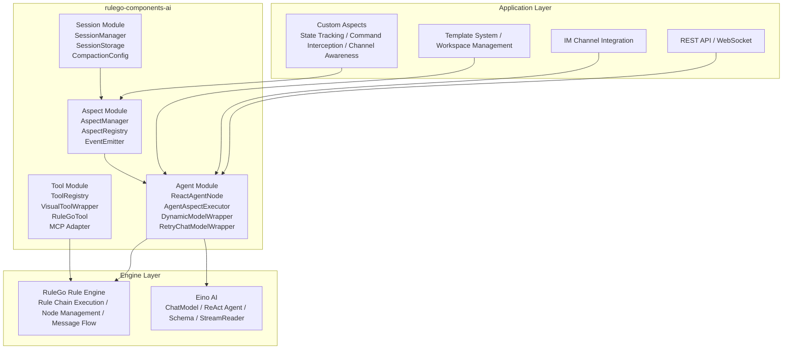
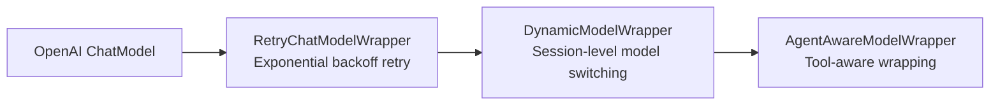
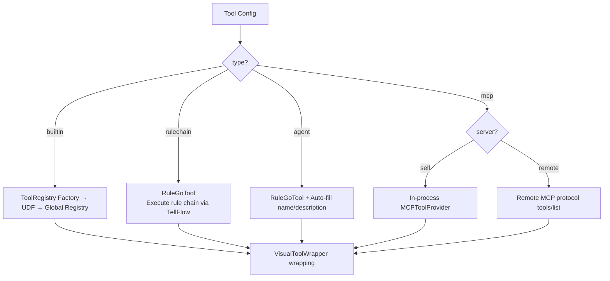
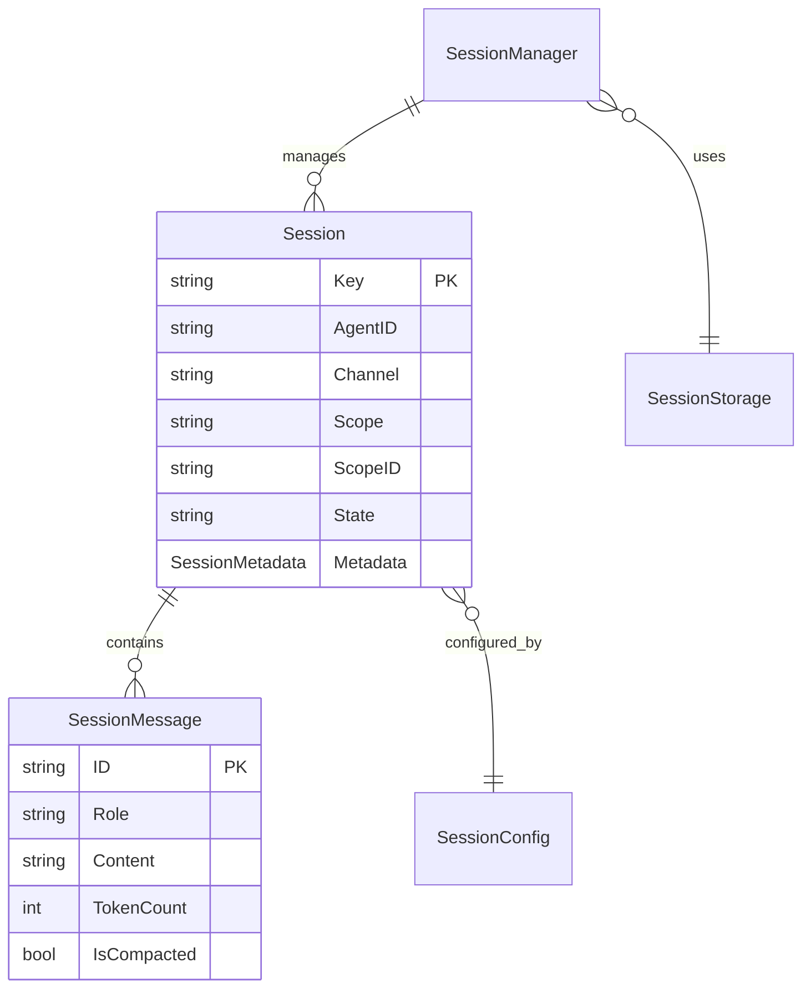
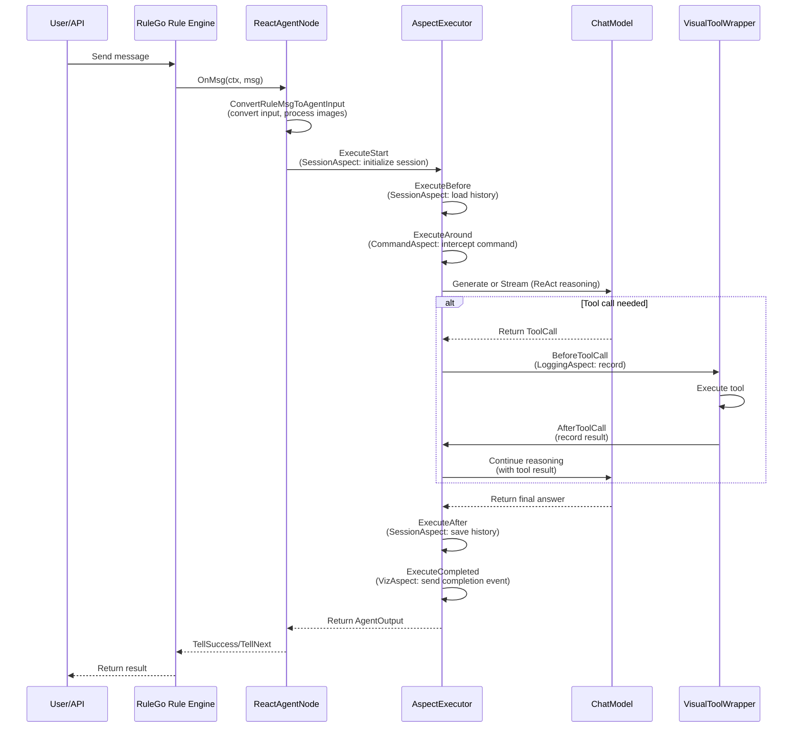

## Technology Stack Layers

The RuleGo AI agent framework adopts a three-layer architecture design:



| Layer | Responsibility | Representative Components |
|-------|---------------|--------------------------|
| **Application Layer** | Business logic, channel access, user management | Custom aspects, API routing |
| **Framework Layer** | Agent lifecycle management, tool scheduling, aspect orchestration, session management | rulego-components-ai |
| **Engine Layer** | Rule chain execution engine, LLM calls and Schema | RuleGo, Eino |

## Agent Module

The Agent module is the core of the framework, responsible for agent initialization, execution, and lifecycle management.

### ReactAgentNode

The implementation of the `ai/agent` node, registered in the RuleGo component registry. It is the agent node in the rule chain, responsible for:

1. **Initialization** (`Init`): Parse configuration → initialize templates → create ChatModel (with retry wrapping) → wrap dynamic model switching → initialize aspect executor → create tools → create ReAct Agent
2. **Message Processing** (`OnMsg`): Convert input → build execution context → build aspect input → dispatch to sync/stream execution
3. **Sync Execution** (`executeSync`): Wrapped through `AgentAspectExecutor`, executes the complete aspect lifecycle
4. **Stream Execution** (`executeStream`): Similar to sync execution, but outputs intermediate results chunk by chunk

### AgentAspectExecutor

The aspect executor bridges the agent's execution process with the aspect system. It manages the complete aspect lifecycle:

```
ExecuteSync:
  Start → Before → (merge messages) → Around → [LLM call] → After → Completed

ExecuteStream:
  Start → Before → (merge messages) → Around → [LLM stream call + OnChunk] → After → Completed
```

Message merging logic: SystemPrompt modified by aspects > Messages injected by aspects > Original messages.

### Model Decorator Chain

ChatModel is wrapped layer by layer through the decorator pattern to enhance functionality:



- **RetryChatModelWrapper**: Automatically handles 429/5xx/network errors/timeouts, exponential backoff (initial 1s, doubles, max 30s, random jitter)
- **DynamicModelWrapper**: Reads `session_model` from Context, creates a new instance when it differs from the default model, `sync.Map` cache

### ToolAgent

Wraps a single `InvokableTool` as an `adk.Agent` for simplified scenarios: extracts the last user message as tool input, calls the tool, and returns the result.

## Tool Module

### Tool Creation Factory

`CreateTools` / `CreateTool` uses different strategies to create tools based on configuration type:



### VisualToolWrapper

All tools are decorated by `VisualToolWrapper` after creation, providing unified cross-cutting capabilities:

1. Parameter validation (reject empty parameters/invalid JSON)
2. Step tracking (check `maxStep` limit)
3. Unique call ID generation
4. Execute `ToolCallBeforeAspect` aspect chain
5. Emit AG-UI events (`tool_start` / `tool_result` / `tool_error`)
6. SSE stream push
7. Record metrics (Token, duration, errors)
8. Execute `ToolCallAfterAspect` aspect chain
9. Output truncation

### MCP Adapter

Three MCP adaptation modes:

| Mode | Adapter | Features |
|------|---------|----------|
| In-process | `MCPToolAdapter` | Zero network calls, gets MCPToolProvider from RuleConfig UDF |
| Remote HTTP | `RemoteMCPToolAdapter` | Auto-discovery via MCP protocol `tools/list`, multiple adapters share client |
| Remote Stdio | `mcpTool` | Communicates with MCP service via stdin/stdout |

## Aspect Module

### AspectManager

Manages all registered aspects, categorized and stored by type, thread-safe (`sync.RWMutex`).

Aspects are sorted by `Order()` and categorized during registration. Around aspects build a chain of responsibility in reverse order (the last registered wraps the outermost layer).

### Event Emitter

The `EventEmitter` interface implements the AG-UI standard event protocol, supporting two retrieval methods:
1. From Context (request level)
2. From `EmitterRegistry` global registry (rule chain level)

### Built-in Aspects

| Aspect | Order | Implemented Interfaces | Responsibility |
|--------|-------|----------------------|----------------|
| SessionAspect | 50 | Before, After | Load/save history messages, auto-compaction |
| VizAspect | 100 | Start, Completed, StreamChunk, ToolCallBefore, ToolCallAfter | Send AG-UI visualization events |
| LoggingAspect | 200 | Start, Completed, StreamChunk, ToolCallBefore, ToolCallAfter | Record execution logs |

## Session Module

### Data Model



### Storage Backend

The framework provides `MemoryStorage` (in-memory storage) as the default implementation and supports extension through the `SessionStorage` interface:

- **MemoryStorage**: In-memory map protected by `sync.RWMutex`, deep copy to prevent concurrent modification
- **Extension**: Implement the `SessionStorage` interface to connect to Redis, SQLite, file systems, etc.

## Data Flow

The following shows a complete agent request processing flow:



## Related Documentation

- [Overview](./00.Overview.md) — Framework positioning and core concepts
- [Agent Node](./02.Agent Node.md) — ReAct node concepts and advanced features
- [Agent Component](../08.Components/01.Agent.md) — Complete configuration reference for `ai/agent`
- [Tool System](./03.Tool System.md) — Tool types, builtin tools, MCP integration
- [Aspect Framework](./04.Aspect Framework.md) — AOP aspect system and custom extensions
- [Session Management](./05.Session Management.md) — Conversation state, message compression, storage extension
- [Development Guide](./06.Development Guide.md) — Building agent applications with the framework
