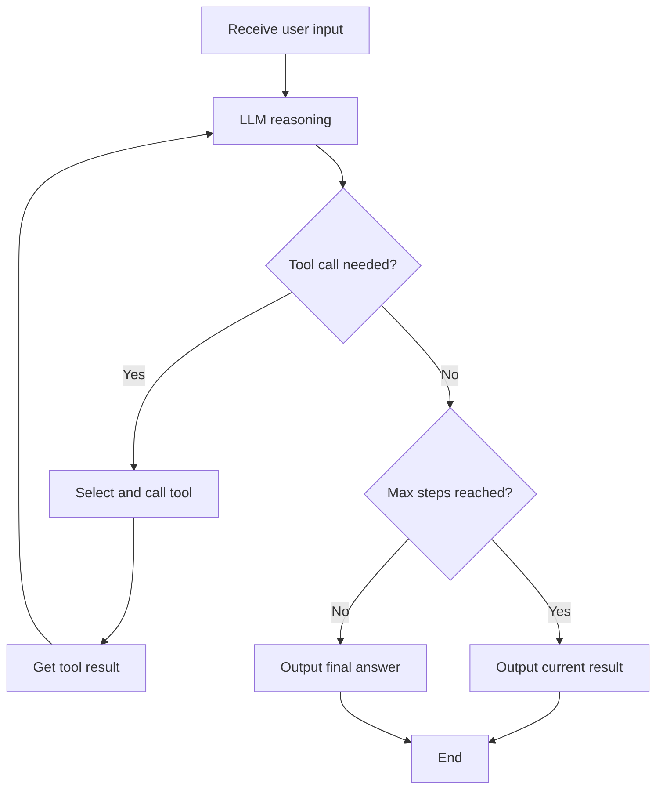

`ai/agent` is the AI agent node in the RuleGo rule chain, implemented based on the ReAct pattern. The agent autonomously completes user tasks through multi-turn reasoning and tool invocation loops.

For complete configuration fields and parameter descriptions, see [Agent Component](../08.Components/01.Agent.md).

## ReAct Loop

The core of the agent is the ReAct (Reasoning + Acting) loop: LLM analyzes context → decides to call a tool or respond directly → gets tool result → continues reasoning.



During each LLM call, the agent sends the current context (system prompt + history messages + tool call results) to the model. The model decides based on the context:

- **Direct output answer**: Task complete, loop ends
- **Call tool**: Get more information and continue reasoning

`maxStep` limits the maximum number of loop iterations to prevent infinite loops. Default is 150 steps; for simple classification tasks it can be set to 1 (single inference, no tool call loop).

## System Prompt Template

The system prompt supports RuleGo expression language for dynamic content injection:

| Expression | Description | Example |
|-----------|-------------|---------|
| `${global.xxx}` | Global variable reference | `${global.llm_url}` |
| `${include("path")}` | Include file content | `${include(global.data_dir+'/AGENTS.md')}` |
| `${fileExists("path")}` | Check if file exists | `${fileExists(global.data_dir+'/BOOTSTRAP.md')}` |
| `${now()}` | Current time | `${now()}` |
| `${ruleChain.id}` | Current rule chain ID | `${ruleChain.id}` |

By combining `${include()}` and `${fileExists()}`, you can implement conditionally loaded system prompts:

```json
"systemPrompt": "${include(global.data_dir+'/IDENTITY.md')}\n${include(global.data_dir+'/AGENTS.md')}\n${fileExists(global.data_dir+'/BOOTSTRAP.md') ? include(global.data_dir+'/BOOTSTRAP.md') : ''}\n当前时间：${now()}"
```

This mechanism allows the agent's behavior to be dynamically adjusted through external files without modifying the rule chain configuration. Combined with the `write`/`edit` tools, the agent can even modify its own behavior rule files, achieving self-evolution.

## Dynamic Model Switching

The agent supports session-level model switching. When the message Metadata contains a `session_model` field, `DynamicModelWrapper` detects the difference from the default model and automatically creates and caches the corresponding model instance:

```
Request Metadata: { "session_model": "qwen-max" }
→ Model change detected
→ Get from sync.Map cache or create new ChatModel
→ Use new model for this request
```

This means multiple users can share the same agent configuration but each use a different model.

## Relation Type

| Connection Type | Description |
|----------------|-------------|
| Success | Sync mode execution succeeded, `msg.Data` contains the complete answer |
| Stream | Stream mode, outputs intermediate results chunk by chunk (each chunk is a message) |
| Failure | Execution failed, `msg.Data` contains error information |

In stream mode, an additional `Success` type message is sent at the end (marked with `full_content=true` in Metadata), containing the complete merged content.

## Multi-node Pipeline

The agent node can be combined with JS filters, REST API call nodes, and others to build a "classify → route → execute" pipeline:

```json
{
  "ruleChain": {
    "id": "intent-router",
    "name": "Intent Router Agent"
  },
  "metadata": {
    "firstNodeIndex": 0,
    "nodes": [
      {
        "id": "node_agent",
        "type": "ai/agent",
        "name": "Intent Classification",
        "configuration": {
          "url": "${global.models.providers.default.base_url}",
          "key": "${global.models.providers.default.api_key}",
          "model": "${global.models.providers.default.model}",
          "maxStep": 1,
          "systemPrompt": "Analyze user intent, output JSON. Supported intents: createRule, deleteRule, control, chat.",
          "params": { "temperature": 0.3, "maxTokens": 1024 }
        }
      },
      {
        "id": "node_filter",
        "type": "jsFilter",
        "name": "Route Decision",
        "configuration": {
          "jsScript": "var data = JSON.parse(msg.data); return data.action !== undefined;"
        }
      },
      {
        "id": "node_api",
        "type": "restApiCall",
        "name": "Execute Command",
        "configuration": {
          "url": "http://127.0.0.1/api/v1/cmd",
          "requestMethod": "POST",
          "body": "${msg.data}"
        }
      },
      {"id": "node_end", "type": "end", "name": "End"}
    ],
    "connections": [
      {"fromId": "node_agent", "toId": "node_filter", "type": "Success"},
      {"fromId": "node_agent", "toId": "node_end", "type": "Stream"},
      {"fromId": "node_filter", "toId": "node_api", "type": "True"},
      {"fromId": "node_filter", "toId": "node_end", "type": "False"},
      {"fromId": "node_api", "toId": "node_end", "type": "Success"}
    ]
  }
}
```

## Advanced Features

### Model Retry Mechanism

Built-in exponential backoff retry, automatically handles the following errors:

| Error Type | Handling |
|-----------|----------|
| 429 rate limit | Wait for `Retry-After` or retry with exponential backoff |
| 5xx server error | Retry with exponential backoff |
| Network error | Retry with exponential backoff |
| Timeout | Retry with exponential backoff |

Parameters: Initial wait 1s, doubles each time, max 30s, random jitter to avoid thundering herd. Retry count controlled by `maxRetries` (default 3).

### Unknown Tool Call Handling

When the LLM hallucinates and calls a non-existent tool, the framework returns an error message guiding the model to use registered tools instead of interrupting execution:

```
"Error: Unknown tool 'search_web', please use registered tools."
```

### Tool Output Truncation

When a tool returns results exceeding `maxToolOutputLength` (default 50000 bytes), it is automatically truncated to prevent consuming too much context window:

```
First 50000 characters...(truncated, original: 120000 bytes)
```

## Related Documentation

- [Overview](./00.Overview.md) — Framework positioning and core concepts
- [Architecture Design](./01.Architecture Design.md) — Layered architecture and data flow details
- [Agent Component](../08.Components/01.Agent.md) — Complete configuration fields and examples
- [Tool System](./03.Tool System.md) — Tool configuration and extension
- [Aspect Framework](./04.Aspect Framework.md) — Aspect lifecycle and customization
- [Development Guide](./06.Development Guide.md) — Complete agent application development workflow
