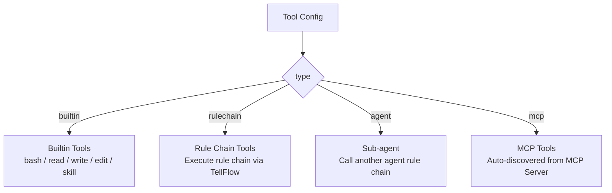

Tools are capability units that an agent can invoke. During the ReAct loop, the agent autonomously selects and calls tools based on task needs. The framework provides four tool types, where the built-in **4 primitive tools** (read, write, edit, bash) form the basic capabilities for the agent to interact with the world, and the **skill system** provides extensible domain-specific knowledge for the agent.

## Tool Types



| Type | Identifier | Description |
|------|-----------|-------------|
| Builtin tool | `builtin` | Framework pre-registered tools, supports factory-created independent instances |
| Rule chain tool | `rulechain` | Encapsulates a rule chain as a tool |
| Sub-agent | `agent` | Calls another agent as a tool (auto-fills name and description) |
| MCP tool | `mcp` | Auto-discovers and loads tools from MCP Server |

## 4 Primitive Capabilities

`read`, `write`, `edit`, and `bash` form the 4 primitive capabilities of the agent, analogous to human cognition and action systems — through these 4 tools, the agent perceives the world, creates content, iterates on itself, and interacts with the environment:

| Tool | Capability | Description | Analogy |
|------|-----------|-------------|---------|
| `read` | **Memory** | Get/read information, perceive the world | Human senses and memory |
| `write` | **Creation** | Create new content, generate knowledge | Human creativity |
| `edit` | **Evolution** | Modify/improve existing content, self-iteration | Human learning and growth |
| `bash` | **Action** | Execute commands, interact with the world | Human agency |

These 4 tools each have clear responsibility boundaries, and combined use can cover the vast majority of the agent's needs for interacting with the external world. The tool's `workDir` config is set to the agent's workspace directory, achieving file-system-level isolation.

### bash — Action

Execute Shell commands and interact with the external world. Supports pipes, chained commands, and HTTP requests.

| Config Field | Type | Description | Default |
|-------------|------|-------------|---------|
| workDir | string | Working directory | Current directory |
| timeout | int | Timeout (milliseconds) | 30000 |
| maxOutputSize | int | Maximum output size | 50000 |
| mode | string | Security mode: `allow` (whitelist) or `deny` (blacklist) | deny |
| allow | []string | Whitelist command list | |
| deny | []string | Blacklist command list | |
| denyArgs | []string | Blacklist argument pattern list | |
| shellPath | string | Shell path | Auto-detect |

Security mechanisms:
- Automatically extracts all commands from pipes (`|`) and chains (`&&`, `;`) for individual checking
- `deny` mode: Default blocks dangerous commands (e.g., `rm -rf`, `format`)
- `allow` mode: Only allows whitelisted commands
- Windows environment auto-detects Git Bash, handles UTF-8/UTF-16 encoding

### read — Memory

Get and read information, perceive the external world. Supports file content reading, keyword search, and directory structure browsing.

| Config Field | Type | Description | Default |
|-------------|------|-------------|---------|
| workDir | string | Working directory | Current directory |
| maxReadLines | int | Maximum lines per read | 1000 |
| maxSearchResults | int | Maximum search results | 30 |

Supported operations:
- `file`: Read file content, supports specifying line ranges (e.g., lines 10-50)
- `search`: Keyword search, supports glob patterns (`*.go`) and `**` recursive search
- `list`: List directory contents

### write — Creation

Create new content and generate knowledge. Supports creating new files, overwriting files, and appending content, using atomic writes to ensure data safety.

| Config Field | Type | Description | Default |
|-------------|------|-------------|---------|
| workDir | string | Working directory | Current directory |
| maxFileSize | int | Maximum single file size | |

Supported operations:
- `create`: Create new file (fails if file already exists)
- `overwrite`: Overwrite existing file (temp file + rename, atomic operation)
- `append`: Append content (auto-adds timestamp separator)

### edit — Evolution

Modify and improve existing content, achieving self-iteration. Supports precise line-level editing, search and replace, insertion, deletion, and backup recovery.

| Config Field | Type | Description | Default |
|-------------|------|-------------|---------|
| workDir | string | Working directory | Current directory |

Supported operations:
- `line`: Edit specified line content
- `search`: Search and replace (supports literal and regex)
- `insert`: Insert new content before/after matched content
- `delete`: Delete specified lines
- `restore`: Restore from backup
- `list_backups`: List available backups

Security mechanisms:
- Session-isolated backup management (each agent instance is independent)
- Regex length limit of 1000 characters to prevent ReDoS attacks
- All writes use atomic operations (temp file + rename)

## Search & Navigation Tools (grep / glob)

`grep` and `glob` are the agent's navigation tools for locating content and files in a codebase. **ripgrep-first, pure-Go fallback** (auto-degrades when `rg` is not installed, no loss of functionality):

| Tool | Capability | Description |
|------|-------------|-------------|
| `grep` | Content search | Regex search over file contents; supports context (`-A`/`-B`/`-C`), `include`/`exclude` filters, and three output modes (`content`/`files_with_matches`/`count`) |
| `glob` | Filename match | Match file paths by glob pattern (e.g. `**/*.go`), with `**` for recursive cross-level matching |

Both go through `SecurePathResolver` + allowDirs multi-root path security (allowed inside the workDir root OR any allowDir), and their output passes through unified truncation (error-aware head+tail) to prevent context overflow.

### grep Configuration

| Field | Type | Description | Default |
|----------|------|------|--------|
| workDir | string | Default search directory | Current directory |
| maxResults | int | Max matches per call (head_limit default) | |
| hardMaxLimit | int | Hard upper bound for head_limit | |

### glob Configuration

| Field | Type | Description | Default |
|----------|------|------|--------|
| workDir | string | Default match directory | Current directory |
| maxResults | int | Max files per call | |
| hardMaxLimit | int | Hard upper bound | |

## Skill System (skill)

If the 4 primitive tools are the agent's "instincts", then **skill** is the agent's "learning and expertise". The agent extends core capabilities through the skill tool, acquiring domain-specific professional knowledge, just as humans acquire professional skills through learning.

| Tool | Capability | Description | Analogy |
|------|-----------|-------------|---------|
| `skill` | **Learning/Expertise** | Call predefined skills, acquire domain-specific professional capabilities | Human professional skill training |

### Skill Configuration

| Config Field | Type | Description | Default |
|-------------|------|-------------|---------|
| globalDirs | []string | Global skill directory list (shared by all agents) | |
| localDirs | []string | Local skill directory list (exclusive to current agent) | |
| useChinese | bool | Use Chinese descriptions | false |

Skill files use the `SKILL.md` format (Markdown + YAML frontmatter). During search, files are found by directory priority, cached based on file fingerprint (FNV hash), and support hot updates.

Skills are divided into two levels:
- **Global skills** (`globalDirs`): Common capabilities shared by all agents
- **Local skills** (`localDirs`): Professional capabilities exclusive to the current agent

The agent can also create new SKILL.md files in the workspace's `skills/` directory via the `write` tool, achieving **autonomous learning of new skills**.

## Other Builtin Tools

### browser_use — Browser Automation

Control Chrome/Chromium browser to perform web operations (requires additional browser driver installation).

## MCP Tools

MCP (Model Context Protocol) tools auto-discover and load tools from MCP servers.

### In-process Mode (self)

```json
{
  "type": "mcp",
  "config": {
    "server": "self",
    "tools": ["tool_a", "tool_b"]
  }
}
```

Gets MCPToolProvider from RuleConfig UDF, zero network calls, directly uses MCP tools registered in the current process. When `tools` field is empty or omitted, all tools are loaded.

### Remote Mode

```json
{
  "type": "mcp",
  "config": {
    "server": "http://localhost:8080/mcp",
    "tools": ["search", "lookup"]
  }
}
```

Auto-discovers tools on the remote server via MCP protocol's `tools/list`. Supports both HTTP and stdio transport modes. Multiple tool adapters share the same MCP client connection (lazy initialization, thread-safe).

For complete configuration reference of MCP-related components, see [MCP Client](../08.Components/21.MCP Client.md), [MCP Server](../08.Components/22.MCP Server.md).

## Rule Chain Tools

Encapsulate a RuleGo rule chain as a tool:

```json
{
  "type": "rulechain",
  "name": "send_email",
  "description": "Send email to specified recipient",
  "targetId": "email-sender-chain",
  "parameters": "{\"type\":\"object\",\"properties\":{\"to\":{\"type\":\"string\"},\"subject\":{\"type\":\"string\"},\"body\":{\"type\":\"string\"}}}",
  "timeout": 30000
}
```

| Field | Type | Description |
|-------|------|-------------|
| type | string | `"rulechain"` |
| name | string | Tool name |
| description | string | Tool description (LLM decides when to call based on this) |
| targetId | string | Target rule chain ID |
| parameters | string | JSON Schema for tool parameters |
| timeout | int64 | Timeout (milliseconds), default 120000 |

The tool's input is passed to the target rule chain through `msg.Data`, and the output result is retrieved from `msg.Data`.

## Sub-agent Tools

The `agent` type is a semantic alias for `rulechain`; the framework auto-fills name, description, and parameters from the target rule chain:

```json
{
  "type": "agent",
  "targetId": "code-reviewer"
}
```

| Field | Type | Description |
|-------|------|-------------|
| type | string | `"agent"` |
| targetId | string | Target agent (rule chain) ID |
| name | string | Tool name (optional, auto-fetched from rule chain name) |
| description | string | Tool description (optional, auto-fetched from `additionalInfo.description`) |
| parameters | string | Parameter JSON Schema (optional, auto-generates OpenAI message format) |

## Post-Write Diagnostics (Extension Hook)

After `write`/`edit` successfully save a file, they can automatically run diagnostics on it (e.g. `go vet`, LSP) and feed **ERROR-level** issues back to the agent, so it notices compile/type errors and self-repairs. This is an **opt-in** hook — no provider registered means no run, zero overhead.

### DiagnosticProvider Interface

Register providers by file extension. The framework ships `GoVetProvider` (`.go` → `go vet`):

```go
// tool/common/diagnostic.go
type DiagnosticProvider interface {
    Report(filePath string) ([]Diagnostic, error) // run diagnostics, return issues
    Supports(filePath string) bool                // does it handle this file type?
}

type Diagnostic struct {
    Severity int    // 1=Error (only Error is fed back) / 2=Warning / 3=Info / 4=Hint
    Line, Col int
    Message   string
}
```

### Register to Enable

Register at application startup (one line):

```go
import "github.com/rulego/rulego-components-ai/tool/common"

// use the built-in go vet provider
common.RegisterDiagnosticProvider(".go", &common.GoVetProvider{})

// or a custom one (e.g. .ts → tsserver, .py → pyright)
common.RegisterDiagnosticProvider(".ts", &myTsserverProvider{})
```

### Custom Provider

Implement two methods:

```go
type myTsserverProvider struct{}

func (p *myTsserverProvider) Supports(filePath string) bool {
    return strings.ToLower(filepath.Ext(filePath)) == ".ts"
}

func (p *myTsserverProvider) Report(filePath string) ([]common.Diagnostic, error) {
    return runTsserver(filePath) // call your diagnostic tool, return Diagnostic list
}
```

### Use Cases

| Scenario | Description |
|----------|-------------|
| Code self-repair | See compile/type errors right after writing; fix in the next turn instead of discovering them at runtime |
| Multi-language | `.go`→go vet, `.ts`→tsserver, `.py`→pyright — register a provider per extension |
| Non-invasive | Off by default; projects that don't register see unchanged write/edit behavior |

### Safety & Performance

`GoVetProvider` has three guards:

- Skips non-`.go` files
- Skips if `go` is not installed (`exec.LookPath` pre-check, no process spawn)
- 10s timeout (`context.WithTimeout`) prevents vet from hanging the tool

Diagnostics run **synchronously** (write/edit wait for them to finish), typically a few hundred ms per file; zero overhead when disabled.

## VisualToolWrapper

All tools are decorated by `VisualToolWrapper` at creation time, providing unified enhanced capabilities:


| Enhancement | Description |
|------------|-------------|
| Parameter validation | Reject empty parameters or invalid JSON |
| Step tracking | Check if `maxStep` limit is exceeded |
| Aspect notification | Execute `ToolCallBeforeAspect` and `ToolCallAfterAspect` |
| AG-UI events | Send `tool_start` / `tool_args` / `tool_end` / `tool_result` events |
| SSE push | Push tool call status in stream mode |
| Metrics collection | Record Token usage, duration, errors |
| Output truncation | Auto-truncate when exceeding `maxToolOutputLength` |

## Tool Registry

### ToolRegistry

Global tool registry, manages registration and lookup of builtin tools:

| Method | Description |
|--------|-------------|
| `Register(name, tool)` | Register tool shared instance |
| `Get(name)` | Get tool instance |
| `GetDef(name)` | Get tool definition (with factory function) |
| `RegisterTool[T](name, desc, factory)` | Generic registration helper |

### Custom Tools

Register custom tools through `ToolRegistry`:

```go
// Method 1: Register shared instance (for stateless tools)
tool.Registry.Register("my_tool", &MyTool{})

// Method 2: Register via factory (creates independent instance per config, recommended)
tool.Registry.RegisterDef(tool.ToolDefinition{
    Name: "my_tool",
    Desc: "Custom tool description",
    Factory: func(config map[string]interface{}) (tool.BaseTool, error) {
        return &MyTool{Config: config}, nil
    },
})
```

## Complete Tool Configuration Example

### Tool Array Structure

```json
{
  "tools": [
    {
      "type": "builtin",
      "name": "bash",
      "config": {
        "workDir": "${global.root_dir}/workspace-main",
        "timeout": 60000,
        "mode": "deny",
        "deny": ["rm -rf", "format", "del /s"]
      }
    },
    {
      "type": "builtin",
      "name": "read",
      "config": {
        "workDir": "${global.root_dir}/workspace-main",
        "maxReadLines": 500
      }
    },
    {
      "type": "builtin",
      "name": "write",
      "config": {
        "workDir": "${global.root_dir}/workspace-main"
      }
    },
    {
      "type": "builtin",
      "name": "edit",
      "config": {
        "workDir": "${global.root_dir}/workspace-main"
      }
    },
    {
      "type": "builtin",
      "name": "skill",
      "config": {
        "globalDirs": ["${global.root_dir}/skills"],
        "localDirs": ["${global.root_dir}/workspace-main/skills"],
        "useChinese": true
      }
    },
    {
      "type": "mcp",
      "config": {
        "server": "self",
        "tools": ["list_rule_chains", "get_rule_chain", "save_rule_chain"]
      }
    },
    {
      "type": "agent",
      "targetId": "code-reviewer"
    }
  ]
}
```

### Agent Rule Chain Configuration Example

In the agent rule chain JSON, the `tools` array is located within the `configuration` field of the `ai/agent` node:

```json
{
  "ruleChain": {
    "id": "my-agent",
    "name": "My Agent",
    "debugMode": false,
    "root": false,
    "disabled": false,
    "additionalInfo": {
      "description": "An agent with file operations and command execution capabilities"
    }
  },
  "metadata": {
    "firstNodeIndex": 0,
    "nodes": [
      {
        "id": "node_agent",
        "type": "ai/agent",
        "name": "Agent",
        "configuration": {
          "url": "https://api.openai.com/v1",
          "key": "${global.api_key}",
          "model": "gpt-4o",
          "maxStep": 25,
          "maxToolOutputLength": 50000,
          "systemPrompt": "You are a helpful assistant...",
          "tools": [
            {
              "type": "builtin",
              "name": "read",
              "config": {
                "workDir": "/home/user/workspace",
                "maxReadLines": 500
              }
            },
            {
              "type": "builtin",
              "name": "write",
              "config": {
                "workDir": "/home/user/workspace"
              }
            },
            {
              "type": "builtin",
              "name": "edit",
              "config": {
                "workDir": "/home/user/workspace"
              }
            },
            {
              "type": "builtin",
              "name": "bash",
              "config": {
                "workDir": "/home/user/workspace",
                "timeout": 60000,
                "mode": "deny",
                "deny": ["rm -rf", "format"]
              }
            },
            {
              "type": "builtin",
              "name": "skill",
              "config": {
                "globalDirs": ["/home/user/skills"],
                "localDirs": ["/home/user/workspace/skills"],
                "useChinese": true
              }
            },
            {
              "type": "mcp",
              "config": {
                "server": "self",
                "tools": ["list_rule_chains", "get_rule_chain", "save_rule_chain"]
              }
            }
          ]
        }
      },
      {
        "id": "node_end",
        "type": "end",
        "name": "End"
      }
    ],
    "connections": [
      {
        "fromId": "node_agent",
        "toId": "node_end",
        "type": "Success"
      }
    ]
  }
}
```

## Related Documentation

- [Overview](./00.Overview.md) — Framework positioning and core concepts
- [Agent Node](./02.Agent Node.md) — ReAct node concepts and advanced features
- [Agent Component](../08.Components/01.Agent.md) — Complete configuration reference for `ai/agent`
- [Aspect Framework](./04.Aspect Framework.md) — Tool call aspect interception
- [Development Guide](./06.Development Guide.md) — Custom tool development in practice
