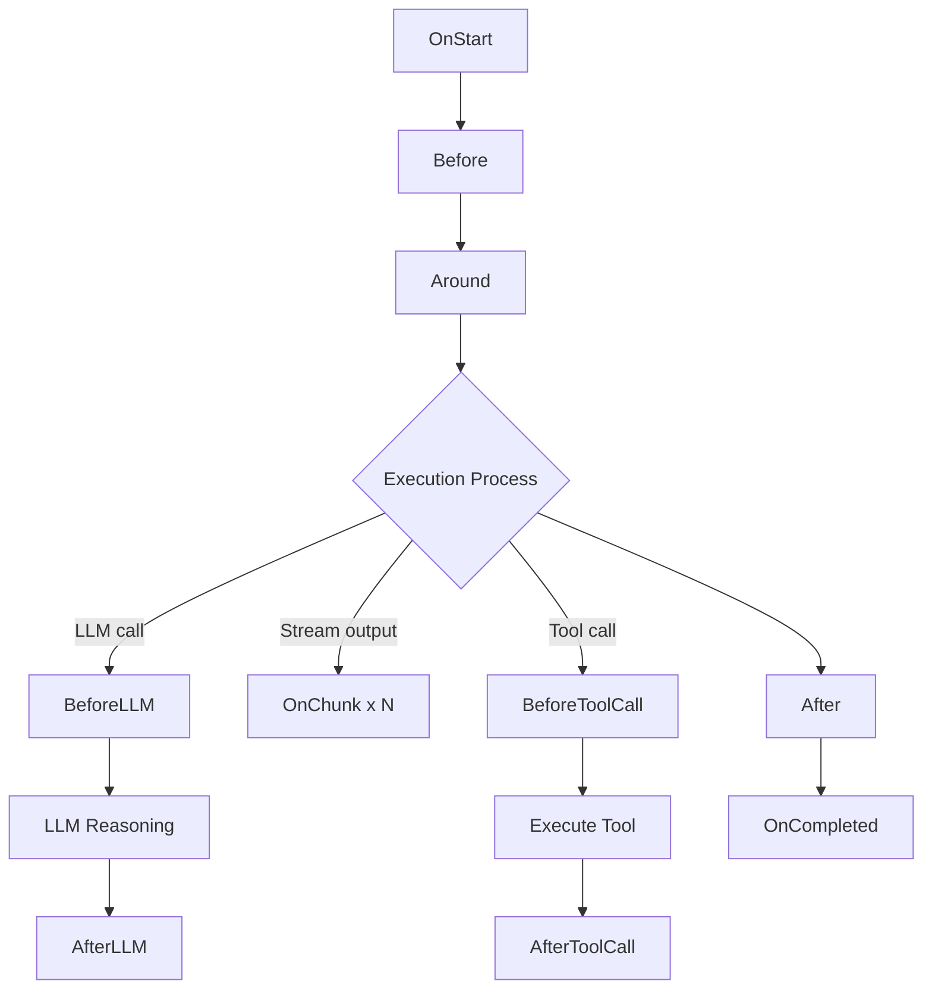
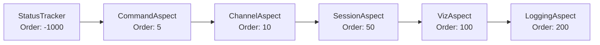

The aspect framework is based on AOP (Aspect-Oriented Programming) principles, providing a pluggable middleware mechanism for AI agents. Through aspects, you can add cross-cutting concerns such as session management, logging, visualization, and access control without modifying the agent's core logic.

## Purpose of Aspects

Aspects solve the **cross-cutting concerns** problem in agent development — those general capabilities that span all agents but are unrelated to business logic:

| Concern | Without Aspects | With Aspects |
|----------|----------|--------|
| Conversation history management | Every agent writes load/save logic | SessionAspect handles it uniformly |
| Execution logging | Scattered log statements in agent code | LoggingAspect collects uniformly |
| Frontend visualization | Manually sending events during agent output | VizAspect automatically pushes AG-UI events |
| Command interception | Modifying input processing logic | Around aspect intercepts, returns `SkippedAI` |
| Status tracking | Manual marking at each call point | Start/Completed aspects track automatically |
| Channel awareness | Agents perceive IM platform differences | Before aspect injects channel context |
| Access control | Validation before every tool call | ToolCallBefore aspect intercepts uniformly |

**Core value**: Aspects keep agents focused on pure reasoning and tool invocation logic. All "infrastructure" code is injected through aspects, achieving separation of concerns.

## Comparison with Other Systems

If you've used Claude Code's Hooks or Web framework middleware, the concept of aspects is not unfamiliar — they all insert custom logic at specific execution points. But RuleGo aspects cover finer interception points and offer stronger control:

### vs Claude Code Hooks

| Dimension | Claude Code Hooks | RuleGo Aspects |
|------|-------------------|-------------|
| **Interception points** | Fixed 3 (PreToolUse, PostToolUse, Notification) | 10 interfaces covering the complete lifecycle |
| **Interception capability** | Can only allow or deny | Around aspects can fully replace execution, cache, retry, skip LLM |
| **Context access** | Tool name and parameters | Input messages, system prompts, history, output results, Token usage |
| **Composition** | Independent triggers, no mutual influence | Sorted by Order, Around forms nested chain of responsibility |
| **Modification ability** | Cannot modify input/output | Before can modify system prompts, Around can replace return values |
| **Typical usage** | Security approval, log notifications | Session management, visualization, command interception, channel awareness, access control, auditing |

In short: **Hooks are "gatekeepers" (allow/deny), aspects are "middleware chains" (read, modify, intercept, replace — all possible).**

### vs Web Middleware

| Dimension | Gin/Echo Middleware | RuleGo Aspects |
|------|----------------|-------------|
| **Target** | HTTP requests | Agent execution process |
| **Nesting** | `c.Next()` calls the next | `next(ctx, input)` calls the next aspect or core logic |
| **Interception points** | Before/after request | 10 lifecycle nodes |
| **Typical patterns** | Auth, logging, CORS | Session, visualization, command interception |

If you've written Gin's `c.Next()` middleware, then `AgentAroundAspect`'s `next()` is the same pattern — the aspect wraps around the core logic and can decide whether to call it and how to modify input/output.

## Execution Lifecycle



### 10 Aspect Interfaces

| Phase | Aspect Interface | Timing | Typical Usage |
|------|----------|------|----------|
| 1 | `AgentStartAspect` | Before agent starts processing | Status tracking, session initialization, sending start events |
| 2 | `AgentBeforeAspect` | Before main execution logic | Loading history messages, injecting channel context |
| 3 | `AgentAroundAspect` | Wraps the entire execution process | Command interception, timeout control, retry, caching |
| 4 | `MessageBeforeAspect` | Before each LLM call | Injecting dynamic messages, pruning context |
| 5 | `MessageAfterAspect` | After each LLM call | Filtering sensitive content, modifying responses |
| 6 | `StreamChunkAspect` | Each streaming output chunk | Real-time visualization, character-by-character logging |
| 7 | `ToolCallBeforeAspect` | Before tool call | Parameter validation, permission interception, logging |
| 8 | `ToolCallAfterAspect` | After tool call | Logging, metrics collection |
| 9 | `AgentAfterAspect` | After main execution logic | Saving history messages, processing output |
| 10 | `AgentCompletedAspect` | After processing completes (success or failure) | Metrics statistics, state cleanup |

## Built-in Aspects

The framework provides three built-in aspects covering the most common cross-cutting concerns. They are registered globally through `AspectRegistry` and automatically applied to all agents.

### SessionAspect — Session Management

- **Order**: 50 (executes in Before/After phase)
- **Implemented interfaces**: `AgentBeforeAspect`, `AgentAfterAspect`
- **Constructor**: `NewSessionAspect(sessionMgr, defaultScope, logger)`
- **PointCut**: `sessionMgr != nil` (only effective when SessionManager is configured)

**Before phase** — loading conversation history:

1. Generate session Key based on AgentId + Channel + Scope + ScopeID + UserID
2. Call `SessionManager.GetOrCreate()` to get or create a session
3. Load history messages from session, convert to `schema.Message` format
4. Filter tool calls in history (keep the most recent N entries to avoid overly long context)
5. Trigger automatic compression when message count >= 10 and Token count >= 100,000
6. Convert local image paths in the most recent 4 history messages to base64
7. Pre-save current user message to session

**After phase** — saving conversation results:

1. Save assistant reply message to session
2. Save tool call messages (filter invalid empty-parameter calls)
3. Estimate Token count (Chinese-English mixed-aware algorithm)
4. Update session statistics (message count, total Token count)
5. Correct estimates when the model returns accurate Token usage

**Registration**:

```go
import (
    agentaspect "github.com/rulego/rulego-components-ai/aspect"
    agentsession "github.com/rulego/rulego-components-ai/session"
    "github.com/rulego/rulego-components-ai/aspect/builtin"
)

// Create session manager
sessionManager := agentsession.NewManager(
    agentsession.NewMemoryStorage(),
    &agentsession.SessionConfig{
        MaxMessages:   100,
        MaxTokenCount: 128000,
    },
)

// Register session aspect
agentaspect.RegisterAspect("session", builtin.NewSessionAspect(
    sessionManager,
    agentsession.ScopePerPeer, // default scope
    logger,
))
```

### VizAspect — Visualization Events

- **Order**: 100
- **Implemented interfaces**: `AgentStartAspect`, `AgentCompletedAspect`, `StreamChunkAspect`, `ToolCallBeforeAspect`, `ToolCallAfterAspect`
- **Constructor**: `NewVizAspect()`
- **PointCut**: Checks if `EventEmitter` exists in Context or global registry

Sends AG-UI standard events for real-time frontend display of the agent's execution process:

| Lifecycle | Sent Event | Event Content |
|----------|-----------|----------|
| OnStart | `RUN_STARTED` | Agent ID, name, type |
| OnStart | `TEXT_MESSAGE_START/CONTENT/END` | Echo user input message |
| StreamChunk | `TEXT_MESSAGE_START` -> `TEXT_MESSAGE_CONTENT` -> ... | Chunk-by-chunk output of assistant reply |
| ToolCallBefore | `TOOL_CALL_START` + `TOOL_CALL_ARGS` | Tool name, type, parameters |
| ToolCallAfter | `TOOL_CALL_RESULT` | Tool execution result |
| OnCompleted | `RUN_FINISHED` | Duration, Token usage, completion status |
| OnCompleted | `RUN_ERROR` (on failure) | Error message |

**Registration**:

```go
// Register visualization aspect (usually no manual registration needed, framework auto-registers)
agentaspect.RegisterAspect("viz", builtin.NewVizAspect())

// Register event emitter for a specific rule chain (push events to frontend channels like WebSocket)
agentaspect.GetGlobalEmitterRegistry().RegisterEmitter("my-agent", myWebSocketEmitter)
```

### LoggingAspect — Execution Logging

- **Order**: 200 (executes last, ensuring complete information is recorded)
- **Implemented interfaces**: `AgentStartAspect`, `AgentCompletedAspect`, `StreamChunkAspect`, `ToolCallBeforeAspect`, `ToolCallAfterAspect`
- **Constructor**: `NewLoggingAspect(logger)`
- **PointCut**: `logger != nil`

Uses `Debugf` level to record the complete lifecycle of agent execution:

| Phase | Recorded Content |
|------|----------|
| OnStart | Agent name, type, thread ID, user ID, message count |
| ToolCallBefore | Tool name, call ID, parameters (truncated to 200 characters) |
| ToolCallAfter | Tool name, call ID, duration, result (truncated to 200 characters) |
| StreamChunk | Only tool call chunks and error chunks (skip content chunks to avoid flooding) |
| OnCompleted | Success/failure, total duration (ms), Token usage (prompt/completion/total), tool call details |

**Registration**:

```go
agentaspect.RegisterAspect("logging", builtin.NewLoggingAspect(logger))
```

### Built-in Aspect Execution Order

All aspects execute in ascending order of their `Order` value:



> StatusTracker, CommandAspect, and ChannelAspect are examples of application-layer custom aspects. SessionAspect, VizAspect, and LoggingAspect are framework built-in aspects.

## Custom Aspect Development

### Development Steps

1. **Choose aspect interface**: Select the appropriate interface based on your interception timing
2. **Implement base methods**: `Order()`, `New()`, `PointCut()`
3. **Implement business methods**: Methods corresponding to the aspect interface
4. **Register aspect**: Register through `AspectRegistry` at application startup

### Base Method Reference

```go
// Order() returns execution priority; lower values execute first
// Recommendation: framework built-in aspects use 50-200, application-layer aspects use negative numbers or values less than 50
func (a *MyAspect) Order() int { return 10 }

// New() creates an independent aspect instance for each agent (avoid shared state)
// If the aspect itself is stateless, it can return itself
func (a *MyAspect) New() aspect.Aspect { return &MyAspect{} }

// PointCut() determines at runtime whether to apply this aspect
// return true applies to all agents
// You can also selectively apply based on conditions like AgentId, MessageType, etc.
func (a *MyAspect) PointCut(ctx context.Context, point *aspect.AgentPoint) bool {
    return true
}
```

### Example 1: Status Tracking Aspect (Start + Completed)

Track whether an agent is currently executing, for heartbeat scheduling decisions:

```go
package aspect

import (
    "context"
    "sync"
    agentaspect "github.com/rulego/rulego-components-ai/aspect"
)

type AgentStatusTracker struct {
    busyMap sync.Map // agentId -> bool
}

func NewAgentStatusTracker() *AgentStatusTracker {
    return &AgentStatusTracker{}
}

// Order set to -1000, ensures first execution, marking status before any other aspect
func (a *AgentStatusTracker) Order() int { return -1000 }

// New returns itself (shared state is intentional, all agents share the same tracker)
func (a *AgentStatusTracker) New() agentaspect.Aspect { return a }

func (a *AgentStatusTracker) PointCut(ctx context.Context, point *agentaspect.AgentPoint) bool {
    return true
}

func (a *AgentStatusTracker) OnStart(ctx context.Context, point *agentaspect.AgentPoint, input *agentaspect.AgentInput) (*agentaspect.AgentInput, error) {
    a.busyMap.Store(point.AgentId, true)
    return input, nil
}

func (a *AgentStatusTracker) OnCompleted(ctx context.Context, point *agentaspect.AgentPoint, output *agentaspect.AgentOutput) {
    a.busyMap.Delete(point.AgentId)
}

func (a *AgentStatusTracker) IsBusy(agentId string) bool {
    _, ok := a.busyMap.Load(agentId)
    return ok
}
```

**Usage**: Heartbeat service calls `tracker.IsBusy(agentId)` to determine if an agent is idle, avoiding triggering heartbeat tasks during execution.

### Example 2: Command Interception Aspect (Around)

Intercept messages starting with `/` and handle them directly without going through LLM:

```go
package aspect

import (
    "context"
    "strings"
    agentaspect "github.com/rulego/rulego-components-ai/aspect"
)

type CommandAspect struct{}

func (c *CommandAspect) Order() int { return 5 }

func (c *CommandAspect) New() agentaspect.Aspect { return &CommandAspect{} }

func (c *CommandAspect) PointCut(ctx context.Context, point *agentaspect.AgentPoint) bool {
    // Only effective for IM channels and API
    channel := point.Metadata["im.channel"]
    platform := point.Metadata["im.platform"]
    return channel != "" || platform != "" || point.Metadata["sourceType"] == "api"
}

func (c *CommandAspect) Around(ctx context.Context, point *agentaspect.AgentPoint,
    input *agentaspect.AgentInput, next agentaspect.AgentExecutor) (*agentaspect.AgentOutput, error) {

    // Get the last user message
    if len(input.OriginalMessages) == 0 {
        return next(ctx, input)
    }
    lastMsg := input.OriginalMessages[len(input.OriginalMessages)-1]
    content, _ := lastMsg.Content.(string)

    if !strings.HasPrefix(content, "/") {
        return next(ctx, input) // Not a command, continue normal flow
    }

    // Parse and execute command
    parts := strings.SplitN(content, " ", 2)
    cmd := parts[0]
    args := ""
    if len(parts) > 1 {
        args = parts[1]
    }

    result := handleCommand(cmd, args)

    // Return result, SkippedAI=true means skip LLM call
    return &agentaspect.AgentOutput{
        Content:   result,
        SkippedAI: true,
        IsSuccess: true,
    }, nil
}
```

**Usage**: Supports management commands like `/help`, `/new`, `/model`, `/status` that return results directly without consuming LLM Tokens.

### Example 3: Channel Awareness Aspect (Before)

Inject different context prompts based on message source (IM channel, API, heartbeat):

```go
package aspect

import (
    "context"
    agentaspect "github.com/rulego/rulego-components-ai/aspect"
)

type ChannelAspect struct{}

func (c *ChannelAspect) Order() int { return 10 }

func (c *ChannelAspect) New() agentaspect.Aspect { return &ChannelAspect{} }

func (c *ChannelAspect) PointCut(ctx context.Context, point *agentaspect.AgentPoint) bool {
    return true
}

func (c *ChannelAspect) Before(ctx context.Context, point *agentaspect.AgentPoint, input *agentaspect.AgentInput) (*agentaspect.AgentInput, error) {
    sourceType := point.Metadata["sourceType"]
    chatType := point.Metadata["chatType"]

    switch sourceType {
    case "im":
        // IM channel: inject chat mode prompt
        if chatType == "group" {
            input.SystemPrompt += "\n\n[Note] Currently in group chat mode, please be mindful of privacy protection."
        } else {
            input.SystemPrompt += "\n\nCurrently in private chat mode."
        }
    case "heartbeat":
        // Heartbeat trigger: inject list of recently active channels so agent can proactively contact users
        input.SystemPrompt += "\n\nRecently active channels: " + getRecentChannels(point.AgentId)
    case "api":
        input.SystemPrompt += "\n\nCurrently interacting via API interface."
    }
    return input, nil
}
```

**Usage**: Enables the same agent to exhibit different behaviors in different scenarios — privacy awareness in group chats, proactive user outreach during heartbeats.

### Example 4: Tool Permission Control Aspect (ToolCallBefore + ToolCallAfter)

Control calling permissions for specific tools:

```go
package aspect

import (
    "context"
    "fmt"
    agentaspect "github.com/rulego/rulego-components-ai/aspect"
)

type ToolPermissionAspect struct {
    allowedTools map[string]bool // agentId -> whether has full permissions
}

func (t *ToolPermissionAspect) Order() int { return 0 }

func (t *ToolPermissionAspect) New() agentaspect.Aspect { return t }

func (t *ToolPermissionAspect) PointCut(ctx context.Context, point *agentaspect.AgentPoint) bool {
    return true
}

// BeforeToolCall checks permissions before tool call
// Returning error can block tool execution
func (t *ToolPermissionAspect) BeforeToolCall(ctx context.Context, point *agentaspect.AgentPoint,
    call *agentaspect.ToolCallInfo) (*agentaspect.ToolCallInfo, error) {

    if !t.allowedTools[point.AgentId] {
        // Unauthorized agent cannot use bash tool
        if call.Name == "bash" {
            return nil, fmt.Errorf("insufficient permissions: agent %s is not authorized to use the bash tool", point.AgentId)
        }
    }
    return call, nil
}

func (t *ToolPermissionAspect) AfterToolCall(ctx context.Context, point *agentaspect.AgentPoint,
    call *agentaspect.ToolCallInfo, result *agentaspect.ToolCallResult) error {
    // Record tool call audit log
    auditLog.Printf("agent=%s tool=%s success=%v", point.AgentId, call.Name, result.Error == nil)
    return nil
}
```

**Usage**: Implement tool permission isolation in multi-tenant scenarios, audit tool call behavior.

### Register Custom Aspects

```go
import agentaspect "github.com/rulego/rulego-components-ai/aspect"

// Register at application startup
tracker := NewAgentStatusTracker()
agentaspect.RegisterAspect("status_tracker", tracker)

agentaspect.RegisterAspect("command", &CommandAspect{})
agentaspect.RegisterAspect("channel", &ChannelAspect{})
agentaspect.RegisterAspect("tool_permission", &ToolPermissionAspect{})

// Unregister
agentaspect.UnregisterAspect("tool_permission")
```

## Aspect Interface Reference

### AgentStartAspect / AgentCompletedAspect

```go
type AgentStartAspect interface {
    Aspect
    PointCut
    OnStart(ctx context.Context, point *AgentPoint, input *AgentInput) (*AgentInput, error)
}

type AgentCompletedAspect interface {
    Aspect
    PointCut
    OnCompleted(ctx context.Context, point *AgentPoint, output *AgentOutput)
}
```

- `OnStart`: Before all processing. Returns modified `input` and `error` (non-nil terminates execution). Used for initialization, sending start events, status tracking.
- `OnCompleted`: After all processing (regardless of success or failure). Used for metrics statistics, state cleanup.

### AgentBeforeAspect / AgentAfterAspect

```go
type AgentBeforeAspect interface {
    Aspect
    PointCut
    Before(ctx context.Context, point *AgentPoint, input *AgentInput) (*AgentInput, error)
}

type AgentAfterAspect interface {
    Aspect
    PointCut
    After(ctx context.Context, point *AgentPoint, output *AgentOutput) (*AgentOutput, error)
}
```

- `Before`: Before main execution. Returns modified `input` and `error` (non-nil terminates execution). Can modify `input.SystemPrompt`, `input.Messages`.
- `After`: After main execution. Returns modified `output`. Can read `output.Content`, `output.ToolCalls`.

### AgentAroundAspect

```go
type AgentAroundAspect interface {
    Aspect
    PointCut
    Around(ctx context.Context, point *AgentPoint, input *AgentInput,
           next AgentExecutor) (*AgentOutput, error)
}
```

Wraps the entire execution process. Calls the next executor through the `next` parameter:

| Usage | Implementation |
|------|----------|
| Command interception | Match specific input, don't call `next`, return `SkippedAI: true` |
| Timeout control | Call `next` in goroutine, `select` + `timer` |
| Retry | Loop calling `next` until success |
| Cache | Check cache hit then skip `next` |

Around aspects nest in reverse registration order, forming a chain of responsibility (the last registered wraps the outermost layer).

### MessageBeforeAspect / MessageAfterAspect

```go
type MessageBeforeAspect interface {
    Aspect
    PointCut
    BeforeLLM(ctx context.Context, point *AgentPoint,
              messages []*schema.Message) ([]*schema.Message, error)
}

type MessageAfterAspect interface {
    Aspect
    PointCut
    AfterLLM(ctx context.Context, point *AgentPoint,
             response *schema.Message) (*schema.Message, error)
}
```

- `BeforeLLM`: Before each LLM call. Returns modified message list and `error` (non-nil terminates execution).
- `AfterLLM`: After each LLM call. Returns modified response and `error`.

### StreamChunkAspect

```go
type StreamChunkAspect interface {
    Aspect
    PointCut
    OnChunk(ctx context.Context, point *AgentPoint, chunk *StreamChunk) error
}
```

Triggered for each output chunk during streaming output. Returning `error` can terminate the stream. Used for real-time visualization.

### ToolCallBeforeAspect / ToolCallAfterAspect

```go
type ToolCallBeforeAspect interface {
    Aspect
    PointCut
    BeforeToolCall(ctx context.Context, point *AgentPoint,
                   call *ToolCallInfo) (*ToolCallInfo, error)
}

type ToolCallAfterAspect interface {
    Aspect
    PointCut
    AfterToolCall(ctx context.Context, point *AgentPoint,
                  call *ToolCallInfo, result *ToolCallResult) error
}
```

- `BeforeToolCall`: Returns modified `ToolCallInfo` and `error` (non-nil blocks tool call).
- `AfterToolCall`: Returns `error`. Used for logging and metrics.

## Core Data Structures

### AgentPoint — Execution Point Information

| Field | Type | Description |
|------|------|------|
| AgentId | string | Agent ID |
| AgentName | string | Agent name |
| AgentType | string | Agent type |
| ThreadId | string | Session thread ID |
| UserId | string | User ID |
| MessageType | string | Message type |
| ToolName | string | Current tool name (valid in tool aspects) |
| Metadata | map | Metadata (includes channel, source, etc.) |

### AgentInput — Agent Input

| Field | Type | Description |
|------|------|------|
| Messages | []*Message | Complete message list (including system messages) |
| OriginalMessages | []*Message | Original user messages (excluding system messages) |
| SystemPrompt | string | Parsed system prompt (modifiable by Before aspects) |
| Context | map | Context data |
| Metadata | map | Message metadata |
| SessionKey | string | Session identifier |
| HistoryMessages | []*Message | History messages |

### AgentOutput — Agent Output

| Field | Type | Description |
|------|------|------|
| Content | string | Output content |
| Messages | []*Message | Complete message list |
| ToolCalls | []ToolCallInfo | Tool call records |
| TokenUsage | TokenUsage | Token usage statistics |
| Duration | int64 | Execution duration (milliseconds) |
| SessionKey | string | Session identifier |
| IsSuccess | bool | Whether execution succeeded |
| Error | error | Error information |
| SkippedAI | bool | Whether intercepted by Around aspect (AI call skipped) |

## AspectManager

Manages all registered aspects, thread-safe.

| Method | Description |
|------|------|
| `Register(aspect)` | Register a single aspect and reclassify |
| `RegisterAll(aspects)` | Batch register aspects |
| `ExecuteStart(ctx, point, input)` | Execute Start aspect chain |
| `ExecuteBefore(ctx, point, input)` | Execute Before aspect chain |
| `ExecuteAround(ctx, point, input, next)` | Execute Around chain of responsibility |
| `ExecuteAfter(ctx, point, output)` | Execute After aspect chain |
| `ExecuteCompleted(ctx, point, output)` | Execute Completed aspect chain |

Aspects are sorted by `Order()` during registration and classified into corresponding aspect type lists. Around aspects build the chain of responsibility in reverse order.

## Global Registry

### AspectRegistry

| Method | Description |
|------|------|
| `RegisterAspect(name, aspect)` | Register a named aspect |
| `GetGlobalAspects()` | Get all registered aspects |
| `UnregisterAspect(name)` | Unregister |
| `HasAspect(name)` | Check if registered |
| `ClearAspects()` | Clear all aspects |

### EmitterRegistry

| Method | Description |
|------|------|
| `RegisterEmitter(chainId, emitter)` | Register event emitter for a rule chain |
| `GetEmitterWithFallback(ctx, chainId)` | Get emitter (prioritize Context, fallback to global registry) |

## AG-UI Event Types

| Event Type | Description |
|----------|------|
| `RUN_STARTED` | Agent starts execution |
| `RUN_FINISHED` | Agent execution completed |
| `RUN_ERROR` | Execution error |
| `STEP_STARTED` / `STEP_FINISHED` | Reasoning steps |
| `TEXT_MESSAGE_START/CONTENT/END` | Text message streaming output |
| `TOOL_CALL_START/ARGS/END/RESULT` | Tool call lifecycle |
| `THINKING_START/CONTENT/END` | Thinking process output |

## Related Documentation

- [Overview](./00.Overview.md) — Framework positioning and core concepts
- [Architecture Design](./01.Architecture Design.md) — Layered architecture details
- [Agent Node](./02.Agent Node.md) — ReAct node concepts and advanced features
- [Agent Component](../08.组件/01.智能体.md) — Complete configuration reference for `ai/agent` component
- [Session Management](./05.Session Management.md) — Underlying mechanism of the session aspect
- [Development Guide](./06.Development Guide.md) — Practical application of custom aspects
