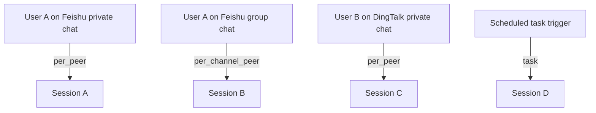
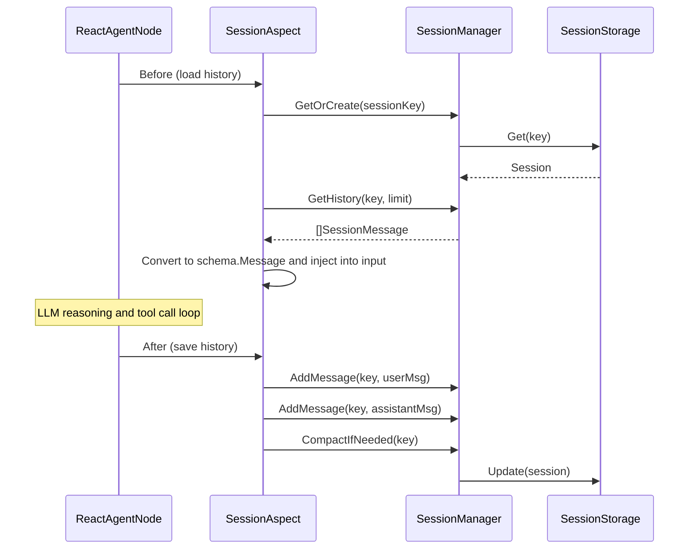

Sessions manage the conversation state, message history, and context information of agents. They handle message persistence, history loading, automatic compression, and expiration cleanup, ensuring agents maintain coherent context across multi-turn conversations.

## Core Data Model

### Session

| Field | Type | Description |
|------|------|------|
| Key | string | Unique session identifier |
| AgentID | string | Associated agent ID |
| Channel | string | Message channel (e.g., feishu, dingtalk, api) |
| Scope | SessionScope | Session scope |
| ScopeID | string | Scope identifier |
| Messages | []SessionMessage | Message history |
| CompactedSummary | string | Compacted history summary |
| Metadata | SessionMetadata | Session metadata (title, model, Token count, etc.) |
| State | SessionState | Session state |

### SessionMessage

| Field | Type | Description |
|------|------|------|
| ID | string | Unique message ID (format: `msg_{uuid}_{nanos}`) |
| Role | string | Message role: `user`, `assistant`, `tool` |
| Content | string | Message content |
| Images | []string | Image URL list |
| TokenCount | int | Token count estimate |
| IsCompacted | bool | Whether from compressed summary |
| ToolCalls | []ToolCallInfo | Tool call information (assistant messages) |
| ToolCallID | string | Associated tool call ID (tool messages) |
| CreatedAt | time | Creation time |

## Session Scope

Sessions use scopes to control conversation isolation levels:



| Scope | Identifier | Description |
|--------|------|------|
| Main session | `main` | Globally shared, all users use the same context |
| Per peer | `per_peer` | Independent session per user (default recommended) |
| Per channel + peer | `per_channel_peer` | Same user has independent sessions on different channels |
| Per account + channel + peer | `per_account_channel_peer` | Complete isolation for multi-account scenarios |
| Per thread | `thread` | Isolated per session thread |
| Per task | `task` | Isolated per task instance (scheduled tasks, one-time tasks) |

### Session Key Generation

```
agent:{agentId}:channel:{channel}:scope:{scopeType}:{scopeId}
```

ScopeID resolution priority: `scopeId` > `chatId` > `threadId` > `userId`

## Session State

| State | Description |
|------|------|
| `active` | Active state, in normal use |
| `idle` | Idle state, not used for longer than `IdleTimeout` |
| `compacted` | Compacted, history messages have been summarized |
| `archived` | Archived |

## Session Configuration

### SessionConfig

| Field | Type | Description | Default |
|------|------|------|--------|
| MaxMessages | int | Maximum number of messages | 100 |
| MaxTokenCount | int | Maximum Token count | 128000 |
| TTL | duration | Session time-to-live | |
| IdleTimeout | duration | Idle timeout | |
| PruningConfig | PruningConfig | Message pruning configuration | |
| CompactionConfig | CompactionConfig | Message compaction configuration | |

### PruningConfig — Pruning Configuration

| Field | Type | Description | Default |
|------|------|------|--------|
| Enabled | bool | Whether to enable pruning | false |
| Mode | string | Pruning mode: `soft`, `hard`, `cache_ttl` | soft |
| KeepRecentCount | int | Keep the most recent N messages | 10 |
| MaxToolResultSize | int | Maximum truncation size for tool results | 2000 |
| SaveToolCalls | bool | Whether to keep tool call records | true |
| KeepToolCallsCount | int | Keep the most recent N tool calls | 5 |

### CompactionConfig — Compaction Configuration

| Field | Type | Description | Default |
|------|------|------|--------|
| Enabled | bool | Whether to enable automatic compaction | false |
| MaxTokenCount | int | Token threshold to trigger compaction | 100000 |
| TriggerThreshold | float64 | Trigger threshold percentage (0.0-1.0) | 0.8 |
| KeepRecentCount | int | Keep the most recent N messages during compaction | 10 |
| MinMessagesToCompact | int | Minimum message count to trigger compaction | 20 |

## SessionManager

The core interface for session management:

| Method | Description |
|------|------|
| `GetOrCreate(ctx, request)` | Get or create a session |
| `Get(ctx, key)` | Get a specific session |
| `AddMessage(ctx, key, message)` | Add message to session |
| `GetHistory(ctx, key, limit)` | Get the most recent N history messages |
| `Update(ctx, session)` | Update session |
| `Delete(ctx, key)` | Delete session |
| `List(ctx, query)` | Query session list by conditions |
| `CompactIfNeeded(ctx, key)` | Check and trigger automatic compaction |
| `GetConfig()` | Get session configuration |

## Storage Backends

### MemoryStorage

In-memory storage, thread-safe (`sync.RWMutex`). Suitable for single-instance deployment.

- Deep copies session objects on read/write to avoid concurrent modification
- Returns the most recent N messages (truncated by `MaxMessages`)

### Custom Storage

Implement the `SessionStorage` interface to extend other storage backends:

```go
type SessionStorage interface {
    Create(ctx context.Context, session *Session) error
    Get(ctx context.Context, key string) (*Session, error)
    Update(ctx context.Context, session *Session) error
    Delete(ctx context.Context, key string) error
    AddMessage(ctx context.Context, key string, message *SessionMessage) error
    GetHistory(ctx context.Context, key string, limit int) ([]*SessionMessage, error)
    List(ctx context.Context, query SessionQuery) ([]*Session, error)
}
```

`SessionQuery` supports filtering by `AgentID`, `Channel`, `Scope`, `State`, and supports `Limit/Offset` pagination.

## Message Processing

### Tool Result Truncation

Tool return results can be very long (file contents, command output). The framework provides automatic truncation:

- Automatically truncated when exceeding `MaxToolResultSize` (default 2000 characters)
- Large JSON fields in tool call parameters (`content`, `body`, `data`, `code`, `text`, etc.) are also truncated

### Parameter Validation

`IsExecutableToolCallArgs()` validates tool call parameters:
- Tool name cannot be empty
- Parameters must be valid JSON
- The `bash` tool must include a `command` field
- The `skill` tool must include a `skill` field

## Context Propagation

Session information is passed through the Go `context.Context` call chain, providing type-safe access methods:

| Function | Description |
|------|------|
| `WithSession(ctx, session)` | Inject session |
| `SessionFromContext(ctx)` | Get session |
| `WithSessionKey(ctx, key)` | Inject session Key |
| `SessionKeyFromContext(ctx)` | Get session Key |
| `WithSessionManager(ctx, mgr)` | Inject SessionManager |
| `SessionManagerFromContext(ctx)` | Get SessionManager |
| `NewSessionContext(ctx, mgr, req)` | One-shot create/get session and inject all values |

## Session and Aspect Collaboration

Session management is typically integrated into agents through the `SessionAspect` aspect:



## Configuration Example

```json
{
  "session": {
    "maxMessages": 100,
    "maxTokenCount": 128000,
    "pruning": {
      "enabled": true,
      "mode": "soft",
      "keepRecentCount": 10,
      "maxToolResultSize": 2000,
      "saveToolCalls": true,
      "keepToolCallsCount": 5
    },
    "compaction": {
      "enabled": true,
      "triggerThreshold": 0.8,
      "keepRecentCount": 10,
      "minMessagesToCompact": 20
    }
  }
}
```

## Related Documentation

- [Overview](./00.Overview.md) — Framework positioning and core concepts
- [Aspect Framework](./04.Aspect Framework.md) — SessionAspect interface definition
- [Development Guide](./06.Development Guide.md) — Practical session management configuration
