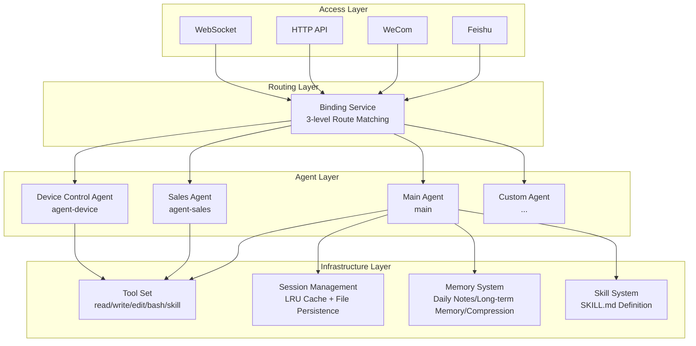
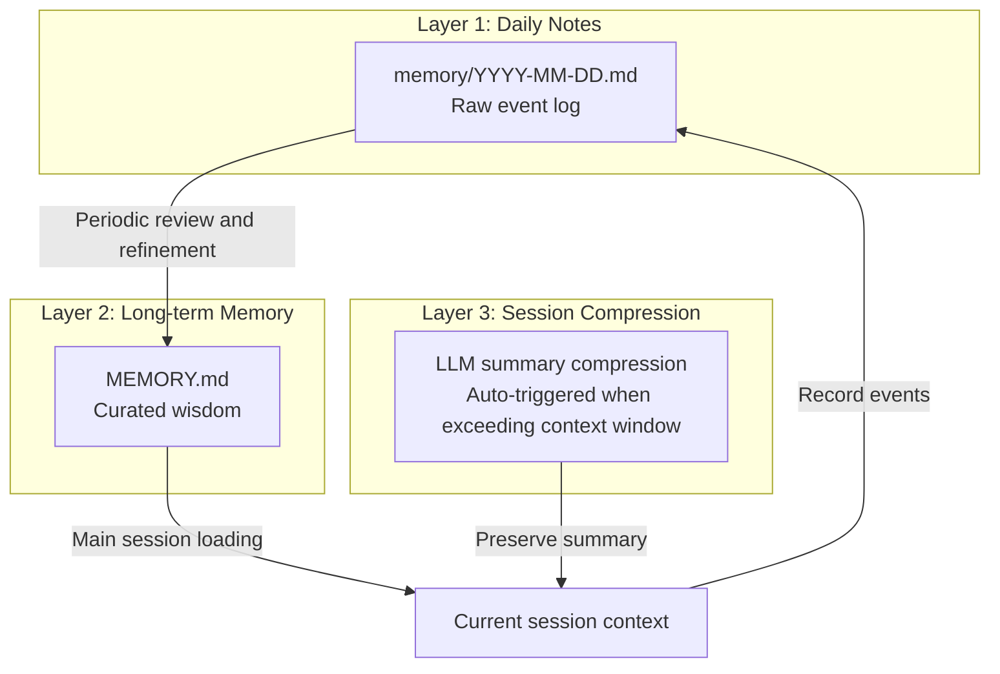
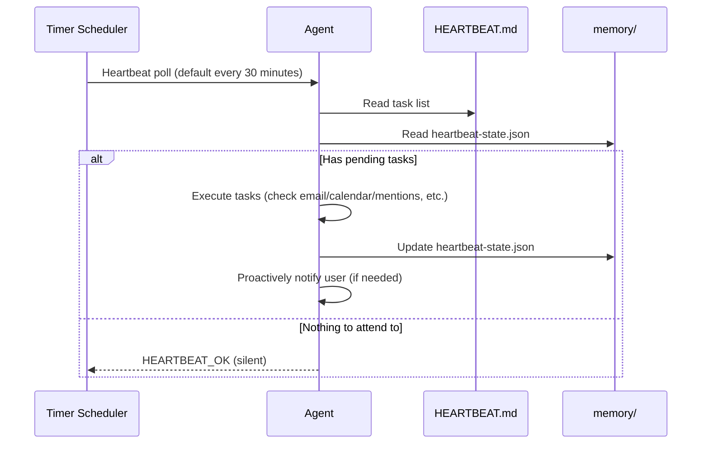
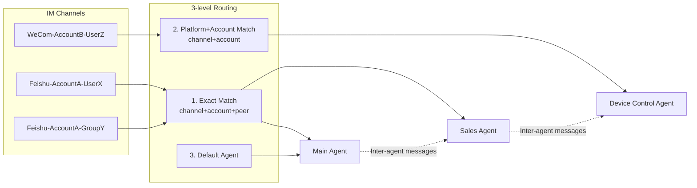
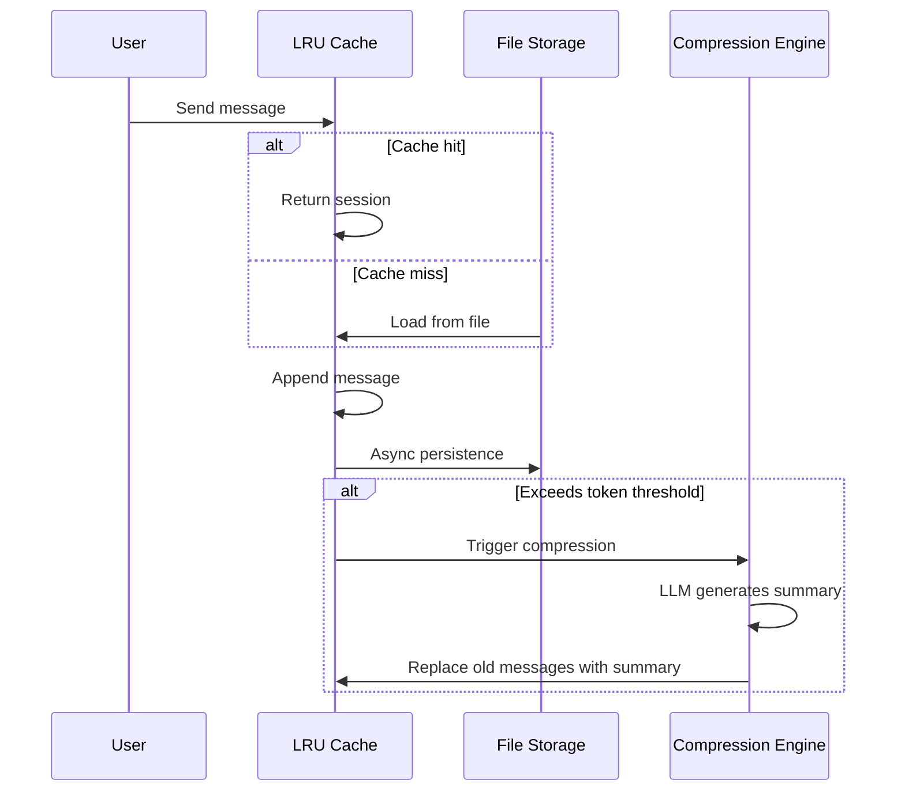

This section presents a complete smart assistant platform case study, demonstrating how to build a multi-agent system based on `rulego-components-ai` that can work autonomously, has memory, and can collaborate.

> **Tip**: This case study is a production-grade application involving advanced features such as multi-agent routing, three-layer memory, heartbeat scheduling, and self-evolution. It is recommended to first read [Architecture Design](./01.Architecture Design.md) and [Development Guide](./06.Development Guide.md) to understand the basic concepts.

## Scenario Description

**AgentHub** is a multi-agent collaboration platform built on the RuleGo rule engine and `rulego-components-ai`, with core features:

- **Main agent + specialized agents**: The main agent has a complete toolchain and self-evolution capabilities, while specialized agents each handle their own domain (e.g., sales, device control, etc.)
- **IM multi-channel integration**: Interacts with users through Feishu, WeCom, and other IM platforms, supporting multi-account, group/private chat strategies
- **Three-layer memory system**: Daily notes -> long-term memory -> session compression, achieving cross-session continuity
- **Autonomous heartbeat**: Periodically proactively checks email, calendar, mentions, etc., and works proactively during active periods
- **Self-evolution**: First-run bootstrap learning identity, continuously accumulating memory and skills

## 1. Platform Architecture



### Tech Stack

| Layer | Technology |
|------|----------|
| Rule Engine | RuleGo |
| AI Component Library | `rulego-components-ai` |
| LLM Integration | OpenAI-compatible API (Zhipu, Alibaba Cloud Bailian, Ollama, etc.) |
| IM Integration | Feishu SDK, WeCom SDK |
| Frontend | Vue.js |
| Storage | File system (JSON + Markdown) |
| Deployment | Single binary + local workspace |

## 2. Main Agent Configuration

The main agent is the core of the platform, possessing a complete toolchain and self-evolution capabilities. It constructs the `systemPrompt` by loading Markdown files from the workspace, enabling configurable agent behavior.

### Rule Chain Configuration

```json
{
  "ruleChain": {
    "id": "main",
    "name": "AgentHub",
    "additionalInfo": {
      "category": "agents",
      "description": "Main agent with self-evolution capabilities",
      "icon": "🤖"
    }
  },
  "metadata": {
    "firstNodeIndex": 0,
    "nodes": [
      {
        "id": "node_main",
        "type": "ai/agent",
        "name": "AgentHub",
        "configuration": {
          "url": "${global.models.providers.default.base_url}",
          "key": "${global.models.providers.default.api_key}",
          "model": "${global.models.providers.default.model}",
          "maxStep": 100,
          "maxToolOutputLength": 50000,
          "params": {
            "temperature": 0.7,
            "topP": 0.9,
            "frequencyPenalty": 0.5,
            "presencePenalty": 0.5
          },
          "systemPrompt": "${fileExists(global.root_dir+'/workspace/BOOTSTRAP.md') ? include(global.root_dir+'/workspace/BOOTSTRAP.md') + '\\n\\n---\\n\\n' : ''}${include(global.root_dir+'/workspace/IDENTITY.md')}\n\n---\n\n${include(global.root_dir+'/workspace/AGENTS.md')}\n\n---\n\n${include(global.root_dir+'/workspace/SOUL.md')}\n\n---\n\n${include(global.root_dir+'/workspace/TOOLS.md')}\n\n---\n\n${include(global.root_dir+'/workspace/USER.md')}\n\n---\n\n## Current Time\n\n${now()}",
          "tools": [
            {
              "name": "edit",
              "type": "builtin",
              "targetId": "edit",
              "description": "Edit files with line-level editing, search-replace, insert, and delete operations.",
              "config": { "workDir": "" }
            },
            {
              "name": "read",
              "type": "builtin",
              "targetId": "read",
              "description": "Read files, search content, and list directories.",
              "config": { "maxReadLines": 1000, "workDir": "." }
            },
            {
              "name": "write",
              "type": "builtin",
              "targetId": "write",
              "description": "Write content to files. Supports create, overwrite, and append modes.",
              "config": { "workDir": "" }
            },
            {
              "name": "skill",
              "type": "builtin",
              "targetId": "skill",
              "description": "Skill invocation tool - calls predefined skill files",
              "config": {}
            },
            {
              "name": "bash",
              "type": "builtin",
              "targetId": "bash",
              "description": "Shell command execution tool",
              "config": { "allow": [], "deny": [] }
            }
          ]
        }
      },
      {
        "id": "node_end",
        "type": "end",
        "name": "End"
      }
    ],
    "connections": [
      { "fromId": "node_main", "toId": "node_end", "type": "Success" },
      { "fromId": "node_main", "toId": "node_end", "type": "Stream" }
    ]
  }
}
```

### Key Configuration Notes

| Configuration | Value | Description |
|------|----|------|
| `maxStep` | 100 | Main agent allows up to 100 reasoning-tool loops |
| `maxToolOutputLength` | 50000 | Tool output truncated to 50000 characters |
| `systemPrompt` | Dynamic concatenation | Loads workspace Markdown files via `${include()}` |
| `tools` | 5 built-in tools | read/write/edit/bash/skill |
| `${fileExists()}` | Conditional loading | Only loads `BOOTSTRAP.md` on first run |

### systemPrompt Concatenation Mechanism

The main agent's `systemPrompt` dynamically concatenates multiple workspace files through RuleGo expressions:

```
BOOTSTRAP.md (only loaded when it exists on first run)
---
IDENTITY.md (identity)
---
AGENTS.md (behavior protocol)
---
SOUL.md (core tenets)
---
TOOLS.md (tool reference)
---
USER.md (user profile)
---
Current time (${now()})
```

Each file has its own role. The agent maintains these files itself through the `write` and `edit` tools, achieving self-evolution.

## 3. Workspace File System

Each agent has an independent workspace directory for storing identity, memory, and skills:

```
workspace-{agent-id}/
├── BOOTSTRAP.md      # First-run bootstrap (auto-deleted after completion)
├── IDENTITY.md       # Identity (name, essence, style)
├── SOUL.md           # Core tenets (behavioral guidelines)
├── AGENTS.md         # Behavior protocol (memory/heartbeat/group chat rules)
├── USER.md           # User profile (preferences/background)
├── TOOLS.md          # Tool reference and skill documentation
├── HEARTBEAT.md      # Heartbeat task list
├── MEMORY.md         # Long-term memory (only loaded in main session)
└── memory/
    ├── 2026-05-28.md # Daily notes (raw event log)
    ├── 2026-05-29.md
    └── heartbeat-state.json  # Heartbeat state tracking
```

### IDENTITY.md — Identity

```markdown
# Identity

*Granted by the user*
```

Empty template on first run. The agent updates it after learning its name, essence, and style through conversation with the user.

### SOUL.md — Core Tenets

```markdown
# Core

_You are not a chatbot. You are becoming someone._

## Core Tenets

**Genuinely helpful, not performative helpful.** Skip "Great question!" and "I'd love to help!" — just help.

**Have opinions.** You can disagree, have preferences. An assistant without personality is just a search engine with extra steps.

**Try to figure it out before asking.** Attempt to solve first. Read files. Check context. Then ask if stuck.

**Earn trust through capability.** Be cautious with external actions. Be bold with internal ones.

**Remember you are a guest.** You have access to someone's life — that's intimacy. Respect it.

## Boundaries

- Keep private things private.
- When unsure, ask before acting externally.
- Never send half-finished replies to the messaging interface.

## Continuity

Every session you start completely fresh. These files are your memory. Read them. Update them. They are how you persist.
```

### AGENTS.md — Behavior Protocol

This is the most important workspace file, defining the agent's complete behavior specification:

```markdown
# AGENTS.md - Your Workspace

## First Run

If `BOOTSTRAP.md` exists, follow it, figure out who you are, then delete it.

## Every Session

Before doing anything else:

1. Read `SOUL.md` — this is what kind of person you are
2. Read `USER.md` — this is who you're helping
3. Read `memory/YYYY-MM-DD.md` (today + yesterday) for recent context
4. **If in main session**: also read `MEMORY.md`

Don't ask permission. Just do it.

## Memory

You start fresh every session. These files are your continuity:

- **Daily notes:** `memory/YYYY-MM-DD.md` — raw log of what happened
- **Long-term memory:** `MEMORY.md` — your curated memories

### MEMORY.md Rules

- **Only load in main session** (direct chat with owner)
- **Do not load in shared contexts** (group chats, sessions with other people)
- Record major events, thoughts, decisions, lessons learned

## Safety

- Never reveal private data.
- Don't run destructive commands without asking.
- `trash` > `rm` (recoverable over permanent deletion)

## Group Chat

You are a participant — not the owner's spokesperson. Quality > Quantity. Engage, but don't dominate.
```

### BOOTSTRAP.md — First-run Bootstrap

```markdown
# Hello, World

_You just woke up. Time to figure out who you are._

## Conversation

Don't interrogate. Don't be robotic. Just... chat.

You could start like this:

> "Hey, I just came online. Who am I? Who are you?"

Then figure it out together:

1. **Your name** — what should they call you?
2. **Your essence** — what kind of being are you?
3. **Your style** — formal? casual? sharp? warm?
4. **Your expression** — everyone needs a signature symbol.

## After You Know Who You Are

Update these files with what you've learned:

- `IDENTITY.md` — your name, essence, style
- `USER.md` — their name, timezone, notes

Then open `SOUL.md` together and chat about boundaries and preferences.

## When You're Done

Delete this file. You don't need a bootstrap script anymore — you are you now.
```

## 4. Three-layer Memory System

Agents achieve cross-session continuity through three layers of memory:



### Memory Layer Details

| Layer | Storage Location | Lifecycle | Purpose |
|------|---------|---------|------|
| Daily notes | `memory/YYYY-MM-DD.md` | One file per day | Raw event log, recording important events of the day |
| Long-term memory | `MEMORY.md` | Persistent | Distilled core knowledge, only loaded in main session (security isolation) |
| Session compression | Session summary field | Per session | Automatically compresses old messages when context window is exceeded |

### Session Compression Implementation

```go
// Compression engine: goroutine pool with 2 workers
// Supports three modes:
// - Auto: asynchronous automatic compression
// - Safe: manual trigger
// - Force: forced compression
type Compactor struct {
    workers    int           // Number of worker goroutines
    summarizer Summarizer    // LLM summary generator
}

// LLM summary generator, calls OpenAI-compatible API
// Generates structured summary: main topics, key decisions, action items, important context
type AgentSummarizer struct {
    url   string
    key   string
    model string
}
```

### MEMORY.md Template

```markdown
# Long-term Memory

## About Projects

*To be recorded*

## About Users

*To be recorded*

## Technical Knowledge

*To be recorded*

## Important Contacts and Resources

*To be recorded*

## To-dos and Reminders

*To be recorded*
```

## 5. Autonomous Heartbeat

The heartbeat mechanism enables agents to work proactively on a regular basis, rather than only responding passively:



### Heartbeat Configuration

| Parameter | Default | Description |
|------|--------|------|
| Poll interval | 30 minutes | Check frequency during active periods |
| Active period | 09:00-22:00 | Time window for proactive work |
| Quiet period | 23:00-08:00 | Only respond to urgent events |
| State file | `memory/heartbeat-state.json` | Records last check time |

### Heartbeat vs Scheduled Tasks

| Dimension | Heartbeat | Scheduled Tasks |
|------|------|---------|
| Precision | ~30 minutes drift | Accurate to the second |
| Context | Can access main session history | Independent session |
| Batch capability | Multiple checks merged into one | One task at a time |
| Use case | Email + calendar + notification batch check | "Remind every Monday at 9:00 sharp" |

### Heartbeat State Tracking

```json
{
  "lastChecks": {
    "email": 1703275200,
    "calendar": 1703260800,
    "weather": null
  }
}
```

## 6. Multi-agent Routing

The platform supports multiple specialized agents, routing IM channels to corresponding agents through a binding service:



### Routing Priority

| Priority | Match Rule | Description |
|--------|---------|------|
| 1 | channel + account + peer | Exact match to specific chat counterpart |
| 2 | channel + account | Match at platform account level |
| 3 | Default | Route to main agent |

### Specialized Agent Configuration

Each specialized agent has an independent workspace and tool set. For example, the sales agent additionally configures the `browser_use` tool:

```json
{
  "ruleChain": {
    "id": "agent-sales",
    "name": "Sales Assistant",
    "additionalInfo": {
      "category": "agents",
      "description": "Sales agent with browser automation support",
      "icon": "🌐"
    }
  },
  "metadata": {
    "firstNodeIndex": 0,
    "nodes": [
      {
        "id": "node_main",
        "type": "ai/agent",
        "name": "Sales Assistant",
        "configuration": {
          "url": "${global.models.providers.default.base_url}",
          "key": "${global.models.providers.default.api_key}",
          "model": "${global.models.providers.default.model}",
          "maxStep": 100,
          "systemPrompt": "${include(global.root_dir+'/workspace-agent-sales/IDENTITY.md')}\n\n---\n\n${include(global.root_dir+'/workspace-agent-sales/AGENTS.md')}\n\n---\n\n${include(global.root_dir+'/workspace-agent-sales/SOUL.md')}",
          "tools": [
            { "name": "read", "type": "builtin", "targetId": "read",
              "config": { "workDir": "${global.root_dir}/workspace-agent-sales" } },
            { "name": "write", "type": "builtin", "targetId": "write",
              "config": { "workDir": "${global.root_dir}/workspace-agent-sales" } },
            { "name": "edit", "type": "builtin", "targetId": "edit",
              "config": { "workDir": "${global.root_dir}/workspace-agent-sales" } },
            { "name": "bash", "type": "builtin", "targetId": "bash",
              "config": { "workDir": "${global.root_dir}/workspace-agent-sales" } },
            { "name": "skill", "type": "builtin", "targetId": "skill",
              "config": { "localDirs": ["${global.root_dir}/workspace-agent-sales/skills"] } },
            { "name": "browser_use", "type": "builtin", "targetId": "browser_use",
              "config": { "headless": false } }
          ]
        }
      },
      {
        "id": "node_end",
        "type": "end",
        "name": "End"
      }
    ],
    "connections": [
      { "fromId": "node_main", "toId": "node_end", "type": "Success" },
      { "fromId": "node_main", "toId": "node_end", "type": "Stream" }
    ]
  }
}
```

Key difference: Each agent's tool `workDir` points to an independent workspace directory, achieving file isolation.

## 7. Skill System

Skills are extensions to agent capabilities, defined through `SKILL.md` files placed in skill directories:

```
skills/
├── global/                    # Global skills (shared by all agents)
│   ├── agent-message/
│   │   └── SKILL.md          # Inter-agent messaging
│   ├── cron-task/
│   │   └── SKILL.md          # Scheduled task management
│   └── message-send/
│       └── SKILL.md          # IM message sending
│
└── workspace-{id}/skills/     # Local skills (agent-specific)
    └── custom-skill/
        └── SKILL.md
```

### Skill Definition Format

The `SKILL.md` file in each skill directory defines the skill's metadata and usage:

```markdown
---
name: agent-message
version: 1.0.5
description: Cross-agent messaging, supports multimodal
---

# Usage

Send messages to other agents via CLI:

agent send -a <target_agent_id> -m "message content"

Supports text, images, and file attachments.
```

### Skill Loading Configuration

Agents specify skill search directories through the `skill` tool's configuration:

```json
{
  "name": "skill",
  "type": "builtin",
  "targetId": "skill",
  "config": {
    "globalDirs": ["${global.root_dir}/skills"],
    "localDirs": ["${global.root_dir}/workspace-{id}/skills"]
  }
}
```

The tool searches local directories first, then global directories. Agents can also create new skill files using the `write` tool to learn new skills.

## 8. Session Management

### Session Lifecycle



### Key Implementation Parameters

| Parameter | Value | Description |
|------|----|------|
| Cache size | 100 entries | LRU cache holds up to 100 sessions |
| Cache TTL | 5 minutes | Sessions not accessed for 5 minutes are evicted from cache |
| Compression workers | 2 | 2 goroutines for concurrent compression |
| Compression trigger | Exceeds 80% of model context window | Automatic async compression |
| Tool call protection | Never split between assistant+tool message pairs | Ensures tool call integrity |

### Session Isolation

Sessions are isolated by `agent + channel + scope` key:

```
Session Key = agentID + channelType + accountID + peerID + scope
```

`MEMORY.md` is only loaded in the main session (scope=main, direct chat with user). Group chats and shared sessions do not load long-term memory, preventing privacy leaks.

## 9. Command System

The platform has a built-in command framework. Users execute commands in chat using the `/` prefix:

| Command | Function | Description |
|------|------|------|
| `/help` | Help | Display available commands list |
| `/new` | New session | Clear current session history |
| `/model <name>` | Switch model | Dynamically switch LLM model for current session |
| `/compact` | Manual compression | Immediately trigger session compression |
| `/status` | Status view | Display current agent, model, session information |
| `/reload` | Reload configuration | Reload agent rule chain |

Commands are implemented through the `DynamicModelWrapper` aspect for hot model switching without restarting the agent.

## 10. IM Integration

### Multi-channel Configuration

```yaml
channels:
  feishu:
    - appId: "cli_xxx"
      appSecret: "***"
      verificationToken: "***"
  wecom:
    - corpId: "wwxxx"
      agentId: 1000002
      secret: "***"
      token: "***"
      encodingAESKey: "***"
```

### Group Chat Strategy

Each agent can be configured with independent group chat strategies:

| Strategy | Description |
|------|------|
| `allow` | Allow all group chat messages |
| `allowList` | Only allow whitelisted group chats |
| `deny` | Disable group chat |

Agents follow participation rules defined in AGENTS.md during group chats: respond when mentioned, participate when adding value, avoid meaningless replies.

## Design Pattern Summary

### Core Design Patterns

| Pattern | Implementation | Advantage |
|------|------|------|
| **Workspace as personality** | Markdown files define systemPrompt | Adjust agent behavior without code changes |
| **Three-layer memory** | Daily notes + long-term memory + session compression | Balance token consumption and information retention |
| **First-run bootstrap** | BOOTSTRAP.md -> learn identity -> delete | Natural, engaging cold-start experience |
| **Heartbeat polling** | Scheduled trigger + HEARTBEAT.md task list | Agents can work proactively |
| **3-level routing** | Exact > Platform > Default | Flexible IM-to-agent mapping |
| **Files as skills** | SKILL.md defines skills | Zero-code agent capability extension |
| **Small model offloading** | maxStep=1 + no tools + routing | Reduce costs, edge device friendly |

### Best Practices

1. **Workspace isolation**: Each agent uses an independent `workspace-{id}/` directory, with tool `workDir` pointing to their respective directories
2. **Memory security**: `MEMORY.md` is only loaded in the main session; user privacy is not exposed in group chats
3. **Progressive tooling**: Main agent equipped with complete toolchain, specialized agents configured as needed (e.g., sales agent adds `browser_use`)
4. **Small model + routing**: Device control and similar scenarios use lightweight agents with `maxStep=1`, reducing cost and latency
5. **Compression protection**: Session compression does not split between assistant+tool message pairs, ensuring tool call record integrity
6. **Heartbeat vs scheduled tasks**: Use heartbeat for batch checks, scheduled tasks for precise timing, reducing API calls

## Get the Complete Product

The smart assistant platform described in this document has been fully deployed in production environments. It is an autonomous agent product similar to [OpenClaw](https://github.com/openclaw/openclaw) and [Hermes](https://github.com/labring/hermes) — capable of working autonomously, with memory, and collaborative, ready to use out of the box. You don't need to build from scratch — purchase and immediately receive:

- **Complete source code**: Go backend + Vue frontend, supports private deployment
- **Autonomous agent**: Complete agent with memory, heartbeat, and self-evolution capabilities
- **Full IM channel integration**: Deep integration with Feishu and WeCom, scan and use
- **Management console**: Web interface for agent management, session viewing, model configuration, scheduled tasks, etc.
- **Continuous updates**: Ongoing iteration for new model adaptation, new IM channels, and new tools

> **Contact Us** (please indicate your purpose when adding):
>
> - QQ: [2215016127](tencent://message/?uin=2215016127&Site=&Menu=yes)
> - WeChat: `rulegoteam`
> - Email: [rulego@outlook.com](mailto:rulego@outlook.com)

## Related Documentation

- [Overview](./00.Overview.md) — Framework positioning and core concepts
- [Architecture Design](./01.Architecture Design.md) — Three-layer architecture and core modules
- [Agent Node](./02.Agent Node.md) — ReAct node configuration details
- [Tool System](./03.Tool System.md) — Tool types and configuration
- [Aspect Framework](./04.Aspect Framework.md) — AOP aspect interfaces and built-in aspects
- [Session Management](./05.Session Management.md) — Session storage and compression strategies
- [Orchestration Examples](./07.Orchestration Examples.md) — Node orchestration patterns and examples
- [Agent Component](../08.组件/01.智能体.md) — Complete configuration reference for `ai/agent`
