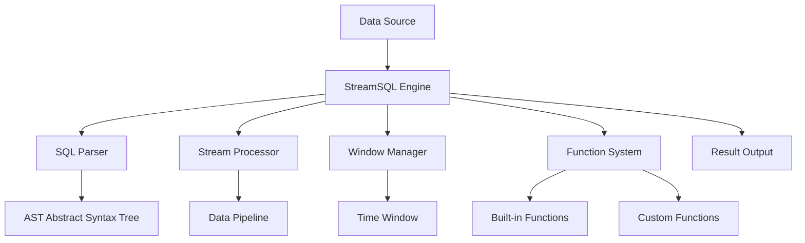

# Overview

## A New Choice for Stream Computing

In traditional stream data processing scenarios, developers usually face two extreme choices:

- **Time-series Database Solutions**: Such as InfluxDB, TimescaleDB, etc., while having strong storage capabilities, their real-time computing capabilities are limited and complex aggregation operations have poor performance.
- **Distributed Framework Solutions**: Such as Apache Flink, Apache Storm, etc., while powerful, they have complex deployment, huge resource consumption, and are not suitable for edge environments.

**StreamSQL provides a third choice**: a lightweight stream processing engine designed specifically for edge computing, capable of real-time aggregation operations on massive data in resource-constrained environments, filling the gap between lightweight and high performance.

### 🌐 Typical Application Scenarios

**Edge-Cloud Collaborative Architecture**: In IoT and Industry 4.0 scenarios, a large number of sensors and devices generate massive amounts of raw data. Direct upload to the cloud would cause:
- Huge network bandwidth pressure
- High cloud computing costs
- Real-time requirements cannot be met

**StreamSQL's Solution**:
```
Massive raw data → Edge StreamSQL processing → Aggregated results → Cloud storage/analysis
   (TB level)        (real-time filtering/aggregation)      (MB level)      (long-term storage)
```

**Specific Scenario Examples**:
- **Smart Factory**: 1000 devices generate 100,000 data points per second, edge real-time aggregation to 100 key indicators per minute
- **Smart City**: Environmental data from thousands of sensors, edge preprocessing only uploads abnormal events and statistical summaries
- **Connected Vehicles**: Fleet real-time data aggregated at edge gateway, only sending driving behavior analysis and abnormal alerts to the cloud

## What is StreamSQL

StreamSQL is a lightweight stream processing engine designed specifically for IoT edge scenarios. It uses familiar SQL syntax to process unbounded data streams, allowing developers to implement complex real-time data analysis with simple SQL statements. It can also be integrated as a [RuleGo](https://rulego.cc) component into the RuleGo ecosystem, leveraging its rich input/output and data processing component library and rule engine capabilities.

## Core Architecture



### Core Components

1. **SQL Parser (rsql)**: Parses standard SQL statements, generates abstract syntax tree (AST), configures stream processing pipeline
2. **Stream Processor (stream)**: Real-time data processing, filtering and transformation, aggregation calculations
3. **Window Manager (window)**: Time windows: tumbling, sliding, session, count windows, window lifecycle management
4. **Function System (functions)**: 60+ built-in functions, pluggable custom functions, 8 function type supports
5. **Expression Engine (expr)**: Arithmetic expression calculation, logical expression processing, field reference resolution

## Design Philosophy

🪶 **Lightweight First**: Pure Go implementation, zero external dependencies, memory efficient, second-level startup. Designed specifically for edge devices and resource-constrained environments.

📝 **SQL First**: Uses standard SQL syntax, declarative programming, intuitive business logic expression, extremely low learning cost.

🔧 **Extension First**: Plugin architecture, supports hot-pluggable functions, deep integration with RuleGo, leveraging its rich input/output component ecosystem, and supports hot updates.

## Technical Features

- 🚀 **High Performance**: Stream processing, in-memory computing, concurrent design, fully utilizing multi-core performance.
- 🔧 **Easy to Use**: Uses standard SQL syntax, no need to learn complex stream processing frameworks.
- 🛡️ **Pure In-Memory Computing**: No disk storage, all calculations are performed in memory, extremely fast processing speed.
- 📦 **Basic Library Design**: Can be integrated as a basic library into other projects, only depends on Go standard library and expr expression engine, no third-party dependencies.
- 🔄 **RuleGo Integration**: Can be deeply integrated with RuleGo, leveraging its rich component ecosystem and rule engine capabilities.
  - **Data Input**: MQTT, HTTP, WebSocket, TCP/UDP, message queues, files, etc.
  - **Data Output**: databases, message queues, REST API, email, SMS, etc.
  - **Data Processing**: filtering, transformation, routing, aggregation, etc. 60+ components
  - **Extension Capability**: custom components, hot-pluggable, dynamic configuration
  - **Low Code**: No need to write code, just configure rule chains to implement complex data processing logic.

## Comparison with Other Solutions

### 📊 Comprehensive Comparison Analysis

| Feature        | StreamSQL  | Apache Flink | Apache Storm | ksqlDB     | eKuiper      | Time-series Database |
|--------------|------------|--------------|--------------|------------|--------------|------------------|
| **Deployment Complexity** | Extremely Simple | Complex | Medium | Medium | Simple | Medium |
| **Resource Usage**  | Extremely Low (10MB) | High (GB level) | Medium | High (GB level) | Extremely Low (10MB) | Medium |
| **Embeddability**  | ✅ Embeddable/Standalone | ❌ Heavy Dependencies/Standalone | ⚠️ Medium Dependencies/Standalone | ❌ Heavy Dependencies/Standalone | ⚠️ Few Dependencies/Standalone | ⚠️ Medium Dependencies/Standalone |
| **SQL Support** | ✅ Complete | ✅ Complete | ❌ None | ✅ Complete | ✅ Complete | ⚠️ Limited |
| **Edge Deployment**  | ✅ Excellent | ❌ Not Suitable | ⚠️ Barely | ❌ Not Suitable | ✅ Excellent | ⚠️ Barely |
| **Real-time Aggregation**  | ✅ Support | ✅ Powerful | ⚠️ Limited | ✅ Support | ✅ Support | ❌ Poor Performance |
| **Learning Cost**  | Extremely Low | High | High | Medium | Low | Low |
| **Nested Fields**  | ✅ Native Support | ⚠️ Needs Configuration | ❌ Not Supported | ⚠️ Limited | ✅ Support | ⚠️ Limited |
| **Cluster Scaling**  | ❌ Single Machine | ✅ Horizontal Scaling | ✅ Horizontal Scaling | ✅ Horizontal Scaling | ❌ Single Machine | ✅ Support |
| **Development Language**  | Go | Java/Scala | Clojure | Java | Go | Multiple |

## Applicable Scenarios

### ✅ Suitable Scenarios
- **Edge Computing**: IoT devices, industrial gateways, edge servers
- **Real-time Analysis**: device monitoring, anomaly detection, real-time alerts
- **Quick Deployment**: single machine deployment, containerization, embedded applications
- **Prototype Validation**: quickly validate stream processing logic and business rules
- **RuleGo Enhancement**: add SQL stream processing capabilities to RuleGo rule chains

### ❌ Unsuitable Scenarios
- **Large-scale Clustering**: distributed systems requiring horizontal scaling
- **Complex State**: applications requiring persistent state management
- **High Concurrent Writes**: data volume exceeding single machine processing capability
- **Transaction Processing**: complex transaction scenarios requiring ACID properties

## Core Application Scenarios

### 🏭 Industrial IoT - Massive Device Data Real-time Processing
**Device Monitoring and Predictive Maintenance**: Real-time monitoring of device status, anomaly detection, predictive maintenance

**Scenario Description**: A manufacturing factory has 1000+ devices, generating 10,000+ data points per second, requiring real-time monitoring and anomaly detection

```sql
-- Device anomaly detection example - processing million-level TPS data streams
SELECT device_id,
       COUNT(*) as data_points,
       AVG(temperature) as avg_temp,
       MAX(temperature) as max_temp,
       STDDEV(vibration) as vibration_variance,
       CASE WHEN AVG(temperature) > 80 OR STDDEV(vibration) > 5 
            THEN 'ALERT' ELSE 'NORMAL' END as status
FROM stream
GROUP BY device_id, TumblingWindow('5m')
HAVING status = 'ALERT'
```

### 🏙️ Smart City
**Traffic Flow Optimization**: Real-time analysis of traffic flow, congestion detection, traffic light optimization
**Environmental Monitoring**: Air quality monitoring, pollution warnings, environmental data analysis

### 🚗 Connected Vehicles - Large-scale Fleet Real-time Monitoring
**Vehicle Status Monitoring**: Real-time monitoring of vehicle operation status, fault diagnosis, driving behavior analysis

**Scenario Description**: A logistics company has 5000+ vehicles, each vehicle reports 20+ data points per second, totaling 100,000+ events/sec

```sql
-- Vehicle anomaly detection - processing million-level data streams
SELECT vehicle_id,
       COUNT(*) as total_events,
       AVG(engine_temp) as avg_engine_temp,
       MAX(engine_temp) as max_engine_temp,
       AVG(fuel_consumption) as avg_fuel,
       COUNT(CASE WHEN brake_pressure > 80 THEN 1 END) as hard_brake_count,
       COUNT(CASE WHEN speed > 120 THEN 1 END) as speeding_count
FROM stream
GROUP BY vehicle_id, TumblingWindow('10m')
HAVING avg_engine_temp > 90 OR hard_brake_count > 5 OR speeding_count > 3
```

**Edge Deployment Advantages**:
- Multiple edge nodes distributed deployment, each node handles 1000+ vehicles
- Local real-time processing, reduces network transmission pressure
- Fault isolation, single point failure does not affect overall system

### 💰 Financial Risk Control
**Real-time Risk Control**: Transaction behavior analysis, fraud detection, risk scoring

```sql
-- Abnormal transaction detection
SELECT user_id,
       COUNT(*) as transaction_count,
       SUM(amount) as total_amount
FROM stream
WHERE amount > 0
GROUP BY user_id, TumblingWindow('1h')
HAVING transaction_count > 20 OR total_amount > 10000
```

### 🔥 Core Advantages
- **Say Goodbye to Heavy Frameworks**: No need to deploy complex Flink clusters, single machine can handle million-level TPS
- **Beyond Time-series Databases**: Not only storage, but also real-time computing, millisecond-level response
- **Edge Computing First Choice**: 10MB memory usage, perfect for resource-constrained environments
- **Extremely High Development Efficiency**: Standard SQL syntax, zero learning cost, minute-level onboarding
- **High Performance Processing**: Single machine can reach million-level TPS, in-memory computing, millisecond-level response

### 📈 Applicable Scale
- **Small Projects**: Quick prototype validation, MVP development
- **Medium Applications**: Single machine million-level TPS, meets most business needs
- **Edge Scenarios**: IoT gateways, industrial controllers, in-vehicle systems
- **Hybrid Architecture**: Combined with RuleGo, build complete edge computing solutions

**StreamSQL = Real-time capability of time-series databases + Computing power of Flink + Minimal deployment and integration experience**