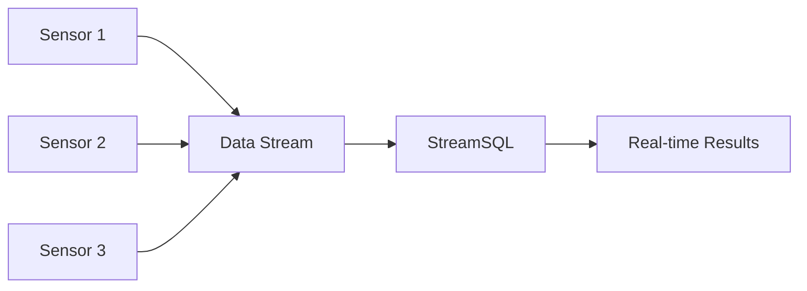
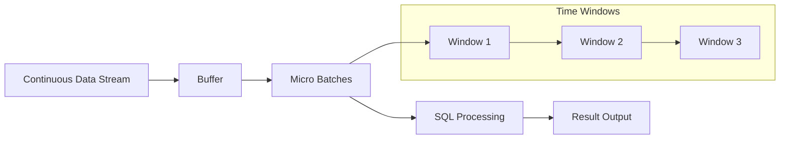
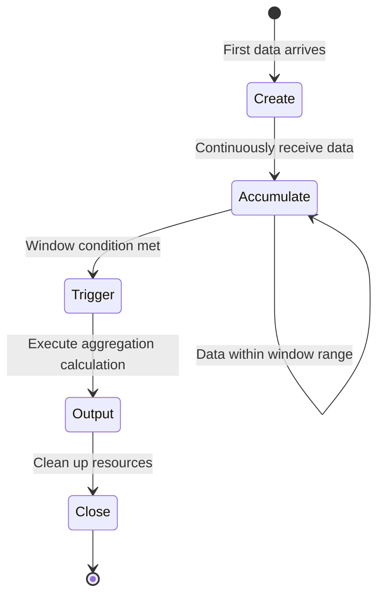
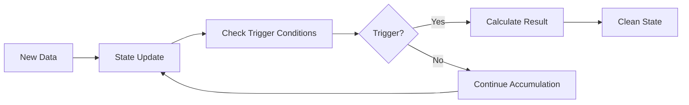
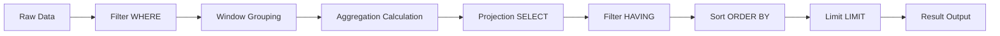

# Core Concepts

Understanding StreamSQL's core concepts is key to using it efficiently. This chapter will detail important concepts such as stream processing, windows, and aggregation.

## Stream Processing Basics

### What is a Data Stream

A data stream (Stream) is a series of continuously generated data records with the following characteristics:

- **Unbounded**: Data is continuously generated without a clear end
- **Sequential**: Data arrives in chronological order
- **Real-time**: Needs to be processed quickly, cannot wait for all data
- **Immutable**: Historical data cannot be modified



### Stream Processing vs Batch Processing

| Feature | Stream Processing | Batch Processing |
|------|--------|--------|
| **Data Boundary** | Unbounded | Bounded |
| **Processing Latency** | Milliseconds | Minutes/Hours |
| **Data Completeness** | Approximate results | Exact results |
| **Resource Usage** | Continuous occupation | Periodic occupation |
| **Application Scenarios** | Real-time monitoring, alerts | Reports, analysis |

### Stream Processing Model

StreamSQL adopts a **micro-batch processing** model:



## Time Semantics

### Time Types

StreamSQL supports two time concepts that determine how windows are partitioned and triggered:

#### 1. Event Time

Definition: The time when the data was actually generated, usually in a field such as `order_time`, `event_time`, or `timestamp`.

Features:
- Partition windows based on the timestamp field value
- Late-arriving data is counted into the correct window
- Uses a Watermark mechanism to handle out-of-order and late data
- Accurate results, but may be delayed (waits for late data)

Use cases:
- Precise time-series analysis
- Out-of-order or delayed data
- Historical replay and analysis

Configuration: Use `WITH (TIMESTAMP='field_name')` to specify the event-time field

Example (orders):
```sql
-- Event-time window: partitioned by order_time
SELECT COUNT(*) AS order_count
FROM stream
GROUP BY TumblingWindow('5m')
WITH (TIMESTAMP='order_time')
```

How it works:
- On arrival, the system extracts `order_time`
- Assign the record to the window defined by `order_time` (e.g., 10:00–10:05)
- Use Watermark to decide when a window can trigger
- Even if data arrives at 11:00, if `order_time=10:03` it is counted in [10:00–10:05)

```sql
-- Full example: event time with time unit
SELECT deviceId, AVG(temperature)
FROM stream
GROUP BY deviceId, TumblingWindow('1m')
WITH (TIMESTAMP='event_time', TIMEUNIT='ms')
```

#### 2. Processing Time

Definition: The time when StreamSQL receives the record.

Features:
- Partition windows by arrival time (`time.Now()`)
- Ignores timestamp fields inside the record
- Uses system clock (Timer) to trigger windows
- Low latency, but may be less accurate

Use cases:
- Real-time monitoring and alerts
- Low-latency requirements
- Data arrives in order with controlled delays

Configuration: Omit `WITH (TIMESTAMP=...)` to use processing time

Example (orders):
```sql
-- Processing-time window: partitioned by system time
SELECT COUNT(*) AS order_count
FROM stream
GROUP BY TumblingWindow('5m')
```

How it works:
- Use current time on arrival
- Assign by arrival time (e.g., 11:00–11:05)
- Trigger via system timer
- If data arrives between 11:00–11:05, even with `order_time=10:03`, it is counted in [11:00–11:05)

```sql
-- Default uses processing time
SELECT deviceId, AVG(temperature)
FROM stream
GROUP BY deviceId, TumblingWindow('1m')
```

### Event Time vs Processing Time

| Feature | Event Time | Processing Time |
|------|------|------|
| Time source | Timestamp field in data | System current time |
| Window partitioning | Based on event timestamp | Based on arrival time |
| Late handling | Supported (Watermark) | Not supported |
| Out-of-order handling | Supported (Watermark) | Not supported |
| Result accuracy | Accurate | May be inaccurate |
| Processing latency | Higher | Lower |
| Configuration | `WITH (TIMESTAMP='field')` | Default (omit WITH) |
| Scenarios | Precise analysis, historical replay | Real-time monitoring, low latency |

### Time Unit Configuration

When the event-time field is an integer (Unix timestamp), specify the unit:

```sql
WITH (TIMEUNIT='ns')  -- nanoseconds
WITH (TIMEUNIT='ms')  -- milliseconds (default)
WITH (TIMEUNIT='ss')  -- seconds
WITH (TIMEUNIT='mi')  -- minutes
WITH (TIMEUNIT='hh')  -- hours
WITH (TIMEUNIT='dd')  -- days
```

Notes:
- No `TIMEUNIT` needed for `time.Time` fields
- Integer timestamps (`int64`) must specify `TIMEUNIT`
- Processing-time windows never need a time unit

### Watermark and Late Data

Event-time windows use Watermarks to handle out-of-order and late data.

Watermark:
- Meaning: events earlier than the watermark are assumed complete
- Formula: `Watermark = max(event_time) - MaxOutOfOrderness`
- Trigger: window fires when `watermark >= window_end`
- `MaxOutOfOrderness`: allowed out-of-order duration

Example:
- `MaxOutOfOrderness = 5s`, `max(event_time) = 10:10` → `watermark = 10:05`
- Window [10:00, 10:05) can trigger

Late data handling:

1. MaxOutOfOrderness (before trigger)
- Config: `WITH (MAXOUTOFORDERNESS='5s')`
- Effect: delays watermark and window trigger to tolerate out-of-order data

2. AllowedLateness (after trigger)
- Config: `WITH (ALLOWEDLATENESS='2s')`
- Effect: keeps window open after trigger and updates results with late data

```sql
SELECT COUNT(*) AS order_count
FROM stream
GROUP BY TumblingWindow('5m')
WITH (
  TIMESTAMP='order_time',
  MAXOUTOFORDERNESS='5s',
  ALLOWEDLATENESS='2s'
)
```

3. IdleTimeout (idle source)
- Config: `WITH (IDLETIMEOUT='5s')`
- Effect: when the source is idle, advance watermark by processing time so windows can close

```sql
SELECT COUNT(*) AS order_count
FROM stream
GROUP BY TumblingWindow('5m')
WITH (
  TIMESTAMP='order_time',
  MAXOUTOFORDERNESS='5s',
  ALLOWEDLATENESS='2s',
  IDLETIMEOUT='5s'
)
```

Workflow:
- Update watermark on data arrival (consider MaxOutOfOrderness)
- Trigger when `watermark >= window_end`
- Keep open until `watermark >= window_end + AllowedLateness`
- Late arrivals within this period cause delayed updates
- After AllowedLateness, the window closes and late data is ignored
- If the source is idle beyond `IdleTimeout`, `watermark = currentProcessingTime - MaxOutOfOrderness`, ensuring windows eventually close

## Window Concepts

Windows are core concepts in stream processing, used to divide unbounded streams into bounded datasets for aggregation operations.

### Window Types

#### 1. Tumbling Window

Fixed-size, non-overlapping time windows:

```mermaid
gantt
    title Tumbling Window (TumblingWindow) - 5-minute window
    dateFormat X
    axisFormat %s
    
    section Timeline
    Event 1 :milestone, e1, 1, 0s
    Event 2 :milestone, e2, 3, 0s
    Event 3 :milestone, e3, 7, 0s
    Event 4 :milestone, e4, 12, 0s
    Event 5 :milestone, e5, 14, 0s
    Event 6 :milestone, e6, 18, 0s
    
    section Window 1 (0-5 minutes)
    Contains events 1,2,3 :active, w1, 0, 5
    
    section Window 2 (5-10 minutes)
    Contains events 4,5 :active, w2, 5, 10
    
    section Window 3 (10-15 minutes)
    Contains event 6 :active, w3, 10, 15
```



```sql
-- Calculate average every 5 minutes
SELECT AVG(temperature) 
FROM stream 
GROUP BY TumblingWindow('5m')
```

**Features**:
- Each data belongs to only one window
- No overlap between windows
- Suitable for periodic statistics

#### 2. Sliding Window

Fixed-size, overlapping time windows:

```mermaid
gantt
    title Sliding Window (SlidingWindow) - 5-minute window, sliding every 2 minutes
    dateFormat X
    axisFormat %s
    
    section Timeline
    Event 1 :milestone, e1, 0, 0s
    Event 2 :milestone, e2, 2, 0s
    Event 3 :milestone, e3, 4, 0s
    Event 4 :milestone, e4, 6, 0s
    Event 5 :milestone, e5, 8, 0s
    Event 6 :milestone, e6, 10, 0s
    
    section Window 1 (0-5 minutes)
    Contains events 1,2,3 :active, w1, 0, 5
    
    section Window 2 (2-7 minutes)
    Contains events 2,3,4 :active, w2, 2, 7
    
    section Window 3 (4-9 minutes)
    Contains events 3,4,5 :active, w3, 4, 9
    
    section Window 4 (6-11 minutes)
    Contains events 4,5,6 :active, w4, 6, 11
```



```sql
-- 5-minute window, sliding every 2 minutes
SELECT AVG(temperature) 
FROM stream 
GROUP BY SlidingWindow('5m', '2m')
```

**Features**:
- Each data may belong to multiple windows
- Provides smoother analysis results
- Relatively higher computational overhead

#### 3. Counting Window

Window based on data count:

```mermaid
gantt
    title Counting Window (CountingWindow) - 5 events per window
    dateFormat X
    axisFormat %d
    
    section Event Sequence
    Event 1 :milestone, e1, 1, 0d
    Event 2 :milestone, e2, 2, 0d
    Event 3 :milestone, e3, 3, 0d
    Event 4 :milestone, e4, 4, 0d
    Event 5 :milestone, e5, 5, 0d
    Event 6 :milestone, e6, 6, 0d
    Event 7 :milestone, e7, 7, 0d
    Event 8 :milestone, e8, 8, 0d
    Event 9 :milestone, e9, 9, 0d
    Event 10 :milestone, e10, 10, 0d
    
    section Window 1 (Events 1-5)
    Contains 5 events :active, w1, 1, 5
    
    section Window 2 (Events 6-10)
    Contains 5 events :active, w2, 6, 10
```



```sql
-- Calculate average every 100 data points
SELECT AVG(temperature) 
FROM stream 
GROUP BY CountingWindow(100)
```

**Features**:
- Based on data volume rather than time
- Fixed window size
- Suitable for scenarios with stable data volume

#### 4. Session Window

Dynamic window based on data activity:

```mermaid
gantt
    title Session Window (SessionWindow) - 5-second timeout
    dateFormat X
    axisFormat %s
    
    section Timeline
    Event 1 :milestone, e1, 2, 0s
    Event 2 :milestone, e2, 5, 0s
    Event 3 :milestone, e3, 8, 0s
    Event 4 :milestone, e4, 15, 0s
    Event 5 :milestone, e5, 20, 0s
    Event 6 :milestone, e6, 22, 0s
    Event 7 :milestone, e7, 30, 0s
    Event 8 :milestone, e8, 33, 0s
    Event 9 :milestone, e9, 35, 0s
    
    section Session 1
    Active period :active, s1, 2, 8
    Timeout wait :done, t1, 8, 13
    
    section Session 2
    Active period :active, s2, 15, 22
    Timeout wait :done, t2, 22, 27
    
    section Session 3
    Active period :active, s3, 30, 35
    Timeout wait :done, t3, 35, 40
```



```sql
-- Close session after 5 minutes timeout
SELECT user_id, COUNT(*) 
FROM stream 
GROUP BY user_id, SessionWindow('5m')
```

**Features**:
- Window size varies dynamically
- Session is determined based on data intervals
- Suitable for user behavior analysis

### Window Lifecycle



## Aggregation Operations

### Aggregation Function Categories

#### 1. Statistical Aggregation
```sql
SELECT deviceId,
       COUNT(*) as data_count,           -- Count
       SUM(temperature) as total_temp,   -- Sum
       AVG(temperature) as avg_temp,     -- Average
       MIN(temperature) as min_temp,     -- Minimum
       MAX(temperature) as max_temp      -- Maximum
FROM stream 
GROUP BY deviceId, TumblingWindow('1m')
```

#### 2. Advanced Statistics
```sql
SELECT deviceId,
       STDDEV(temperature) as std_temp,      -- Standard deviation
       MEDIAN(temperature) as med_temp,      -- Median
       PERCENTILE(temperature, 0.95) as p95 -- 95th percentile
FROM stream 
GROUP BY deviceId, TumblingWindow('1m')
```

#### 3. Collection Aggregation
```sql
SELECT deviceId,
       COLLECT(temperature) as temp_list,     -- Collect to array
       LAST_VALUE(temperature) as last_temp   -- Last value
FROM stream 
GROUP BY deviceId, TumblingWindow('1m')
```

### Aggregation State Management

StreamSQL automatically manages aggregation states:



## Expression System

### Arithmetic Expressions
```sql
SELECT deviceId,
       temperature * 1.8 + 32 as fahrenheit,  -- Temperature conversion
       (humidity + moisture) / 2 as avg_wet   -- Average humidity
FROM stream
```

### Logical Expressions
```sql
SELECT deviceId,
       temperature > 30 AND humidity > 80 as alert_condition
FROM stream
WHERE temperature IS NOT NULL
```

### String Expressions
```sql
SELECT deviceId,
       CONCAT(deviceId, '_', status) as device_status,
       UPPER(location) as location_upper
FROM stream
```

### Conditional Expressions
```sql
SELECT deviceId,
       CASE 
           WHEN temperature > 35 THEN 'High'
           WHEN temperature > 25 THEN 'Normal'
           ELSE 'Low'
       END as temp_level
FROM stream
```

## Data Types

### Basic Types

| Type | Description | Example |
|------|------|------|
| **Numeric** | Integer, Float | `25`, `3.14`, `-10` |
| **String** | Text data | `"sensor001"`, `'active'` |
| **Boolean** | Logical values | `true`, `false` |
| **Time** | Timestamp | `time.Now()` |

### Composite Types

```go
// Support nested structures
data := map[string]interface{}{
    "deviceId": "sensor001",
    "location": map[string]interface{}{
        "building": "A",
        "floor": 3,
    },
    "readings": []float64{23.5, 24.1, 25.2},
}
```

### Type Conversion

StreamSQL provides automatic type conversion:

```sql
-- Automatic string to number conversion
SELECT deviceId, temperature + '5' as adjusted_temp
FROM stream

-- Explicit conversion
SELECT deviceId, CAST(temperature AS STRING) as temp_str
FROM stream
```

## Execution Model

### Data Flow



### Processing Stages

1. **Parsing Phase**: SQL statement parsed into abstract syntax tree
2. **Planning Phase**: Generate execution plan and configuration
3. **Execution Phase**: Create stream processing pipeline
4. **Running Phase**: Continuously process data streams

### Resource Management

```go
// Proper resource management
ssql := streamsql.New()
defer ssql.Stop()  // Ensure resource release

// Error handling
err := ssql.Execute(sql)
if err != nil {
    log.Printf("Execution failed: %v", err)
    return
}
```

## Performance Considerations

### Memory Usage

- **Window Size**: Larger windows occupy more memory
- **Aggregation State**: Complex aggregations require more state storage
- **Data Types**: Avoid unnecessary large objects

### Computational Complexity

- **Sliding Window** > **Tumbling Window** > **No Window**
- **Complex Expressions** > **Simple Expressions**
- **Multiple GROUP BY** > **Single GROUP BY**