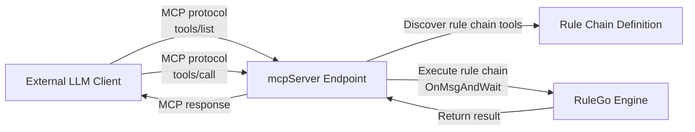

`endpoint/mcpServer` component: <Badge text="v0.36.0+"/> an MCP (Model Context Protocol) server endpoint that exposes RuleGo rule chains as MCP tools, allowing external LLM clients to invoke rule chains over the MCP protocol.

The MCP server implements the MCP StreamableHTTP transport protocol, supporting GET/POST/DELETE requests on a single HTTP endpoint, and is compatible with all clients that support the MCP protocol.

## How It Works



1. **Tool discovery**: MCP clients fetch the available tool list via `tools/list` (one tool per Router)
2. **Tool invocation**: clients invoke tools via `tools/call`; the server executes the corresponding rule chain and returns the result
3. **Automatic parameter inference**: the server parses `${msg.xxx}` variables in the rule chain definition to generate the tool's input parameter Schema

## Configuration

| Field | Type | Description | Default |
|-------|------|-------------|---------|
| server | string | Listen address | `:6334` |
| certFile | string | TLS certificate file path | |
| certKeyFile | string | TLS key file path | |
| allowCors | bool | Whether to enable cross-origin support | false |
| name | string | MCP service name (defaults to the rule chain name) | `RuleGo MCP Server` |
| version | string | MCP service version | `1.0.0` |
| basePath | string | Root path of the MCP endpoint. Defaults to the generated `/api/v1/rules/{ruleChain.id}/mcp` | Auto-generated |

## Tool Parameter Schema Inference

When a Router does not specify `inputSchema`, the server automatically extracts `${msg.xxx}` variables from the rule chain definition to generate tool parameters:

- If nodes in the chain use `${msg.city}` and `${msg.unit}`, the tool parameters are `city` (string) and `unit` (string)
- If no variable is detected, the tool accepts a single `inMessage` object parameter

The parameter Schema can also be specified manually via the rule chain's `additionalInfo.inputSchema`.

## Configuration Example

### As a rule chain endpoint

```json
{
  "ruleChain": {
    "id": "my-mcp-server",
    "name": "MCP Service"
  },
  "metadata": {
    "endpoints": [
      {
        "id": "e1",
        "type": "endpoint/mcpServer",
        "name": "MCP Server",
        "configuration": {
          "server": ":6334",
          "name": "My MCP Server",
          "version": "1.0.0"
        },
        "routers": [
          {
            "id": "r1",
            "from": {
              "path": "/get_weather",
              "configuration": {
                "description": "Get weather information for a specified city"
              },
              "to": {
                "process": "",
                "to": "weather-chain"
              }
            }
          },
          {
            "id": "r2",
            "from": {
              "path": "/search",
              "configuration": {
                "description": "Search the knowledge base"
              },
              "to": {
                "process": "",
                "to": "search-chain"
              }
            }
          }
        ]
      }
    ],
    "nodes": [],
    "connections": []
  }
}
```

### Working with the MCP client

The MCP server and client can work together to enable cross-process tool invocation between rule chains:

```
Rule chain A (ai/agent)
  → x/mcpClient invokes remote tool
    → HTTP request to the MCP server
      → Executes rule chain B
        → Returns result
```

## Connection Pool

`MCPConnectionPool` manages multiple MCP server instances (indexed by rule chain ID), supports connection reuse on the same HTTP port, and routes each request to the corresponding MCP server instance via the `id` parameter in the request.
